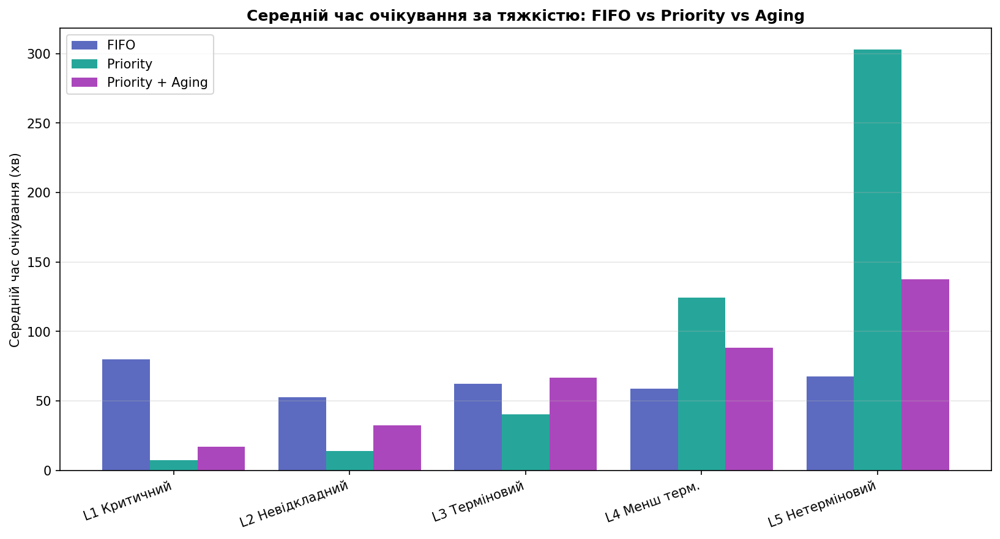

# Симуляція приймального відділення лікарні

### Чому черга з пріоритетами рятує життя

Дослідження на основі дискретно-подійної симуляції: що відбувається в приймальному
відділенні (ER), якщо пацієнтів обслуговувати **за порядком приходу (FIFO)** проти
**за тяжкістю стану (Priority)** проти **тяжкості з урахуванням часу очікування
(Priority + Aging)**. Пріоритетна черга реалізована як **двійкова купа (binary
heap)** — і саме її структура виявляється тим, що рятує критичних пацієнтів.

> Симуляція не «малює гарну картинку»: її рушій **звірено з точними формулами теорії
> черг** (M/G/1 Pollaczek–Khinchine та M/M/c Erlang-C), а всі ключові числа
> перевірено **Монте-Карло** на 300 незалежних прогонах.

## Питання дослідження

Інтуїтивно «по черзі» = чесно. Але якщо хтось із інфарктом стоїть за десятьма
застудами — чесність коштує життя. Наскільки саме гірше FIFO за пріоритетну чергу,
який у пріоритету зворотний бік і чи можна цей бік вилікувати? І коли «хвилини
очікування» перетворюються на **смерті**?

## Головний результат (seed=42)

Критичний пацієнт (рівень тяжкості L1) у середньому чекає на лікаря:

| Дисципліна | Середнє очікування L1 | Найдовше очікування L1 |
|-----------|----------------------:|-----------------------:|
| **FIFO** | 80 хв | 116 хв |
| **Priority** | 7 хв | 15 хв |
| **Priority + Aging** | 17 хв | 34 хв |

**Пріоритетна черга обслуговує критичних приблизно в 11× швидше** на цьому наборі.
Чесна оцінка по 300 прогонах скромніша — **близько 5×** (медіана ~4.5×): seed=42
виявився щасливим, і прогони це чесно показують.

Зворотний бік Priority — **голодування легких**: максимум очікування L5 сягає
**703 хв**, тоді як Aging зрізає його до **246 хв**, майже не шкодячи критичним.

А в найреалістичнішій моделі (пацієнти погіршуються чекаючи й можуть померти)
питання вже не про хвилини, а про життя: під FIFO помирає **~32 %** прибулих
критичних, під Priority — лише **~6 %**.



### Дисципліна ≠ структура

FIFO і Priority у пакеті — це **одна двійкова купа** з різним ключем (`(severity, arrival)` проти `(arrival,)`): дисципліна — це вибір ключа, а не окрема структура. Водночас FIFO має й **природну O(1)-форму** — звичайну чергу `deque` ([`simulate_fifo_deque`](src/triage_sim/engines/__init__.py)), що дає **той самий результат** біт-у-біт. Тобто *який порядок* (дисципліна) **ортогональний** до *як зберігати* (структура): ту саму priority можна тримати і на купі, і на bucket-черзі (`simulate_bucket`), а FIFO — і на купі, і на deque. Підставну структуру забезпечує драйвер «один рушій + політика черги», а `run_main_comparison.py` друкує цю звірку (`Однаковий порядок: True`).

## Структура репозиторію

```
hospital-triage-simulation/
├── README.md                  ← ви тут
├── docs/                      повний виклад дослідження, розбитий на 17 розділів
│   ├── README.md              зміст і навігація по розділах
│   ├── 00…14-*.md             пояснення + код + результати + графіки
│   └── code-map.md            карта коду: функції за файлами й фазами
├── figures/                   23 графіки (відтворюються scripts/save_figures.py)
├── src/triage_sim/            чистий, придатний для імпорту пакет
│   ├── model.py               Patient, шкала тяжкості, час обслуговування
│   ├── generation.py          генерація пуассонівського потоку пацієнтів
│   ├── engines/               рушії: драйвери + політики + публічні simulate*
│   │   ├── drivers.py         узагальнений цикл симуляції + протокол черги
│   │   └── policies.py        політики черги (heap/deque) + фабрики ключів
│   ├── aging/                 дисципліна aging (пакет, варіант на модуль)
│   │   ├── linear.py          лінійний aging: список-еталон + купа O(log n)
│   │   ├── bucket.py          bucket-черга O(1) для дискретних рівнів
│   │   └── step.py            порогова ескалація + купа з лінивим видаленням
│   ├── metrics.py             метрики очікування та небезпеки
│   ├── validation.py          звірка з M/G/1 і M/M/c
│   ├── experiments.py         експерименти (спільне джерело: скрипти + графіки)
│   ├── reneging.py            відхід пацієнтів (LWBS)
│   ├── deterioration.py       погіршення стану і смерть
│   └── heap_demo.py           навчальна купа «з нуля» (sift-up/down)
├── scripts/                   відтворити числа й графіки однією командою
│   ├── run_main_comparison.py
│   ├── run_monte_carlo.py
│   ├── run_load_sweep.py
│   ├── run_validation.py
│   ├── run_reneging.py
│   ├── run_deterioration.py
│   ├── save_figures.py        тонкий CLI: перебудувати всі 23 графіки
│   └── figbuild/              код побудови графіків (по модулю на фазу)
│       ├── constants.py       палітра й підписи дисциплін
│       ├── data.py            лінива підготовка даних (клас Data)
│       ├── helpers.py         спільні плот-утиліти (легенди, підписи, таймлайн)
│       ├── flow.py            01–03  потік пацієнтів
│       ├── structure.py       04–08  купа + aging
│       ├── comparison.py      09–14  головне порівняння
│       ├── queue_trace.py     15–16  візуалізація черги
│       ├── robustness.py      17–19  Монте-Карло + навантаження
│       └── outcomes.py        20–23  шкода, відхід, смертність
├── tests/
│   ├── test_equivalence.py    еквівалентність реалізацій рушія + поведінкові гарантії
│   ├── test_departures.py     інваріанти моделей із вибуттям (reneging / deterioration)
│   ├── test_metrics.py        метрики очікування та підрахунку «в небезпеці»
│   ├── test_experiments.py    контракти спільних експериментів (МК / sweep / reneging / deter)
│   └── test_figures.py        смоук-тест: усі 23 графіки будуються
├── requirements.txt
├── pyproject.toml
└── LICENSE
```

## Встановлення

Потрібен Python 3.10+. Залежності: лише `numpy` та `matplotlib` (для тестів —
`pytest`).

```bash
# варіант А: встановити пакет (рекомендовано)
pip install -e .

# варіант Б: без встановлення — скрипти самі знайдуть пакет у src/
pip install -r requirements.txt
```

## Як запустити

Команди — з кореня репозиторію (залежності — див. «Встановлення»). Аналітичні
скрипти друкують результати в консоль:

```bash
# головне порівняння FIFO vs Priority vs Aging (seed=42, «головна цифра»)
python scripts/run_main_comparison.py

# звірка рушія з точними формулами теорії черг (M/G/1, M/M/c)
python scripts/run_validation.py

# чутливість до навантаження ρ — коли Priority критично важливий
python scripts/run_load_sweep.py

# Монте-Карло — необовʼязковий аргумент: к-ть прогонів (типово 300)
python scripts/run_monte_carlo.py        # 300
python scripts/run_monte_carlo.py 50     # швидше

# відхід пацієнтів (LWBS) та ефект клапана — теж приймає к-ть прогонів
python scripts/run_reneging.py

# погіршення стану і смертність: наївна vs реалістична — теж приймає к-ть прогонів
python scripts/run_deterioration.py
```

Перебудувати всі 23 графіки у `figures/NN_*.png`:

```bash
python scripts/save_figures.py                  # усі (runs=300)
python scripts/save_figures.py --only 09,17,23  # лише вибрані (за номером)
python scripts/save_figures.py --runs 60        # менше прогонів МК (швидше)
python scripts/save_figures.py --out /tmp/fig   # в інший каталог
```

Перевірки (як у CI):

```bash
ruff check                     # лінтер
mypy src/triage_sim scripts    # типи (бібліотека + скрипти/figbuild)
pytest -q                      # тести (вкл. смоук-тест 23 графіків)
```

Мінімальний приклад використання пакета:

```python
import copy
from triage_sim import generate_patients, simulate, simulate_aging, metrics_by_severity

patients = generate_patients(seed=42)
fifo  = metrics_by_severity(simulate(copy.deepcopy(patients), "fifo"))
prio  = metrics_by_severity(simulate(copy.deepcopy(patients), "priority"))
print("Критичні (L1), середнє очікування:",
      round(fifo[1]["avg"]), "хв (FIFO) →", round(prio[1]["avg"]), "хв (Priority)")
```

## Документація

Повний наратив дослідження — з усіма поясненнями, кодом, результатами та графіками —
у каталозі [`docs/`](docs/README.md). Почати варто зі **[Змісту](docs/README.md)**.

Покажчик коду «за модулями» — які функції, для чого, в якій фазі — у
[**Карті коду**](docs/code-map.md).

## Ліцензія

[MIT](LICENSE).
