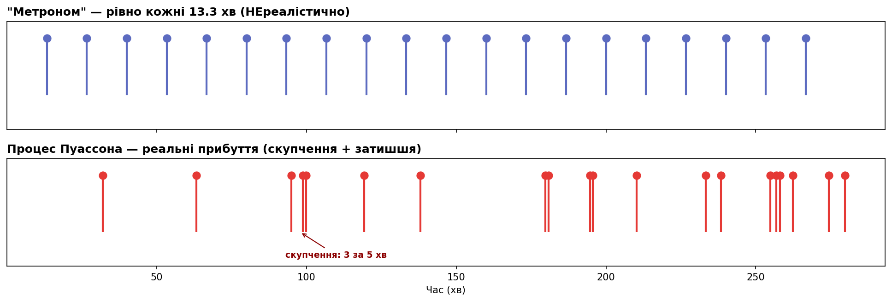
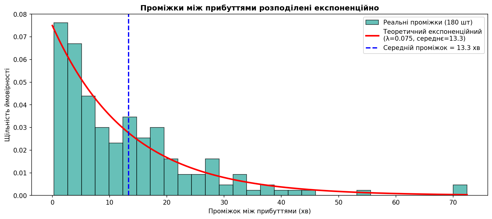
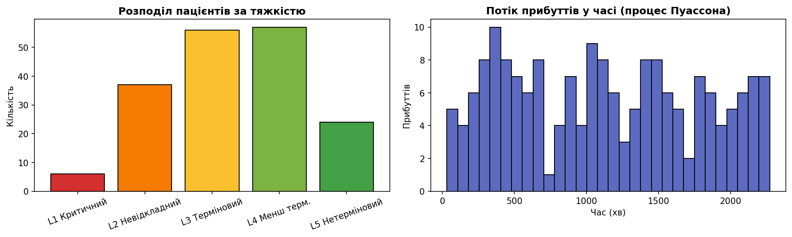

# Фаза 2. Потік пацієнтів (процес Пуассона)

> Розділ 02 · [↑ Зміст документації](README.md) · [↑ Головний README](../README.md)

[← Фаза 1. Модель даних](01-data-model.md)    [Фаза 3. Рушій симуляції →](03-simulation-engine.md)

---

## Фаза 2: Генерація реалістичного потоку пацієнтів

Моделюємо потік за **процесом Пуассона** — стандартною моделлю випадкових незалежних подій у часі (прибуття клієнтів, дзвінків, пацієнтів). Його математична властивість: час **між** прибуттями розподілений експоненційно.

Тяжкість розподіляємо реалістично: більшість випадків середні (L3–L4), критичних мало (L1). Час лікування залежить від тяжкості — критичні потребують більше уваги.

> **Примітка щодо реалізації.** Розподіли тут задано inline для наочності. У пакеті вони винесені в `model.SEVERITY_PROBS`/`BASE_SERVICE` + спільні семплери `sample_severities`/`sample_service_durations` — **єдине джерело**, з якого беруть і генерація, і валідація (`service_moments`), тож вони звіряються з тим самим розподілом.

## Як працює потік пацієнтів: процес Пуассона

### Що таке процес Пуассона (ідея)

**Процес Пуассона** — це математична модель **випадкових подій, які трапляються незалежно одна від одної з постійною середньою частотою**.

Приклади з життя:
- краплі дощу падають на конкретну плитку тротуару,
- повідомлення приходять у месенджер,
- дзвінки в кол-центр,
- **пацієнти прибувають у приймальне відділення** ← наш випадок.

Головна особливість: ми знаємо **середню** частоту ("в середньому один пацієнт кожні 13 хвилин"), але **конкретний момент** прибуття кожного пацієнта — випадковий. Інколи двоє приходять майже одночасно, інколи буває довге затишшя.

### Ключовий математичний факт

> У процесі Пуассона **час між сусідніми подіями** (проміжок) розподілений за **експоненційним законом**.

Якщо середня частота — `λ` (лямбда) подій за хвилину, то:
- **середній** проміжок між подіями = `1/λ`,
- але **конкретний** проміжок — випадковий, витягнутий з експоненційного розподілу.

У нашому коді `arrival_rate = 0.075` пацієнта за хвилину, отже середній проміжок:

$$\frac{1}{\lambda} = \frac{1}{0.075} \approx 13.3 \text{ хвилини}$$

## Чому `arrival_rate = 0.075`?

На відміну від `seed` (який можна взяти будь-який), значення `arrival_rate` **не довільне** — воно прораховане. Воно керує тим, **наскільки завантажений лікар**.

### Ключова формула теорії черг

$$\rho = \text{arrival\_rate} \times \text{середній\_час\_лікування}$$

`ρ` (ро) — **завантаженість**: частка часу, коли лікар зайнятий. Це найважливіший параметр будь-якої системи з чергою.

### Крок 1: середній час лікування

Він залежить від розподілу тяжкості й часу на кожен рівень (з `generate_patients`):

| Рівень | Ймовірність | Час лікування | Внесок |
|---|---|---|---|
| L1 | 0.05 | 25 хв | 1.25 |
| L2 | 0.15 | 18 хв | 2.70 |
| L3 | 0.35 | 12 хв | 4.20 |
| L4 | 0.30 | 8 хв | 2.40 |
| L5 | 0.15 | 5 хв | 0.75 |
| **Середнє** | | | **≈ 11.3 хв** |

### Крок 2: завантаженість

$$\rho = 0.075 \times 11.3 \approx 0.85 = 85\%$$

Лікар зайнятий **85% часу** — це й було цільове значення.

```python
# Автоматичний розрахунок завантаженості ρ з параметрів моделі
arrival_rate = 0.075

severity_probs = {1: 0.05, 2: 0.15, 3: 0.35, 4: 0.30, 5: 0.15}
base_service   = {1: 25, 2: 18, 3: 12, 4: 8, 5: 5}

avg_service = sum(severity_probs[severity] * base_service[severity] for severity in range(1, 6))
rho = arrival_rate * avg_service

print(f"Середній час лікування: {avg_service:.1f} хв")
print(f"Частота прибуттів:      {arrival_rate} пацієнта/хв (один кожні {1/arrival_rate:.1f} хв)")
print(f"Завантаженість лікаря:  ρ = {arrival_rate} × {avg_service:.1f} = {rho:.2f}  ({rho*100:.0f}%)")
print()
if rho >= 1:
    print("⚠️  ПЕРЕВАНТАЖЕННЯ (ρ ≥ 1): черга росте нескінченно, дослід зіпсується.")
elif rho < 0.5:
    print("⚠️  ЗАНИЗЬКЕ (ρ < 0.5): черги майже немає, FIFO і Priority дадуть однаковий результат.")
else:
    print("✅ ОПТИМАЛЬНО (0.5 ≤ ρ < 1): черга утворюється, система стабільна.")
```


**Результат:**

```
Середній час лікування: 11.3 хв
Частота прибуттів:      0.075 пацієнта/хв (один кожні 13.3 хв)
Завантаженість лікаря:  ρ = 0.075 × 11.3 = 0.85  (85%)

✅ ОПТИМАЛЬНО (0.5 ≤ ρ < 1): черга утворюється, система стабільна.
```

### Чому саме ~85%, а не більше чи менше

Це "золота середина" між двома крайнощами:

| Завантаженість | Що відбувається | Проблема для досліду |
|---|---|---|
| **Низька** (ρ < 0.5) | Лікар часто вільний, черги майже немає | Priority і FIFO дають **однаковий** результат — нема що порівнювати |
| **~85%** (наш вибір) | Черга утворюється, але система стабільна | ✅ Драматичний контраст + реалістично |
| **Перевантаження** (ρ ≥ 1) | Прибуття швидші за лікування → черга росте **нескінченно** | Усі чекають годинами, картина "розмита" |

Простими словами: щоб **побачити користь** черги з пріоритетами, потрібна **реальна черга**. При низькому навантаженні лікар встигає всіх — і байдуже, в якому порядку брати. При перевантаженні всі тонуть однаково. Лише в "напруженому, але стабільному" режимі (~85%) різниця між FIFO і Priority стає драматичною.

### Що буде, якщо змінити значення

Результати тестування різних значень `arrival_rate`:

| `arrival_rate` | ρ | Критичні (L1): FIFO → Priority | Висновок |
|---|---|---|---|
| 0.070 | 0.79 | 64 → 8 хв | трохи слабший контраст |
| **0.075** | **0.85** | **80 → 7 хв** | ✅ оптимально |
| 0.080 | 0.90 | 110 → 9 хв | сильніше, але близько до межі |
| 0.090 | 1.02 | 108 → 8 хв, але L5 чекає 1090 хв | ⚠️ нестабільно, картина зіпсована |

При `0.090` (ρ > 1) система перевантажена — черга росте без меж, і легкі пацієнти "тонуть" на тисячі хвилин. Це нереалістично для робочого приймального відділення.

**Висновок:** `arrival_rate = 0.075` дає завантаженість 85% — достатньо, щоб черга з пріоритетами показала свою цінність, але не настільки, щоб система зламалася.

### Чому саме експоненційний, а не "рівно кожні 13 хвилин"?

Це найважливіший момент.

**Якби** ми робили пацієнта **рівно кожні 13.3 хв**, потік був би як метроном — це **нереалістично**, бо в житті прибуття **групуються** і мають **провали**.

**Експоненційний розподіл** дає реалістичну картину: проміжки різні. Він має властивість "відсутності пам'яті" — ймовірність, що пацієнт прибуде в наступну хвилину, **не залежить** від того, скільки ви вже чекали. Це й породжує природні скупчення та затишшя.

Побудуємо обидва потоки поряд, щоб побачити різницю 👇

```python
arrival_rate = 0.075
rng = np.random.default_rng(42)
inter_arrivals = rng.exponential(1 / arrival_rate, size=180)
arrival_times = np.cumsum(inter_arrivals)
mean_gap = 1 / arrival_rate

n_show = 20
poisson_arr = arrival_times[:n_show]
metronome_arr = np.arange(1, n_show + 1) * mean_gap  # рівно кожні 13.3 хв

fig, axes = plt.subplots(2, 1, figsize=(13, 4.5), sharex=True)

# Метроном — ідеально рівні проміжки
axes[0].vlines(metronome_arr, 0, 1, color='#5c6bc0', lw=2)
axes[0].scatter(metronome_arr, [1] * n_show, color='#5c6bc0', s=60, zorder=3)
axes[0].set_title('"Метроном" — рівно кожні 13.3 хв (НЕреалістично)',
                  fontweight='bold', loc='left')
axes[0].set_yticks([]); axes[0].set_ylim(-0.6, 1.3)

# Пуассон — реальні випадкові прибуття
axes[1].vlines(poisson_arr, 0, 1, color='#e53935', lw=2)
axes[1].scatter(poisson_arr, [1] * n_show, color='#e53935', s=60, zorder=3)
axes[1].set_title('Процес Пуассона — реальні прибуття (скупчення + затишшя)',
                  fontweight='bold', loc='left')
axes[1].set_yticks([]); axes[1].set_ylim(-0.6, 1.3)
axes[1].set_xlabel('Час (хв)')

# Підсвічуємо скупчення
cluster = poisson_arr[(poisson_arr >= 94) & (poisson_arr <= 101)]
axes[1].annotate('скупчення: 3 за 5 хв', xy=(cluster.mean(), 0),
                 xytext=(cluster.mean() + 12, -0.45),
                 color='darkred', fontsize=9, fontweight='bold', ha='center',
                 arrowprops=dict(arrowstyle='->', color='darkred'))

plt.tight_layout()
plt.show()
```


**Результат:**



### Реалізація рядок за рядком

```python
rng = np.random.default_rng(42)
inter_arrivals = rng.exponential(1 / arrival_rate, size=180)
arrival_times = np.cumsum(inter_arrivals)
```

**Рядок 1 — `np.random.default_rng(42)`.** Генератор випадкових чисел із зерном `42`. Зерно гарантує, що щоразу отримаємо ті самі "випадкові" числа — потрібно для відтворюваності й чесного порівняння FIFO vs Priority на однакових пацієнтах.

**Рядок 2 — `rng.exponential(1 / arrival_rate, size=180)`.** Генеруємо 180 випадкових проміжків між прибуттями.

⚠️ **Важливий нюанс numpy:** функція `exponential` приймає **середнє значення** (`1/λ`), а **не** саму частоту `λ`. Тому передаємо `1 / 0.075 = 13.33`, а не `0.075`.

**Рядок 3 — `np.cumsum(inter_arrivals)`.** Кумулятивна (накопичувальна) сума перетворює **проміжки** на **абсолютні моменти прибуття**. Кожен пацієнт прибуває через свій проміжок після попереднього, тому момент прибуття = сума всіх проміжків до нього включно.

Подивимось на конкретні числа 👇

```python
print(f"1 / arrival_rate = 1 / {arrival_rate} = {mean_gap:.2f}  (середній проміжок, хв)\n")

print("Перші 8 ПРОМІЖКІВ між прибуттями (хв):")
print("  ", [round(float(x), 1) for x in inter_arrivals[:8]])

print("\nПерші 8 МОМЕНТІВ прибуття (хв від початку):")
print("  ", [round(float(x), 1) for x in arrival_times[:8]])

print(f"\nСередній проміжок по 180 пацієнтах: {inter_arrivals.mean():.2f} хв")
print(f"Найкоротший проміжок: {inter_arrivals.min():.2f} хв")
print(f"Найдовший проміжок:   {inter_arrivals.max():.2f} хв")
```


**Результат:**

```
1 / arrival_rate = 1 / 0.075 = 13.33  (середній проміжок, хв)

Перші 8 ПРОМІЖКІВ між прибуттями (хв):
   [32.1, 31.1, 31.8, 3.7, 1.2, 19.4, 18.8, 41.7]

Перші 8 МОМЕНТІВ прибуття (хв від початку):
   [32.1, 63.2, 95.0, 98.7, 99.9, 119.3, 138.1, 179.7]

Середній проміжок по 180 пацієнтах: 12.62 хв
Найкоротший проміжок: 0.28 хв
Найдовший проміжок:   72.42 хв
```

### Як cumsum перетворює проміжки на прибуття

```
Проміжки:   32.1   31.1   31.8    3.7   1.2  ...
            └──┬──┘ └──┬──┘ └──┬──┘ └─┬─┘ └┬┘
Прибуття:  32.1  63.2   95.0  98.7  99.9  ...
```

Як рахується:
- Пацієнт 0 прибуває в момент `32.1`
- Пацієнт 1: `32.1 + 31.1 = 63.2`
- Пацієнт 2: `63.2 + 31.8 = 95.0`
- Пацієнт 3: `95.0 + 3.7 = 98.7`
- Пацієнт 4: `98.7 + 1.2 = 99.9`

**Що показують реальні числа.** Подивіться на моменти прибуття `95.0, 98.7, 99.9` — **троє пацієнтів за 5 хвилин**! А між `32.1` і `63.2` — порожні 30 хвилин. Це реалістична картина приймального відділення: то затишшя, то напливи.

Саме тому черга з пріоритетами важлива: під час напливу лікар має вирішити, кого брати першим — і якщо серед них є критичний, priority queue врятує його.

Тепер подивимось на **форму** розподілу проміжків 👇

```python
fig, ax = plt.subplots(figsize=(11, 5))

# Гістограма реальних проміжків
ax.hist(inter_arrivals, bins=30, density=True, color='#26a69a',
        edgecolor='black', alpha=0.7, label='Реальні проміжки (180 шт)')

# Теоретична експоненційна крива
x = np.linspace(0, inter_arrivals.max(), 200)
theoretical = arrival_rate * np.exp(-arrival_rate * x)
ax.plot(x, theoretical, 'r-', lw=2.5,
        label=f'Теоретичний експоненційний\n(λ={arrival_rate}, середнє={mean_gap:.1f})')

ax.axvline(mean_gap, color='blue', ls='--', lw=2,
           label=f'Середній проміжок = {mean_gap:.1f} хв')
ax.set_xlabel('Проміжок між прибуттями (хв)')
ax.set_ylabel('Щільність ймовірності')
ax.set_title('Проміжки між прибуттями розподілені експоненційно', fontweight='bold')
ax.legend()
plt.tight_layout()
plt.show()
```


**Результат:**



### Підсумок у трьох реченнях

1. **Ідея:** процес Пуассона моделює випадкові незалежні прибуття з постійною середньою частотою.
2. **Механізм:** проміжки між прибуттями випадкові й експоненційні — це дає реалістичні скупчення/затишшя замість метронома.
3. **Реалізація:** `exponential(1/λ)` генерує проміжки → `cumsum` перетворює їх на моменти прибуття.

На гістограмі видно характерну форму експоненційного розподілу: **коротких проміжків багато** (пацієнти часто приходять один за одним), **довгих — мало** (рідкісні великі затишшя). Червона крива — теоретичний розподіл — добре лягає на реальні дані.

```python
def generate_patients(n=180, arrival_rate=0.075, seed=42):
    """Генерує потік пацієнтів.

    arrival_rate — пацієнтів за хвилину (0.075 = один кожні ~13 хв).
    Параметри підібрані так, щоб лікар був завантажений на ~85% —
    черга утворюється, але система стабільна.
    """
    rng = np.random.default_rng(seed)

    # Час МІЖ прибуттями ~ експоненційний → це процес Пуассона
    inter_arrivals = rng.exponential(1 / arrival_rate, size=n)
    arrival_times = np.cumsum(inter_arrivals)

    # Тяжкість: більшість — середні випадки
    severities = rng.choice([1, 2, 3, 4, 5], size=n,
                            p=[0.05, 0.15, 0.35, 0.30, 0.15])

    # Час лікування залежить від тяжкості (критичні — довше)
    base = {1: 25, 2: 18, 3: 12, 4: 8, 5: 5}
    durations = [max(2, rng.normal(base[severity], base[severity] * 0.25)) for severity in severities]

    return [Patient(i, float(arrival_times[i]), int(severities[i]), float(durations[i]))
            for i in range(n)]


patients = generate_patients()
print(f'Згенеровано {len(patients)} пацієнтів')
print(f'Період спостереження ~{patients[-1].arrival_time / 60:.1f} годин')

# Перевіримо розподіл тяжкості
from collections import Counter
dist = Counter(patient.severity for patient in patients)
for severity in range(1, 6):
    print(f'  {SEV_NAMES[severity]}: {dist[severity]} пацієнтів')
```


**Результат:**

```
Згенеровано 180 пацієнтів
Період спостереження ~37.9 годин
  L1 Критичний: 6 пацієнтів
  L2 Невідкладний: 37 пацієнтів
  L3 Терміновий: 56 пацієнтів
  L4 Менш терм.: 57 пацієнтів
  L5 Нетерміновий: 24 пацієнтів
```

## Як визначається час лікування кожного пацієнта

У функції `generate_patients` час лікування задається так:

```python
base = {1: 25, 2: 18, 3: 12, 4: 8, 5: 5}
durations = [max(2, rng.normal(base[severity], base[severity] * 0.25)) for severity in severities]
```

Це працює у **три кроки**.

### Крок 1: базовий час за тяжкістю

Кожному рівню задано **типовий** час лікування:

| Рівень | Базовий час | Логіка |
|---|---|---|
| L1 (критичний) | 25 хв | реанімація потребує найбільше уваги |
| L2 | 18 хв | |
| L3 | 12 хв | |
| L4 | 8 хв | |
| L5 (легкий) | 5 хв | подряпина — швидко |

**Принцип:** чим тяжчий пацієнт, тим довше лікування. Це реалістично — інфаркт займає більше часу, ніж довідка.

### Крок 2: випадковий розкид навколо базового

```python
rng.normal(base[severity], base[severity] * 0.25)
```

Час не фіксований — він витягується з **нормального розподілу**:
- **центр** = базовий час (наприклад, 12 хв для L3),
- **стандартне відхилення** = 25% від базового (для L3 це 3 хв).

Це моделює реальність: навіть пацієнти з однаковою тяжкістю лікуються по-різному. Відхилення 25% означає, що ~95% випадків потраплять у діапазон ±50% від базового (для L3 — приблизно 6–18 хв).

### Крок 3: захисний мінімум

```python
max(2, ...)
```

Нормальний розподіл теоретично може видати від'ємне або абсурдно мале число (особливо для L5: база 5, відхилення 1.25). `max(2, ...)` гарантує, що лікування триває **щонайменше 2 хвилини** — фізично осмислений мінімум.

### Чому саме нормальний розподіл

**Нормальний (Гаусів) розподіл** — стандартна модель для величини, яка **коливається навколо типового значення**:
- більшість значень близькі до середнього,
- рідкісні випадки сильно відхиляються в обидва боки,
- розподіл **симетричний** навколо центру.

Час лікування поводиться саме так: більшість переломів займають ~12 хв, але трапляються і простіші (8 хв), і складніші (16 хв). Тому нормальний розподіл — природний вибір для навчальної моделі.

### Чесне застереження

Нормальний розподіл має ваду для часу обслуговування: він **симетричний і може давати від'ємні значення**. Для L5 (база 5, відхилення 1.25) інколи "вилазить" нижче нуля — саме тому потрібен `max(2, ...)`.

У "серйозних" моделях черг частіше використовують **логнормальний** або **гамма-розподіл** — вони:
- ніколи не від'ємні (фізично коректні для часу),
- асиметричні (довгий "хвіст" у бік великих значень — кілька випадків лікують дуже довго).

Але вони складніші для розуміння. Для нашого досліду нормальний розподіл + захисний мінімум — достатньо хороше й просте наближення, яке не спотворює висновки.

```python
rng = np.random.default_rng(42)
base = {1: 25, 2: 18, 3: 12, 4: 8, 5: 5}

print("Приклади згенерованого часу лікування (по 5 пацієнтів кожного рівня):\n")
for sev in range(1, 6):
    samples = [round(max(2, rng.normal(base[sev], base[sev] * 0.25)), 1) for _ in range(5)]
    print(f"  L{sev} (база {base[sev]:>2} хв): {samples}")

print("\nВидно: значення коливаються навколо базового, але не фіксовані —")
print("напр. L3 (база 12) дає ~9-15 хв, як у реальності.")
```


**Результат:**

```
Приклади згенерованого часу лікування (по 5 пацієнтів кожного рівня):

  L1 (база 25 хв): [26.9, 18.5, 29.7, 30.9, 12.8]
  L2 (база 18 хв): [12.1, 18.6, 16.6, 17.9, 14.2]
  L3 (база 12 хв): [14.6, 14.3, 12.2, 15.4, 13.4]
  L4 (база  8 хв): [6.3, 8.7, 6.1, 9.8, 7.9]
  L5 (база  5 хв): [4.8, 4.1, 6.5, 4.8, 4.5]

Видно: значення коливаються навколо базового, але не фіксовані —
напр. L3 (база 12) дає ~9-15 хв, як у реальності.
```

```python
# Візуалізуємо розподіл тяжкості та потік прибуттів
fig, axes = plt.subplots(1, 2, figsize=(13, 4))

# Зліва: гістограма тяжкості
levels = list(range(1, 6))
counts = [dist[severity] for severity in levels]
axes[0].bar([SEV_NAMES[severity] for severity in levels], counts,
            color=[SEV_COLORS[severity] for severity in levels], edgecolor='black')
axes[0].set_title('Розподіл пацієнтів за тяжкістю', fontweight='bold')
axes[0].set_ylabel('Кількість')
axes[0].tick_params(axis='x', rotation=20)

# Справа: прибуття в часі
arr_times = [patient.arrival_time for patient in patients]
axes[1].hist(arr_times, bins=30, color='#5c6bc0', edgecolor='black')
axes[1].set_title('Потік прибуттів у часі (процес Пуассона)', fontweight='bold')
axes[1].set_xlabel('Час (хв)')
axes[1].set_ylabel('Прибуттів')

plt.tight_layout()
plt.show()
```


**Результат:**




---

[← Фаза 1. Модель даних](01-data-model.md)    [Фаза 3. Рушій симуляції →](03-simulation-engine.md)
