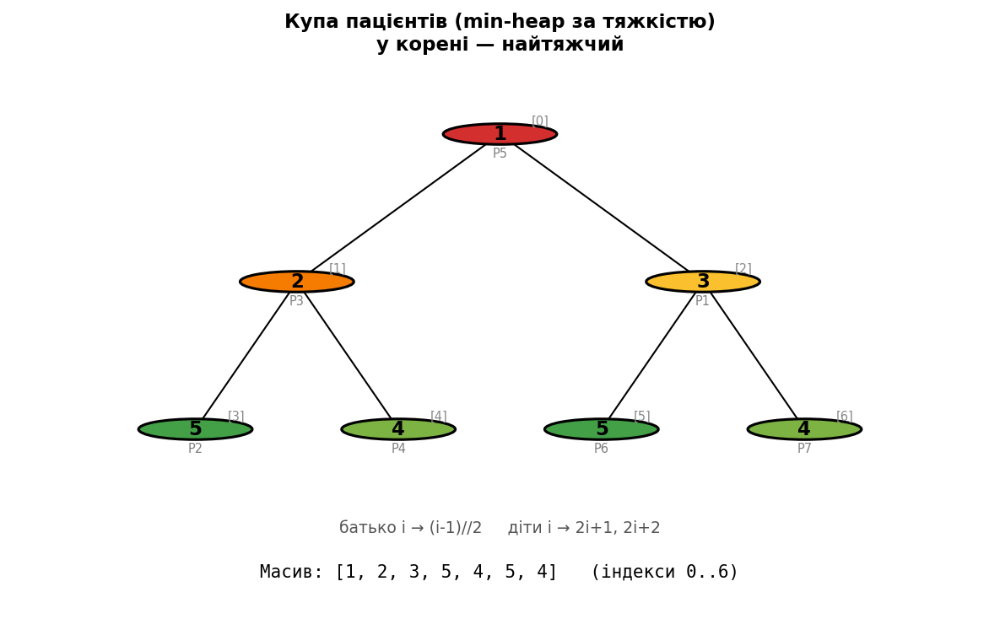
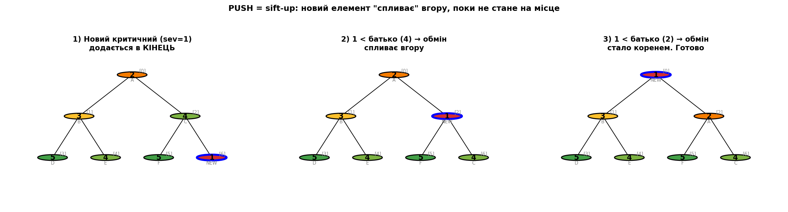
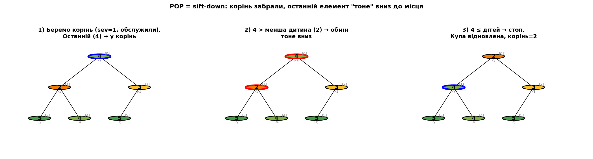

# Як влаштована купа (heap) зсередини

> Розділ 04 · [↑ Зміст документації](README.md) · [↑ Головний README](../README.md)

[← Фаза 3. Рушій симуляції](03-simulation-engine.md)    [Aging: третя дисципліна →](05-aging.md)

---

## Як насправді влаштована купа (heap)

Досі ми брали `heapq` як **готовий інструмент**: `heappush` додає, `heappop` дає найтяжчого. Але це чорна скринька. Тут ми її **відкриємо** — на наших же пацієнтах — і побачимо, *чому* купа дає мінімум за $O(\log n)$, а не магією.

Розберемо: що таке купа структурно, як вона лежить у масиві, як працюють push і pop, і навіть **напишемо купу з нуля** й перевіримо, що вона робить те саме, що `heapq`.

### Що таке купа: дерево + одне правило

**Купа — це повне бінарне дерево** з єдиним правилом (інваріантом):

> **Кожен батько не "більший" за своїх дітей.** (для min-heap)

У нас "менший" = тяжчий (severity=1 критичний). Тож правило означає: **батько не легший за дітей** → у корені завжди **найтяжчий** пацієнт. Це все. Жодного повного сортування — лише локальне правило "батько ≤ діти" в кожному вузлі.

**Хитрість, що робить купу швидкою:** дерево не зберігають зі справжніми "стрілками". Його кладуть у **звичайний пласкій масив**, а зв'язки батько–дитина обчислюють за індексом:
- діти вузла `i`: `2i+1` (лівий) і `2i+2` (правий),
- батько вузла `i`: `(i-1)//2`.

Тобто дерево "несправжнє" — це просто масив, який ми *читаємо* як дерево.

```python
import heapq, math
from matplotlib import pyplot as plt

def draw_heap(ax, arr, title, highlight=None, swap=None):
    """Малює купу (масив пар (severity, id)) як бінарне дерево."""
    n = len(arr); pos = {}
    for i in range(n):
        depth = int(math.floor(math.log2(i + 1)))
        idx = i - (2**depth - 1)
        pos[i] = ((idx + 0.5) / (2**depth), -depth)
    for i in range(n):                                   # ребра
        for child in (2*i+1, 2*i+2):
            if child < n:
                ax.plot([pos[i][0], pos[child][0]], [pos[i][1], pos[child][1]], 'k-', lw=1, zorder=1)
    for i in range(n):                                   # вузли
        sev, pid = arr[i]; node_x, node_y = pos[i]
        edge_color, line_width = 'black', 1.5
        if highlight and i in highlight: edge_color, line_width = 'blue', 3
        if swap and i in swap: edge_color, line_width = 'red', 3
        ax.add_patch(plt.Circle((node_x, node_y), 0.07, color=SEV_COLORS[sev], ec=edge_color, lw=line_width, zorder=2))
        ax.text(node_x, node_y, f'{sev}', ha='center', va='center', fontsize=11, fontweight='bold', zorder=3)
        ax.text(node_x, node_y-0.13, pid, ha='center', va='center', fontsize=7, color='gray', zorder=3)
        ax.text(node_x+0.05, node_y+0.09, f'[{i}]', ha='center', va='center', fontsize=7, color='#888', zorder=3)
    ax.set_xlim(-0.1, 1.1); ax.set_ylim(-3.2, 0.5); ax.axis('off')
    ax.set_title(title, fontweight='bold', fontsize=11)

# Знімок зали очікування — вставляємо пацієнтів у купу
demo_patients  = [(3,'P1'),(5,'P2'),(2,'P3'),(4,'P4'),(1,'P5'),(5,'P6'),(4,'P7')]
h = []
for x in demo_patients: heapq.heappush(h, x)

fig, ax = plt.subplots(figsize=(8, 5))
draw_heap(ax, h, 'Купа пацієнтів (min-heap за тяжкістю)\nу корені — найтяжчий')
ax.text(0.5, -3.0, f'Масив: {[s for s,_ in h]}   (індекси 0..{len(h)-1})',
        ha='center', fontsize=10, family='monospace')
ax.text(0.5, -2.7, 'батько i → (i-1)//2     діти i → 2i+1, 2i+2', ha='center', fontsize=9, color='#555')
plt.tight_layout(); plt.show()
```


**Результат:**



### Як читати це дерево

У корені (індекс `[0]`) — **severity 1** (найтяжчий), як і має бути. Перевірте інваріант: кожен батько не легший за дітей (1 ≤ 2,3; 2 ≤ 5,4; 3 ≤ 5,4). ✅

Тепер зіставте дерево з масивом `[1, 2, 3, 5, 4, 5, 4]`:
- корінь `[0]` = 1; його діти `[1]`, `[2]` = 2, 3;
- вузол `[1]` = 2; його діти `[3]`, `[4]` = 5, 4;
- батько вузла `[4]` → `(4-1)//2 = [1]` = 2. ✅

**Жодних справжніх стрілок немає** — лише масив і арифметика індексів. Купа впорядкована **частково**: вона гарантує лише, що корінь — мінімум, а не весь масив відсортований. Саме тому вона дешевша за повне сортування.

### PUSH: новий пацієнт "спливає" вгору (sift-up)

Коли прибуває пацієнт, `heappush` робить два кроки:
1. **кладе його в кінець масиву** (останній лист дерева);
2. **"піднімає" (sift-up):** поки новачок тяжчий за свого батька — міняє їх місцями, і так угору, поки правило "батько ≤ діти" не відновиться.

Критичний пацієнт "спливе" аж до кореня; легкий лишиться внизу. Подивимось наочно.

```python
def sift_up_steps(arr, value):
    nodes = list(arr); nodes.append(value); i = len(nodes) - 1
    steps = [(list(nodes), i, None)]
    while i > 0:
        parent = (i - 1) // 2
        if nodes[i][0] < nodes[parent][0]:
            steps.append((list(nodes), i, (i, parent)))      # перед обміном
            nodes[i], nodes[parent] = nodes[parent], nodes[i]; i = parent
            steps.append((list(nodes), i, None))             # після обміну
        else:
            break
    return steps

start = [(2,'A'),(3,'B'),(4,'C'),(5,'D'),(4,'E'),(5,'F')]   # валідна купа, корінь=2
steps = sift_up_steps(start, (1,'NEW'))
frames = [steps[0], steps[2], steps[4]]
titles = ['1) Новий критичний (sev=1)\nдодається в КІНЕЦЬ',
          '2) 1 < батько (4) → обмін\nспливає вгору',
          '3) 1 < батько (2) → обмін\nстало коренем. Готово']
fig, axes = plt.subplots(1, 3, figsize=(16.5, 4.2))
for ax, (arr, hl, sw), title in zip(axes, frames, titles):
    draw_heap(ax, arr, title, highlight={hl}, swap=set(sw) if sw else None)
plt.suptitle('PUSH = sift-up: новий елемент "спливає" вгору, поки не стане на місце', fontweight='bold', y=1.04)
plt.tight_layout(); plt.show()
```


**Результат:**



### POP: останній елемент "тоне" вниз (sift-down)

Коли лікар бере наступного, `heappop` робить так:
1. **забирає корінь** (найтяжчого — його обслужили);
2. **ставить останній лист на місце кореня** (тимчасово порушуючи правило);
3. **"топить" (sift-down):** поки цей елемент тяжчий... тобто легший за свою **меншу** дитину — міняє з нею місцями, і так униз, поки правило не відновиться.

Чому саме з **меншою** (тяжчою) дитиною? Бо вона має стати новим батьком — інакше правило "батько ≤ діти" знову зламається.

```python
def sift_down_steps(arr):
    nodes = list(arr); root = nodes[0]
    nodes[0] = nodes[-1]; nodes.pop()                 # останній лист → у корінь
    steps = [(list(nodes), 0, None)]
    i = 0; n = len(nodes)
    while True:
        left, right = 2*i+1, 2*i+2; smallest = i
        if left < n and nodes[left][0] < nodes[smallest][0]: smallest = left
        if right < n and nodes[right][0] < nodes[smallest][0]: smallest = right
        if smallest == i: break
        steps.append((list(nodes), i, (i, smallest)))
        nodes[i], nodes[smallest] = nodes[smallest], nodes[i]; i = smallest
        steps.append((list(nodes), i, None))
    return steps

start = [(1,'P5'),(2,'P3'),(3,'P1'),(5,'P2'),(4,'P4'),(5,'P6'),(4,'P7')]
steps = sift_down_steps(start)
frames = [steps[0], steps[1], steps[-1]]
titles = ['1) Беремо корінь (sev=1, обслужили).\nОстанній (4) → у корінь',
          '2) 4 > менша дитина (2) → обмін\nтоне вниз',
          '3) 4 ≤ дітей → стоп.\nКупа відновлена, корінь=2']
fig, axes = plt.subplots(1, 3, figsize=(16.5, 4.2))
for ax, (arr, hl, sw), title in zip(axes, frames, titles):
    draw_heap(ax, arr, title, highlight={hl}, swap=set(sw) if sw else None)
plt.suptitle('POP = sift-down: корінь забрали, останній елемент "тоне" вниз до місця', fontweight='bold', y=1.04)
plt.tight_layout(); plt.show()
```


**Результат:**



### Купа з нуля: `heapq` — не магія

Найкращий спосіб переконатися, що ми зрозуміли купу — **написати її самим**, лише зі sift-up і sift-down, і перевірити, що вона дає той самий порядок, що `heapq`.

```python
class MyHeap:
    """Власна купа на звичайному списку — лише sift-up і sift-down."""
    def __init__(self): self.heap = []

    def push(self, value):
        self.heap.append(value); i = len(self.heap) - 1  # 1) у кінець
        while i > 0:                                      # 2) sift-up
            parent = (i - 1) // 2
            if self.heap[i] < self.heap[parent]:
                self.heap[i], self.heap[parent] = self.heap[parent], self.heap[i]; i = parent
            else:
                break

    def pop(self):
        top = self.heap[0]; last = self.heap.pop()       # 1) забрати корінь
        if self.heap:
            self.heap[0] = last; i = 0; n = len(self.heap)  # 2) останній → корінь, sift-down
            while True:
                left, right = 2*i+1, 2*i+2; smallest = i
                if left < n and self.heap[left] < self.heap[smallest]: smallest = left
                if right < n and self.heap[right] < self.heap[smallest]: smallest = right
                if smallest == i: break
                self.heap[i], self.heap[smallest] = self.heap[smallest], self.heap[i]; i = smallest
        return top

# Перевірка: 20 випадкових пацієнтів через MyHeap і через heapq
import random
random.seed(0)
data = [(random.randint(1, 5), f'P{k}') for k in range(20)]

mine = MyHeap()
for x in data: mine.push(x)
out_mine = [mine.pop() for _ in range(len(data))]

ref = []
for x in data: heapq.heappush(ref, x)
out_ref = [heapq.heappop(ref) for _ in range(len(ref))]

print("MyHeap дає той самий порядок, що heapq:", out_mine == out_ref)
print("Порядок обслуговування (тяжкість):", [s for s, _ in out_mine])
```


**Результат:**

```
MyHeap дає той самий порядок, що heapq: True
Порядок обслуговування (тяжкість): [1, 1, 2, 2, 2, 3, 3, 3, 3, 3, 4, 4, 4, 4, 4, 5, 5, 5, 5, 5]
```

### Чому $O(\log n)$ і навіщо купа взагалі

**Чому операції швидкі.** Повне бінарне дерево з $n$ вузлів має висоту $\approx \log_2 n$. І sift-up, і sift-down ідуть **одним шляхом** від кореня до листа (або навпаки), торкаючись лише $\approx \log_2 n$ вузлів, по одному порівнянню на кожному. Тому push і pop — $O(\log n)$. Для 180 пацієнтів це ~8 кроків замість 180.

**Навіщо купа.** Порівняймо способи тримати чергу з пріоритетами:

| Структура | push (додати) | pop (взяти мінімум) |
|---|---|---|
| Невпорядкований список | $O(1)$ | $O(n)$ — шукати мінімум щоразу |
| Відсортований список | $O(n)$ — вставити на місце | $O(1)$ |
| **Купа** | $O(\log n)$ | $O(\log n)$ |

Список добрий лише в **одній** операції, а програє в іншій. **Купа — золота середина:** обидві операції $O(\log n)$, жодна не $O(n)$. Саме тому черги з пріоритетами будують на купах.


---

[← Фаза 3. Рушій симуляції](03-simulation-engine.md)    [Aging: третя дисципліна →](05-aging.md)
