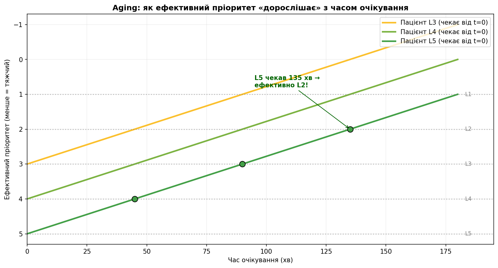
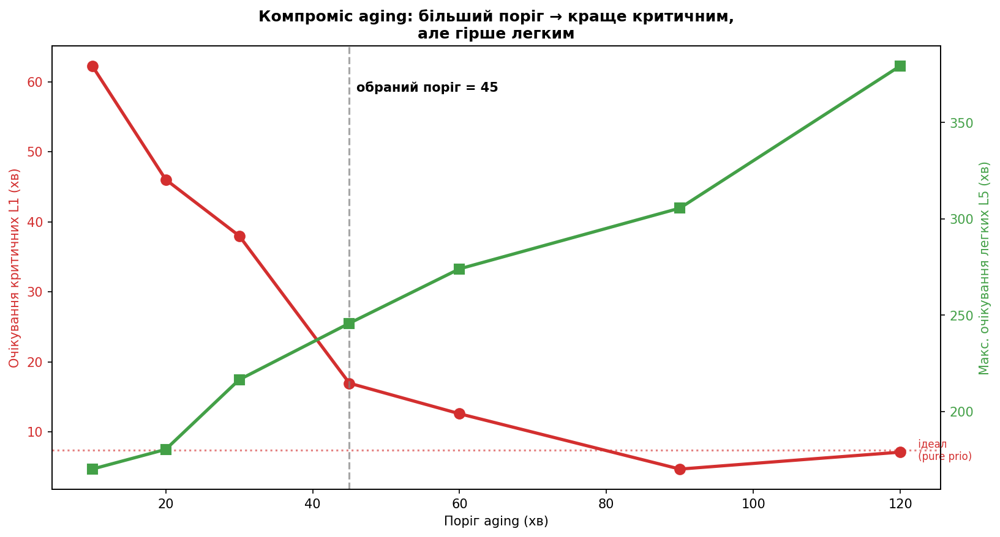

# Aging: третя дисципліна (старіння заявок)

> Розділ 05 · [↑ Зміст документації](README.md) · [↑ Головний README](../README.md)

[← Як влаштована купа (heap) зсередини](04-heap-internals.md)    [Варіанти структури черги →](05b-queue-variants.md)

---

### Третя дисципліна: Priority + Aging ("дорослішання")

Чиста priority має ваду — **голодування** (starvation): легкий пацієнт може чекати вічно, якщо постійно прибувають тяжчі. Реальні лікарні вирішують це через **aging**: що довше пацієнт чекає, то вищим стає його ефективний пріоритет.

Формула: `ефективний_пріоритет = severity - (час_очікування / поріг)`. Здається, що пріоритет залежить від часу, тож купа не підійде. Але для лінійного aging відносний порядок від часу не залежить (доведення — у розділі «Aging на купі»), тому aging теж лягає на купу за O(log n). Нижче спершу простий списковий варіант, далі швидкий на купі.

### Третя дисципліна: чому потрібен Aging

**Проблема чистої Priority — голодування (starvation).** Уявіть: легкий пацієнт L5 сидить у залі. Щоразу, коли лікар звільняється, прибуває хтось тяжчий — і його беруть першим. L5 знову відсувається. Якщо тяжкі прибувають безперервно — **L5 не дочекається ніколи**. У нашій симуляції без aging легкий пацієнт чекав до **703 хвилин** (майже 12 годин!).

**Рішення — aging ("дорослішання").** Що довше пацієнт чекає, то "тяжчим" він стає в очах системи:

```
ефективний_пріоритет = severity - (час_очікування / поріг)
```

Для L5 (severity=5) з порогом 45 хв:

| Час очікування | Розрахунок | Еф. пріоритет | Конкурує з |
|---|---|---|---|
| 0 хв | 5 − 0/45 | 5.0 | L5 |
| 45 хв | 5 − 45/45 | 4.0 | L4 |
| 90 хв | 5 − 90/45 | 3.0 | L3 |
| 135 хв | 5 − 135/45 | 2.0 | L2 |

Рано чи пізно ефективний пріоритет стане настільки високим, що пацієнта оберуть — **голодування неможливе**. Так роблять і реальні лікарні, і планувальники процесів в ОС.

Покажемо це наочно 👇

```python
import numpy as np
import matplotlib.pyplot as plt

aging_threshold = 45
SEV_COLORS = {1: '#d32f2f', 2: '#f57c00', 3: '#fbc02d', 4: '#7cb342', 5: '#43a047'}

# Таблиця: як змінюється ефективний пріоритет пацієнта L5
print(f"Пацієнт L5, поріг aging = {aging_threshold} хв\n")
print(f"{'Очікування':>12}{'Еф. пріоритет':>16}{'Конкурує з':>14}")
print("-" * 42)
for wait in [0, 45, 90, 135, 180]:
    eff = 5 - wait / aging_threshold
    print(f"{wait:>10} хв{eff:>16.1f}{'L' + str(int(round(eff))):>14}")

# Візуалізація: троє пацієнтів (L3, L4, L5), що чекають від t=0
fig, ax = plt.subplots(figsize=(11, 6))
waits = np.linspace(0, 180, 200)

for sev in [3, 4, 5]:
    eff = sev - waits / aging_threshold
    ax.plot(waits, eff, lw=2.5, color=SEV_COLORS[sev],
            label=f'Пацієнт L{sev} (чекає від t=0)')

# Горизонтальні лінії рівнів
for lvl in range(1, 6):
    ax.axhline(lvl, color='gray', ls=':', alpha=0.5)
    ax.text(183, lvl, f'L{lvl}', va='center', fontsize=9, color='gray')

# Ключові моменти для L5
ax.scatter([45, 90, 135], [4, 3, 2], color='#43a047', s=80, zorder=5, ec='black')
ax.annotate('L5 чекав 135 хв →\nефективно L2!', xy=(135, 2), xytext=(95, 0.8),
            arrowprops=dict(arrowstyle='->', color='darkgreen'),
            color='darkgreen', fontweight='bold', fontsize=10)

ax.set_xlabel('Час очікування (хв)')
ax.set_ylabel('Ефективний пріоритет (менше = тяжчий)')
ax.set_title('Aging: як ефективний пріоритет "дорослішає" з часом очікування',
             fontweight='bold')
ax.invert_yaxis()   # щоб "тяжчий" (менший) був угорі
ax.legend(loc='upper right')
ax.set_xlim(0, 195)
ax.grid(alpha=0.2)
plt.tight_layout()
plt.show()
```


**Результат:**

```
Пацієнт L5, поріг aging = 45 хв

  Очікування   Еф. пріоритет    Конкурує з
------------------------------------------
         0 хв             5.0            L5
        45 хв             4.0            L4
        90 хв             3.0            L3
       135 хв             2.0            L2
       180 хв             1.0            L1
<Figure size 1210x660 with 1 Axes>
```




### Що було б без третьої дисципліни

Технічно дослідження **працювало б** і з двома дисциплінами (FIFO + Priority). Але:

1. **Втратили б найважливіший урок.** Priority виглядала б ідеальною, і читач не побачив би її **темного боку** — голодування легких.
2. **Історія була б неповною.** Найсильніша частина поста — це **поворот**: "Priority чудова, АЛЕ створює нову проблему, ОСЬ як її вирішують насправді".
3. **Було б нечесно.** Aging показує, що інженерія — це **компроміси**, а не "срібні кулі".

Простими словами: aging перетворює "ось алгоритм" на справжню історію з глибиною.

### Як працює `simulate_aging()` і чим відрізняється

Структура майже та сама, але є **дві ключові відмінності**.

**Відмінність 1: `waiting` — звичайний список, а не купа.**
```python
waiting = []                  # звичайний список
waiting.append(arrivals[i])   # просто додаємо, БЕЗ ключа
```
Це найпростіша (брутфорс) реалізація: щокроку перераховуємо пріоритети й сортуємо — очевидно, але O(n log n) на крок. У розділі «Aging на купі» показано, що для лінійного правила цього робити не треба: той самий результат дає купа за O(log n).
**Відмінність 2: пересортування на кожному кроці.**
```python
def effective(patient):
    wait_so_far = now - patient.arrival_time
    return (patient.severity - wait_so_far / aging_threshold, patient.arrival_time)

waiting.sort(key=effective)   # пересортовуємо за ПОТОЧНИМ пріоритетом
patient = waiting.pop(0)            # беремо найтяжчого з поправкою на очікування
```
На кожному кроці обчислюємо ефективний пріоритет **на поточний момент**, сортуємо зал і беремо першого.

**Порівняння двох функцій:**

| | `simulate()` | `simulate_aging()` |
|---|---|---|
| Структура `waiting` | купа (`heapq`) | звичайний список |
| Коли визначається пріоритет | при додаванні (фіксований) | на кожному кроці (плаваючий) |
| Як беремо наступного | `heappop` за O(log n) | `sort` + `pop(0)` за O(n log n) |
| Голодування можливе? | так (для priority) | ні (aging рятує) |
| Ефективність | вища | нижча, але концептуально простіша |

У production використовують хитріші структури, щоб не платити за повне пересортування. Для навчального досліду на 180 пацієнтах різниця неважлива.

### Підсумок Фази 3

1. **`simulate()`** — рушій для FIFO і Priority. Обидві дисципліни — одна купа з різним ключем (FIFO = пріоритет за часом, Priority = за тяжкістю).
2. **Третя дисципліна (aging)** виправляє ваду чистої Priority — **голодування** легких пацієнтів.
3. **Без aging** дослідження працювало б, але історія була б неповною й однобокою.
4. **`simulate_aging()`** у простому варіанті використовує список. Але це не обов'язково: для лінійного aging порядок не залежить від поточного часу, тож працює й купа за O(log n)

```python
def simulate_aging(patients, aging_threshold=45):
    """Priority з 'дорослішанням': кожні aging_threshold хв очікування
    піднімають пацієнта на один рівень тяжкості.
    """
    arrivals = sorted(patients, key=lambda patient: patient.arrival_time)
    i = 0
    waiting = []           # звичайний список — пріоритет змінюється з часом
    now = 0.0
    served = []

    while i < len(arrivals) or waiting:
        while i < len(arrivals) and arrivals[i].arrival_time <= now:
            waiting.append(arrivals[i])
            i += 1

        if not waiting:
            now = arrivals[i].arrival_time
            continue

        # Ефективний пріоритет на ПОТОЧНИЙ момент часу
        def effective(patient):
            wait_so_far = now - patient.arrival_time
            return (patient.severity - wait_so_far / aging_threshold, patient.arrival_time)

        waiting.sort(key=effective)
        patient = waiting.pop(0)
        patient.start_time = now
        now += patient.service_duration
        served.append(patient)

    return served


print('Рушій simulate_aging() готовий')
```


**Результат:**

```
Рушій simulate_aging() готовий
```

## Чому поріг aging = 45 хвилин

### Що означає поріг

Поріг — це **скільки хвилин очікування дають підвищення на один рівень тяжкості**:

```
ефективний_пріоритет = severity - (час_очікування / поріг)
```

При порозі 45: кожні **45 хвилин** очікування покращують ефективний пріоритет на 1. Чекав 45 хв → став "на рівень тяжчим", чекав 90 хв → на два рівні тяжчим.

**Це підібране значення (тюнінг), а не довільне.** Нижче — як саме я його підбирав.

### Як саме я підбирав це значення — покроково

**Крок 1. Визначив, що оптимізую.** Дві конкуруючі цілі:
- очікування критичних (L1) — хочу **низьке** (близьке до ідеалу чистої priority ≈ 7 хв);
- максимальне очікування легких (L5) — теж хочу **низьке** (щоб не було голодування, яке без aging сягало 703 хв).

**Крок 2. Зрозумів природу компромісу.** Ці дві цілі тягнуть у різні боки:
- **малий поріг** → агресивне дорослішання → легкі швидко піднімаються і обганяють навіть критичних → L1 страждає;
- **великий поріг** → м'яке дорослішання → критичні захищені, але легкі знову довго чекають.

Отже, є **дилема**: не можна одночасно мінімізувати обидві метрики. Треба знайти **баланс**.

**Крок 3. Прогнав симуляцію з кількома порогами** і записав обидві метрики для кожного.

**Крок 4. Обрав поріг у "коліні" компромісу** — де критичні вже достатньо швидкі, а легкі ще не починають сильно страждати.

Відтворимо цей експеримент 👇

```python
# Експеримент: як поріг aging впливає на компроміс L1 vs L5
# (використовує patients, simulate, simulate_aging, metrics_by_severity з попередніх фаз —
#  повний розбір metrics_by_severity у розділі 06)

# Опорна точка — чиста priority (ідеал для критичних, але голодування легких)
mp_ref = metrics_by_severity(simulate(copy.deepcopy(patients), 'priority'))
print(f"Опора — чиста Priority: L1 avg={mp_ref[1]['avg']:.0f} хв, "
      f"L5 max={mp_ref[5]['max']:.0f} хв (голодування!)\n")

# Перебираємо пороги
thresholds = [10, 20, 30, 45, 60, 90, 120]
l1_avgs, l5_maxs = [], []

print(f"{'Поріг':>7}{'L1 avg':>9}{'L5 max':>9}")
print("-" * 25)
for thr in thresholds:
    m = metrics_by_severity(simulate_aging(copy.deepcopy(patients), thr))
    l1_avgs.append(m[1]['avg'])
    l5_maxs.append(m[5]['max'])
    print(f"{thr:>7}{m[1]['avg']:>9.0f}{m[5]['max']:>9.0f}")

# Графік компромісу: дві осі Y
fig, ax1 = plt.subplots(figsize=(11, 6))

ax1.plot(thresholds, l1_avgs, 'o-', color='#d32f2f', lw=2.5, ms=8)
ax1.set_xlabel('Поріг aging (хв)')
ax1.set_ylabel('Очікування критичних L1 (хв)', color='#d32f2f')
ax1.tick_params(axis='y', labelcolor='#d32f2f')
ax1.axhline(mp_ref[1]['avg'], color='#d32f2f', ls=':', alpha=0.6)
ax1.text(122, mp_ref[1]['avg'], ' ідеал\n (pure prio)', color='#d32f2f', fontsize=8, va='center')

ax2 = ax1.twinx()
ax2.plot(thresholds, l5_maxs, 's-', color='#43a047', lw=2.5, ms=8)
ax2.set_ylabel('Макс. очікування легких L5 (хв)', color='#43a047')
ax2.tick_params(axis='y', labelcolor='#43a047')

ax1.axvline(45, color='gray', ls='--', alpha=0.7)
ax1.text(46, ax1.get_ylim()[1] * 0.9, 'обраний поріг = 45', fontsize=10, fontweight='bold')
ax1.set_title('Компроміс aging: більший поріг → краще критичним,\nале гірше легким',
              fontweight='bold')
fig.tight_layout()
plt.show()
```


**Результат:**

```
Опора — чиста Priority: L1 avg=7 хв, L5 max=703 хв (голодування!)

  Поріг   L1 avg   L5 max
-------------------------
     10       62      170
     20       46      180
     30       38      216
     45       17      246
     60       13      274
     90        5      306
    120        7      379
<Figure size 1210x660 with 2 Axes>
```




### Як читати результат і чому саме 45

На графіку дві криві тягнуться в різні боки:
- 🔴 **червона (L1)** — падає зі зростанням порогу (критичним краще),
- 🟢 **зелена (L5 max)** — росте зі зростанням порогу (легким гірше).

| Поріг | L1 середнє | L5 макс | Коментар |
|---|---|---|---|
| 20 | 46 хв | 180 хв | критичні страждають (46 — задовго) |
| 30 | 38 хв | 216 хв | критичні все ще зависоко |
| **45** | **17 хв** | **246 хв** | ✅ критичні майже як ідеал, голодування зрізане |
| 60 | 13 хв | 274 хв | критичні чудово, але L5 повзе вгору |
| 90 | 5 хв | 306 хв | критичні ідеально, але L5 ще гірше |

**Чому 45, а не 60 чи 90?** При 45 критичні вже швидкі (17 хв — у ~5 разів краще за FIFO), а голодування легких зрізане втричі (246 проти 703 без aging). Подальше збільшення порогу лише незначно покращує критичних, але неухильно погіршує легких. 45 — це "коліно кривої": точка, де додаткова вигода для одних уже не виправдовує втрату для інших.

Це **інженерне судження**, а не формула: я обрав баланс, у якому **обидві** метрики прийнятні.

## Звідки беруться числа 7, 703 і 45 — детально

Три ключові числа з аналізу aging часто плутають. Розберемо кожне на **реальних пацієнтах** з нашої симуляції:
- **7 хв** — середнє очікування критичних (L1) під чистою priority,
- **703 хв** — максимальне очікування легких (L5) під чистою priority (голодування),
- **45 хв** — підібраний поріг aging.

Перші два числа — **виміряні** (результат симуляції), третє — **підібране** (тюнінг). Спочатку дістанемо конкретні дані 👇

### Звідки взялися 7 хвилин (критичні L1)

Це число **не вибране — воно ВИМІРЯНЕ**. У наборі з 180 пацієнтів виявилося 6 критичних (L1). Ось вони всі:

| Пацієнт | Прибув (хв) | Почали (хв) | Чекав (хв) |
|---|---|---|---|
| #22 | 324 | 326 | 2.0 |
| #44 | 514 | 526 | 11.8 |
| #56 | 647 | 654 | 7.4 |
| #87 | 1080 | 1087 | 6.7 |
| #98 | 1169 | 1184 | 14.8 |
| #104 | 1320 | 1322 | 1.6 |

Середнє = (2.0 + 11.8 + 7.4 + 6.7 + 14.8 + 1.6) / 6 = **7.4 хв**. Ось звідки "≈ 7".

**Чому критичні чекають так мало.** Коли критичний прибуває, черга з пріоритетами миттєво ставить його в корінь — він наступний. Але лікар не може **перервати** вже розпочате лікування. Тому критичний чекає рівно стільки, скільки лишилося долікувати поточного пацієнта.

Подивіться на #22: прибув у 324, почали в 326 — чекав лише 2 хв (лікар майже звільнився). А #98 чекав 14.8 хв — лікар щойно почав когось важкого. У середньому це кілька хвилин — час "долікувати поточного". **Це ідеал, який ми хочемо зберегти.**

### Звідки взялися 703 хвилини (легкі L5)

Теж **виміряне** число. Найнещасніший легкий пацієнт — **#82**:

```
прибув у момент      1047 хв
почали лікувати у    1750 хв
ЧЕКАВ                703 хв  (майже 12 годин!)
```

**Чому він голодував.** Поки #82 сидів у залі, лікар звільнявся багато разів — але щоразу там був хтось тяжчий. Конкретно: поки #82 чекав, **48 тяжчих пацієнтів, які прибули ПІЗНІШЕ за нього, обслужили попереду**.

Наживо це виглядало так:
```
#82 (L5) сидить у залі...
  → лікар звільнився → прибув L3 → беруть L3 (тяжчий за #82)
  → лікар звільнився → прибув L2 → беруть L2
  → ... і так 48 разів ...
  → нарешті зал спорожнів від тяжчих → беруть #82
```

Це і є **голодування (starvation)**: чиста priority ніколи не дає шансу легкому, поки є бодай один тяжчий. **Це жах** — 12 годин з подряпиною в залі, навіть якщо випадок "легкий".

### Чому хочемо обидва низькими і як вийшло 45

У нас дві метрики, що тягнуть у різні боки:

| Метрика | Чисте priority | Мета |
|---|---|---|
| Критичні L1 (середнє) | 7 хв ✅ чудово | зберегти низьким |
| Легкі L5 (максимум) | 703 хв ❌ жах | зробити низьким |

**Конфлікт:** якщо почати рятувати легких (піднімати їхній пріоритет за час очікування), вони почнуть обганяти критичних — і "7" зросте. Треба **баланс**.

Поріг aging керує тим, **як швидко легкий "дорослішає"**. Прогін з різними порогами:

| Поріг | L1 середнє | L5 макс | Що відбувається |
|---|---|---|---|
| 10 | **62** хв | 170 хв | aging надто агресивний → легкі обганяють навіть критичних → критичні страждають |
| 20 | 46 хв | 180 хв | критичні ще зависоко |
| 30 | 38 хв | 216 хв | критичні все ще погано |
| **45** | **17** хв | **246** хв | ✅ критичні майже ідеал, голодування зрізане втричі |
| 60 | 13 хв | 274 хв | критичні чудово, легкі повзуть угору |
| 90 | 5 хв | 306 хв | критичні ідеально, легкі ще гірше |

**Як читати:** дивіться на колонки як на терези.
- **Малий поріг (10–20):** легкий стає "тяжчим" за 10–20 хв і обганяє критичних → L1 злітає до 46–62 (зіпсували головне).
- **Великий поріг (90):** легкий "дорослішає" повільно → критичні чудові (5 хв), але легкі знову довго чекають (306).
- **45:** критичні 17 хв (лише на 10 гірше за ідеал, але у ~5 разів краще за FIFO), легкі 246 замість 703 (голодування зрізане втричі).

**Чому саме 45, а не 30 чи 60:**
- при **30** критичні чекають 38 хв — забагато для станів, що загрожують життю;
- при **60** критичні лише трохи кращі (13 vs 17), а легкі вже гірше (274 vs 246) — виграш не вартий програшу;
- **45** — "коліно кривої": критичні вже достатньо швидкі, а далі покращувати їх немає сенсу, бо це лише шкодить легким.

### Підсумок логіки

Числа **7** і **703** — це **виміряні** результати чистого priority: критичні чекають чудово (7 хв), але легкі голодують жахливо (703 хв = 12 годин). Aging має виправити друге, не зіпсувавши перше. Але ці цілі конфліктують: рятуючи легких, ми сповільнюємо критичних.

Тому я прогнав симуляцію з різними порогами, побудував "терези" (L1 проти L5) і обрав **45** — точку, де критичні залишаються майже ідеальними (17 хв), а голодування легких зрізане втричі (246 хв). Менший поріг рятує легких, але вбиває швидкість критичних; більший — навпаки.

### Поріг — не універсальна константа

На відміну від `arrival_rate` (де є фізична межа ρ < 1), поріг aging — це **політичне/етичне рішення**, а не математична необхідність. Він залежить від:
- конкретних часів лікування у вашій системі,
- інтенсивності потоку пацієнтів,
- того, **що ви вважаєте прийнятним** — наскільки готові пожертвувати швидкістю критичних заради скорочення очікування легких.

У реальній лікарні цей поріг налаштовували б під власні дані й під політику закладу. Для нашої симуляції 45 виявилося гарним балансом — але це **результат тюнінгу під ці конкретні параметри**, а не "правильне число взагалі".

---

[← Як влаштована купа (heap) зсередини](04-heap-internals.md)    [Варіанти структури черги →](05b-queue-variants.md)
