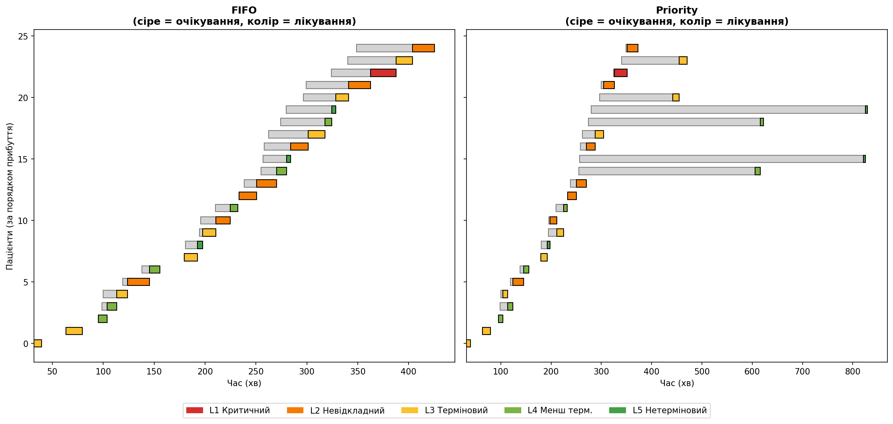
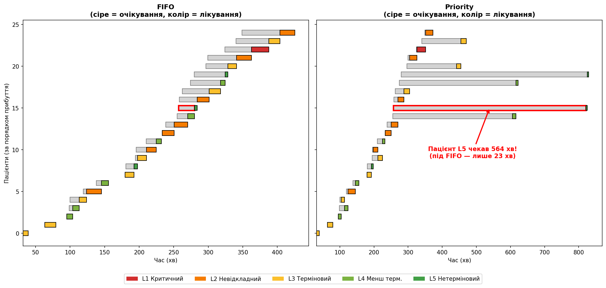
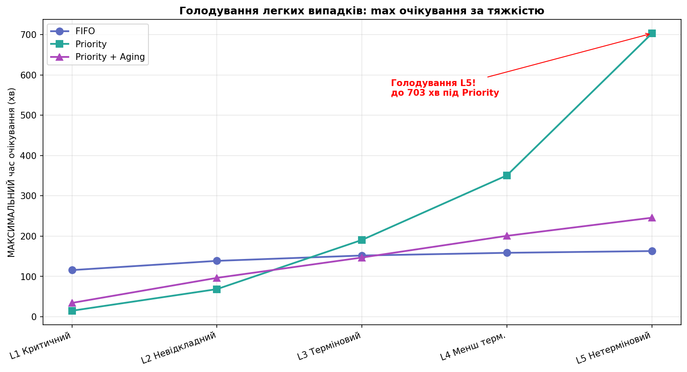
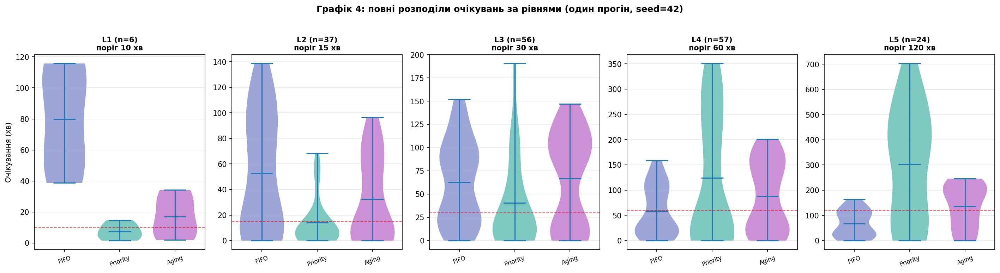

# Фаза 6. Візуалізація (Графіки 1–4)

> Розділ 07 · [↑ Зміст документації](README.md) · [↑ Головний README](../README.md)

[← Фази 4–5. Запуск, метрики та головний результат](06-metrics-and-results.md)    [Фаза 7. Висновки та пропускна здатність →](08-throughput.md)

---

## Фаза 6: Візуалізація

Три графіки, що розповідають історію.

### Графік 1 — середній час очікування за тяжкістю (головний)

```python
fig, ax = plt.subplots(figsize=(11, 6))
levels = list(range(1, 6))
x = np.arange(len(levels))
w = 0.27

ax.bar(x - w, [metrics_fifo[severity]['avg'] for severity in levels], w, label='FIFO', color='#5c6bc0')
ax.bar(x,     [metrics_priority[severity]['avg'] for severity in levels], w, label='Priority', color='#26a69a')
ax.bar(x + w, [metrics_aging[severity]['avg'] for severity in levels], w, label='Priority + Aging', color='#ab47bc')

ax.set_xticks(x)
ax.set_xticklabels([SEV_NAMES[severity] for severity in levels], rotation=20, ha='right')
ax.set_ylabel('Середній час очікування (хв)')
ax.set_title('Середній час очікування за тяжкістю: FIFO vs Priority vs Aging',
             fontweight='bold')
ax.legend()
ax.grid(axis='y', alpha=0.3)
plt.tight_layout()
plt.show()
```


**Результат:**

```
<Figure size 1210x660 with 1 Axes>
```


**Що видно:** під **Priority** критичні (L1) обслуговуються майже миттєво, але легкі (L5) чекають набагато довше — це ціна. **Aging** згладжує крайнощі: критичні все ще швидко, а легкі не страждають так сильно.

## Графік 1 детально: чому він головний

### Що показує

Це **згрупована стовпчикова діаграма** — середній час очікування за кожним рівнем тяжкості, три дисципліни поряд:

- **по горизонталі** — рівні тяжкості зліва направо: від L1 (критичний) до L5 (нетерміновий);
- **по вертикалі** — середній час очікування у хвилинах (менше = краще);
- **три кольори** в кожній групі: 🔵 FIFO, 🟢 Priority, 🟣 Priority + Aging.

### Як його читати

**Спосіб 1: усередині однієї групи** (порівняти дисципліни для одного рівня).

Крайня ліва група — L1 Критичний:
- синій (FIFO) ~80 хв — високий,
- зелений (Priority) ~7 хв — крихітний,
- фіолетовий (Aging) ~17 хв — невеликий.

→ для критичних Priority і Aging набагато кращі за FIFO.

Крайня права група — L5 Нетерміновий:
- синій (FIFO) ~68 хв,
- зелений (Priority) ~303 хв — **величезний!**,
- фіолетовий (Aging) ~138 хв.

→ для легких Priority найгірший — вони чекають утричі довше за FIFO.

**Спосіб 2: один колір через усі групи** (як дисципліна поводиться по рівнях).

- 🟢 **Priority**: `7 → 14 → 40 → 124 → 303` — різко **росте**. Тяжких обслуговує швидко, легких — дедалі повільніше.
- 🔵 **FIFO**: `80 → 52 → 62 → 59 → 68` — майже **рівний**. Ставиться до всіх однаково.
- 🟣 **Aging**: `17 → 33 → 67 → 88 → 138` — росте, але **полого** (згладжений компроміс).

### Три історії в одному графіку

Графік розповідає три речі одночасно:

1. **Priority рятує критичних.** Зелений стовпчик на L1 — найнижчий на всьому графіку (~7 хв). Саме те, чого ми хочемо.

2. **Priority карає легких (зворотний бік).** Зелений стовпчик на L5 — найвищий на всьому графіку (~303 хв). Це **голодування**, видиме оком.

3. **FIFO "сліпо справедливий", і це погано.** Сині стовпчики майже однакові по всіх рівнях. На перший погляд "справедливо" — усі чекають порівну. Але для критичного це **смертельно**: чому людина з інфарктом чекає стільки ж, скільки з довідкою?

4. **Aging — золота середина.** Фіолетові стовпчики ніколи не злітають до екстремумів: критичних обслуговують швидко, легкі не голодують.

### Чому цей графік важливий

**1. Показує всю суть дослідження в одній картинці.** Не треба читати таблиці чи код — сам контраст стовпчиків розповідає історію. Крихітний зелений на L1 поряд із високим синім зрозумілий навіть людині без технічного бекграунду.

**2. Робить компроміс видимим.** Головний урок проєкту — немає "ідеальної" дисципліни, є компроміси. Жоден колір не найнижчий скрізь: Priority виграє ліворуч, програє праворуч. Це суть інженерних рішень.

**3. Ідеальна обкладинка для поста.** Графік одразу чіпляє оком, не потребує підпису (все зрозуміло з форми стовпчиків) і провокує питання ("чому зелений такий високий праворуч?") — а це залучення в коментарях.

**4. Він чесний.** Слабкий пост показав би лише, що "Priority — це круто". Цей графік показує і плюс, і мінус — це викликає довіру до автора як до інженера, що розуміє нюанси.

### Підсумок

Цей графік — **серце всього дослідження**. Він в одній картинці показує: Priority рятує критичних, але створює голодування легких; FIFO "сліпо справедливий" і тому небезпечний для критичних; Aging згладжує крайнощі. Жоден колір не найкращий скрізь — і саме це робить графік чесним та переконливим.

### Графік 2 — таймлайн (механізм роботи)

Перші 25 пацієнтів. Сіра смуга = очікування, кольорова = лікування (колір за тяжкістю). Видно, як під Priority критичні "обганяють" чергу.

```python
fig, axes = plt.subplots(1, 2, figsize=(15, 7), sharey=True)

for ax, served, title in [(axes[0], fifo_result, 'FIFO'),
                          (axes[1], prio_result, 'Priority')]:
    subset = sorted(served, key=lambda patient: patient.arrival_time)[:25]
    for row, patient in enumerate(subset):
        # очікування — сіра смуга
        ax.barh(row, patient.start_time - patient.arrival_time, left=patient.arrival_time,
                color='lightgray', edgecolor='gray', height=0.6)
        # лікування — колір тяжкості
        ax.barh(row, patient.service_duration, left=patient.start_time,
                color=SEV_COLORS[patient.severity], edgecolor='black', height=0.6)
    ax.set_title(f'{title}\n(сіре = очікування, колір = лікування)', fontweight='bold')
    ax.set_xlabel('Час (хв)')
    ax.invert_yaxis()

axes[0].set_ylabel('Пацієнти (за порядком прибуття)')
legend = [Patch(facecolor=SEV_COLORS[severity], label=SEV_NAMES[severity]) for severity in range(1, 6)]
fig.legend(handles=legend, loc='lower center', ncol=5, bbox_to_anchor=(0.5, -0.02))
plt.tight_layout(rect=[0, 0.04, 1, 1])
plt.show()
```


**Результат:**

```
<Figure size 1650x770 with 2 Axes>
```




**Що видно:** під FIFO усі смуги ростуть рівномірно (черга за порядком). Під Priority деякі пацієнти мають **дуже довгі сірі смуги** — це легкі випадки (темно-зелені), яких постійно відсувають назад тяжчі.

## Графік 2 детально: таймлайн (механізм наживо)

### Які дані тут узято

Це **перші 25 пацієнтів за часом прибуття** — однакові пацієнти в обох панелях. Ліва панель показує їхній день під **FIFO**, права — під **Priority**. Тобто беремо **тих самих людей** і дивимось на дві паралельні реальності.

```python
subset = sorted(served, key=lambda patient: patient.arrival_time)[:25]
```
`[:25]` — лише перших 25 (показати всі 180 було б нечитабельно).

### Анатомія одного рядка (ключ до розуміння)

Кожен **горизонтальний рядок = один пацієнт**. У кожного — **дві смуги** підряд:

```
       прибув                почали            закінчили
         │                     │                   │
         ▼                     ▼                   ▼
         ░░░░░░░░░░░░░░░░░░░░░░██████████████████████
         └──── СІРА: чекає ───┘└─ КОЛІР: лікування ─┘
```

- **Сіра смуга** — пацієнт **сидить у залі**. Починається в момент прибуття, довжина = час очікування.
- **Кольорова смуга** — пацієнта **лікують**. Починається одразу після сірої, довжина = час лікування, **колір = тяжкість** (червоний L1 ... зелений L5).

**Осі:**
- горизонтальна = **час у хвилинах** (загальний годинник доби),
- вертикальна = **пацієнти за порядком прибуття** (ряд 0 — перший, ряд 24 — 25-й).

### Як прочитати одного пацієнта (конкретні приклади)

**Приклад 1 — критичний пацієнт (ряд 22, L1, прибув у 324 хв):**

| | Сіра смуга (чекав) | Що видно |
|---|---|---|
| FIFO | 39 хв | помітна сіра смуга — стояв у черзі |
| Priority | **2 хв** | сіра майже невидима — пропустили миттєво |

**Приклад 2 — легкий пацієнт (ряд 15, L5, прибув у 257 хв):**

| | Сіра смуга (чекав) | Що видно |
|---|---|---|
| FIFO | 23 хв | коротка сіра смуга |
| Priority | **564 хв** | **величезна сіра смуга** аж до краю графіка! |

Ці **довгі сірі смуги в правій панелі** — це голодування наживо: пацієнт сидить 564 хвилини, поки повз нього "проскакують" тяжчі.

### Що порівнювати між двома панелями

**Ліва панель (FIFO) — акуратні сходи.** Смуги утворюють рівну **діагональ-драбинку**: кожен наступний пацієнт лікується трохи пізніше за попереднього. Бо FIFO бере строго за порядком прибуття. Сірі смуги короткі й приблизно однакові — усі чекають помірно й порівну.

**Права панель (Priority) — два світи.** Картина роздвоєна:
- **більшість смуг короткі** — тяжкі (червоні, помаранчеві) лікуються майже одразу, сірого майже немає;
- **кілька смуг "вистрілюють" далеко вправо** з величезними сірими хвостами — це легкі (зелені L4/L5), яких постійно відсувають.

Подивіться на **колір смуг із довгими сірими хвостами** — вони **зелені** (L4/L5). А смуги без хвоста — червоні/помаранчеві. Це візуальний доказ: priority обслуговує тяжких миттєво, а легких "паркує" на години.

### Конкретний контраст із даних

Чотири показові пацієнти (час очікування, хв):

| Ряд | Тяжкість | FIFO чекав | Priority чекав | Що сталося під Priority |
|---|---|---|---|---|
| 22 | L1 критичний | 39 | **2** | пропустили вперед |
| 24 | L2 невідкладний | 55 | **2** | пропустили вперед |
| 14 | L4 легкий | 15 | **351** | застряг (×23!) |
| 15 | L5 легкий | 23 | **564** | застряг (×24!) |

Те саме видно на графіку: ряди 22, 24 у правій панелі — короткі, ряди 14, 15 — з гігантськими сірими хвостами.

### Суть і значення графіка

**Чого не показує Графік 1.** Стовпчики давали **усереднену статистику** ("в середньому критичні чекають 7 хв"). Графік 2 показує **механізм наживо** — конкретних людей і як саме черга їх переставляє в часі. Це різниця між "температура в середньому 36.6" і "ось рентген, де видно, що відбувається".

**Головний інсайт:**
- **FIFO = сліпа справедливість.** Рівна драбинка = "усіх однаково". Звучить гарно, але критичний стоїть нарівні з подряпиною.
- **Priority = свідомий вибір.** Тяжких — миттєво, легких — потім.
- **Голодування стало видимим.** Довгі сірі смуги — не абстрактна цифра "703 хв", а **намальована несправедливість**: людина сидить пів дня, поки інші проходять повз.

**Чому цінно для поста.** Графік 1 переконує цифрами, Графік 2 — картинкою людських історій. Коли читач бачить суцільну сіру смугу 564 хв поряд із "пролітаючими" сусідами — це б'є сильніше за статистику. Це **другий слайд поста**.

```python
# Той самий таймлайн, але з підсвічуванням пацієнта, що голодує
fig, axes = plt.subplots(1, 2, figsize=(15, 7), sharey=True)

HIGHLIGHT_ROW = 15  # ряд легкого пацієнта, що голодує під Priority

for ax, served, title in [(axes[0], fifo_result, 'FIFO'),
                          (axes[1], prio_result, 'Priority')]:
    subset = sorted(served, key=lambda patient: patient.arrival_time)[:25]
    for row, patient in enumerate(subset):
        wait = patient.start_time - patient.arrival_time
        # червона рамка на обраному ряду
        edge = 'red' if row == HIGHLIGHT_ROW else 'gray'
        lw = 2.5 if row == HIGHLIGHT_ROW else 1
        ax.barh(row, wait, left=patient.arrival_time,
                color='lightgray', edgecolor=edge, linewidth=lw, height=0.6)
        ax.barh(row, patient.service_duration, left=patient.start_time,
                color=SEV_COLORS[patient.severity], edgecolor='black', height=0.6)
    ax.set_title(f'{title}\n(сіре = очікування, колір = лікування)', fontweight='bold')
    ax.set_xlabel('Час (хв)')
    ax.invert_yaxis()

# Анотація на правій панелі (Priority) для пацієнта, що голодує
prio_subset = sorted(prio_result, key=lambda patient: patient.arrival_time)[:25]
fifo_subset = sorted(fifo_result, key=lambda patient: patient.arrival_time)[:25]
hp = prio_subset[HIGHLIGHT_ROW]
hwait = hp.start_time - hp.arrival_time
fifo_wait = fifo_subset[HIGHLIGHT_ROW].wait_time
axes[1].annotate(
    f'Пацієнт L{hp.severity} чекав {hwait:.0f} хв!\n(під FIFO — лише {fifo_wait:.0f} хв)',
    xy=(hp.arrival_time + hwait / 2, HIGHLIGHT_ROW),
    xytext=(hp.arrival_time + hwait / 2 - 50, HIGHLIGHT_ROW - 6),
    arrowprops=dict(arrowstyle='->', color='red', lw=2),
    color='red', fontweight='bold', fontsize=11, ha='center')

axes[0].set_ylabel('Пацієнти (за порядком прибуття)')
legend = [Patch(facecolor=SEV_COLORS[severity], label=SEV_NAMES[severity]) for severity in range(1, 6)]
fig.legend(handles=legend, loc='lower center', ncol=5, bbox_to_anchor=(0.5, -0.02))
plt.tight_layout(rect=[0, 0.04, 1, 1])
plt.show()
```


**Результат:**

```
<Figure size 1650x770 with 2 Axes>
```




### Підсумок Графіка 2

| Питання | Відповідь |
|---|---|
| Які дані | перші 25 пацієнтів за прибуттям, ті самі в обох панелях |
| Що в рядку | сіра смуга (очікування) + кольорова (лікування), колір = тяжкість |
| Осі | X = час (хв), Y = пацієнти за порядком прибуття |
| Що порівнювати | FIFO (рівна драбинка) vs Priority (короткі тяжкі + довгі хвости легких) |
| Головне видно | голодування легких як довгі сірі смуги в правій панелі |

### Графік 3 — голодування легких випадків

```python
fig, ax = plt.subplots(figsize=(11, 6))

ax.plot(levels, [metrics_fifo[severity]['max'] for severity in levels], 'o-', label='FIFO',
        color='#5c6bc0', lw=2, ms=8)
ax.plot(levels, [metrics_priority[severity]['max'] for severity in levels], 's-', label='Priority',
        color='#26a69a', lw=2, ms=8)
ax.plot(levels, [metrics_aging[severity]['max'] for severity in levels], '^-', label='Priority + Aging',
        color='#ab47bc', lw=2, ms=8)

ax.set_xticks(levels)
ax.set_xticklabels([SEV_NAMES[severity] for severity in levels], rotation=20, ha='right')
ax.set_ylabel('МАКСИМАЛЬНИЙ час очікування (хв)')
ax.set_title('Голодування легких випадків: max очікування за тяжкістю',
             fontweight='bold')
ax.legend()
ax.grid(alpha=0.3)

l5_starve = metrics_priority[5]['max']
ax.annotate(f'Голодування L5!\nдо {l5_starve:.0f} хв під Priority',
            xy=(5, l5_starve), xytext=(3.2, l5_starve * 0.78),
            arrowprops=dict(arrowstyle='->', color='red'),
            color='red', fontweight='bold')
plt.tight_layout()
plt.show()
```


**Результат:**

```
<Figure size 1210x660 with 1 Axes>
```




**Що видно:** лінія Priority різко злітає вгору для легких випадків — хтось чекав години. Лінія Aging залишається обмеженою — голодування усунуто.

## Графік 3 детально: голодування легких випадків

### Що показує

Це **лінійний графік** (не стовпчики!): **максимальний** час очікування за кожним рівнем тяжкості, три лінії.

- **по горизонталі** — рівні тяжкості L1 → L5,
- **по вертикалі** — **МАКСИМАЛЬНИЙ** час очікування (найгірший випадок!),
- **три лінії**: 🔵 FIFO (кружечки), 🟢 Priority (квадрати), 🟣 Aging (трикутники).

### Найважливіше: чому тут МАКСИМУМ, а не середнє

Графік 1 показував **середнє**, цей — **максимум**. Це не дрібниця — вони розповідають різні історії.

**Чому середнє ховає проблему.** Уявіть: 99 пацієнтів чекали по 5 хв, а 1 — цілих 703 хв.
- **Середнє** = (99×5 + 703) / 100 ≈ 12 хв → виглядає **чудово!**
- **Максимум** = 703 хв → виглядає **жахливо.**

Середнє "розчиняє" одного нещасного серед багатьох щасливих. А **голодування — це завжди про окремих нещасних**, а не про "типового" пацієнта.

**Висновок:** щоб побачити голодування, треба дивитися на **найгірший випадок** (максимум), бо саме він відповідає на питання "чи може хтось застрягти на неприйнятно довго?". Подивимось на це в цифрах 👇

```python
# Чому максимум важливіший за середнє для виявлення голодування
print("Порівняння СЕРЕДНЄ vs МАКСИМУМ для легких (L5):\n")
print(f"{'Дисципліна':<20}{'середнє':>10}{'максимум':>10}{'різниця':>10}")
print("-" * 50)
for name, metrics in [('FIFO', metrics_fifo), ('Priority', metrics_priority), ('Aging', metrics_aging)]:
    avg, mx = metrics[5]['avg'], metrics[5]['max']
    print(f"{name:<20}{avg:>10.0f}{mx:>10.0f}{mx - avg:>10.0f}")

print("\nПід Priority максимум (703) удвічі більший за середнє (303) —")
print("один пацієнт постраждав набагато більше, ніж показує середнє.")
```


**Результат:**

```
Порівняння СЕРЕДНЄ vs МАКСИМУМ для легких (L5):

Дисципліна             середнє  максимум   різниця
--------------------------------------------------
FIFO                        68       163        95
Priority                   303       703       400
Aging                      138       246       108

Під Priority максимум (703) удвічі більший за середнє (303) —
один пацієнт постраждав набагато більше, ніж показує середнє.
```

### Як читати три лінії

Точні числа (максимум, хв):

| Рівень | 🔵 FIFO | 🟢 Priority | 🟣 Aging |
|---|---|---|---|
| L1 Критичний | 116 | 15 | 34 |
| L2 Невідкладний | 139 | 69 | 96 |
| L3 Терміновий | 152 | 191 | 147 |
| L4 Менш терм. | 159 | 351 | 201 |
| L5 Нетерміновий | 163 | **703** | 246 |

**🔵 FIFO — майже горизонтальна лінія** (`116 → 163`). Найгірший випадок **обмежений** і приблизно однаковий для всіх (~2-2.5 год). Ніхто не застряє надовго — черга рухається строго по порядку, кожен рано чи пізно доходить до голови.

**🟢 Priority — лінія, що ВИБУХАЄ** (`15 → 703`). Починається найнижче (критичні — лише 15 хв!), але круто злітає. Для L5 досягає **703 хв** — майже вчетверо гірше за FIFO. Ось ціна priority: найгірший легкий страждає катастрофічно.

**🟣 Aging — стримана лінія** (`34 → 246`). Теж росте, але полого й ніколи не злітає до катастрофи. Найгірший L5 чекає 246 замість 703. Aging **ставить стелю** на голодування.

### Точка перетину — найцікавіше місце

Зверніть увагу, де лінії **перетинаються** — приблизно між L2 і L3.

- **Ліворуч (L1, L2):** зелена (Priority) **нижче** синьої (FIFO) → для тяжких priority дає кращий найгірший випадок.
- **Праворуч (L3, L4, L5):** зелена **вище** синьої → для легких priority дає **гірший** найгірший випадок, ніж навіть проста FIFO!

Це візуально доводить **компроміс**: priority "перекладає страждання" з тяжких на легких. Точка перетину — межа, де вигода для одних перетворюється на шкоду для інших.

### Що таке голодування — тепер точно

Червона анотація вказує на пік зеленої лінії: **703 хв під Priority для L5**.

Голодування (starvation) — це коли низькопріоритетний об'єкт **застряє на неприйнятно довго**, бо його постійно обганяють. На цьому графіку воно має точне обличчя: **зелена лінія, що злітає до 703 на правому краю**. А фіолетова (Aging), що залишається біля 246, показує — проблему **можна вирішити**.

### Суть, результати і чому це важливо

| Лінія | Поведінка | Що означає |
|---|---|---|
| 🔵 FIFO | пласка (~116-163) | найгірший випадок обмежений для всіх — ніхто не голодує, але й критичні не в пріоритеті |
| 🟢 Priority | вибухає (15 → 703) | критичним ідеально, але легкі голодують катастрофічно |
| 🟣 Aging | стримана (34 → 246) | компроміс: критичним добре, голодування під контролем |

**Чому графік важливий:**
1. **Розкриває те, що ховає середнє.** Без нього здавалося б "легкі чекають довше, але не критично". Максимум показує: один пацієнт чекав 12 годин.
2. **Робить голодування конкретним** — не абстракція, а число 703 на піку лінії.
3. **Доводить цінність Aging** — фіолетова лінія, що не злітає, це наочний доказ розв'язання проблеми.
4. **Чесність дослідження** — показати найгірший випадок, а не лише комфортне середнє.

### Підсумок Графіка 3

Цей графік відповідає на питання, яке середнє приховує: **"Чи може хтось застрягти надовго?"**

Відповідь:
- під **Priority** — так, до 703 хв (зелена лінія вибухає);
- під **FIFO** — ні, але ціною повільності критичних (пласка лінія);
- під **Aging** — проблему стримано (стеля 246).

Дивитися саме на **максимум** критично, бо голодування — це завжди про найгірший випадок, а не про типовий.

## Графік 4: Повні розподіли очікувань (а не лише avg/max)

### Чому двох чисел замало

Досі ми описували очікування **двома числами** — середнім і максимумом. Але два числа **ховають форму** розподілу, а форма часто важливіша.

Класична пастка: **два розподіли з однаковим середнім можуть бути зовсім різні.** Середнє 30 хв може означати "усі чекають ~30 хв" або "половина 5 хв, половина 55 хв" — однакове середнє, протилежний досвід. Дві точки цього не розрізнять, а violin — одразу.

Тут ми покажемо **всю форму** розподілу очікувань за рівнями для одного репрезентативного дня (seed=42).

```python
pts = generate_patients(seed=42)
results = {'FIFO':     simulate(copy.deepcopy(pts), 'fifo'),
           'Priority': simulate(copy.deepcopy(pts), 'priority'),
           'Aging':    simulate_aging(copy.deepcopy(pts), 45)}

DANGER = {1:10, 2:15, 3:30, 4:60, 5:120}                       # пороги CTAS (Фаза 11)
DCOL = {'FIFO':'#5c6bc0', 'Priority':'#26a69a', 'Aging':'#ab47bc'}
counts = {severity: sum(1 for patient in pts if patient.severity==severity) for severity in range(1,6)}

fig, axes = plt.subplots(1, 5, figsize=(19, 5))
for idx, severity in enumerate(range(1, 6)):
    ax = axes[idx]
    data, colors = [], []
    for disc in ['FIFO','Priority','Aging']:
        waits = [patient.wait_time for patient in results[disc] if patient.severity == severity]
        data.append(waits if waits else [0]); colors.append(DCOL[disc])
    parts = ax.violinplot(data, showmeans=True, showextrema=True, widths=0.8)
    for pc, col in zip(parts['bodies'], colors):
        pc.set_facecolor(col); pc.set_alpha(0.6)
    ax.axhline(DANGER[severity], color='red', ls='--', lw=1, alpha=0.6)        # поріг небезпеки
    ax.set_xticks([1,2,3]); ax.set_xticklabels(['FIFO','Priority','Aging'], rotation=20, fontsize=8)
    ax.set_title(f'L{severity} (n={counts[severity]})\nпоріг {DANGER[severity]} хв', fontsize=10, fontweight='bold')
    if idx == 0: ax.set_ylabel('Очікування (хв)')
    ax.grid(axis='y', alpha=0.3)
plt.suptitle('Графік 4: повні розподіли очікувань за рівнями (один прогін, seed=42)',
             fontweight='bold', y=1.02)
plt.tight_layout()
plt.show()
```


**Результат:**

```
<Figure size 2090x550 with 5 Axes>
```




### Розбір результатів Графіка 4

**Панель L1 (критичні, поріг 10 хв) — найдраматичніша:**
- **FIFO** — висока широка скрипка від ~38 до 116 хв (середнє 80). **Уся** над червоною лінією — кожен критичний у небезпеці.
- **Priority** — крихітний щільний згусток біля нуля (середнє 7), здебільшого **на/під** порогом. Швидко й **стабільно**.
- **Aging** — невеликий (середнє 17), помітно краще за FIFO.

Для критичних FIFO катастрофічний (усі 38+ хв), Priority вузький і безпечний, Aging посередині.

### Панелі L2 → L5: патерн розвертається

Простежте, як **сині скрипки (FIFO) опускаються**, а **бірюзові (Priority) ростуть угору**:

| Рівень | FIFO (сер.) | Priority (сер.) | Що видно |
|---|---|---|---|
| L1 | 80 | **7** | Priority виграє |
| L2 | 53 | **14** | Priority виграє |
| L3 | 62 | 40 | майже нарівні |
| L4 | 59 | **124** | Priority вже гірший |
| L5 | 68 | **303** | Priority катастрофічний |

- **L4:** у Priority з'являється довгий хвіст аж до 351 хв — голодування починається.
- **L5:** хвіст Priority **величезний — до 703 хв** (середнє 303), тоді як FIFO компактний унизу (середнє 68).

### Головний патерн — перетин

Скрипки **міняються ролями** десь біля L3:
- для **тяжких** (L1–L2): FIFO найвищий (найгірший), Priority найнижчий (найкращий);
- для **легких** (L4–L5): Priority найвищий (найгірший), FIFO найнижчий.

Це той самий компроміс, що проходить крізь усе дослідження, але тепер видно **очима, через форму**.


### Що розкриває форма (чого не було в avg/max)

1. **Надійність, а не лише середнє.** L1 під Priority — не просто низьке середнє, а **вузька** скрипка: усім ~однаково швидко. Під FIFO — широка: як пощастить (38–116 хв).
2. **Хвіст — це маса, а не один невдаха.** "max=703" для L5 під Priority раніше виглядав як один випадок. Скрипка показує: це **товстий хвіст**, ціла група застрягла.
3. **Площа ризику видно прямо.** Частина скрипки **над червоною лінією** — пацієнти "в небезпеці". Для L1 під FIFO над лінією **вся** скрипка; під Priority — майже нічого.
4. **Роздвоєність.** У FIFO для L2–L3 скрипки широкі/роздвоєні (когось беруть рано, когось пізно) — порядок приходу не має стосунку до тяжкості.

### Підсумок

| Що показує форма | Інсайт |
|---|---|
| вузько vs широко | Priority дає критичним **передбачуваність**, не лише швидкість |
| товщина хвоста | голодування легких під Priority — масове, не поодиноке |
| маса над порогом | прямо видно, хто і наскільки в небезпеці |

**Головне:** перевага Priority для критичних — це **щільний, передбачуваний** розподіл (а не просто нижче середнє), а його ціна для легких — **товстий хвіст** голодування (а не один максимум). Саме це ховалося за двома числами avg/max.


---

[← Фази 4–5. Запуск, метрики та головний результат](06-metrics-and-results.md)    [Фаза 7. Висновки та пропускна здатність →](08-throughput.md)
