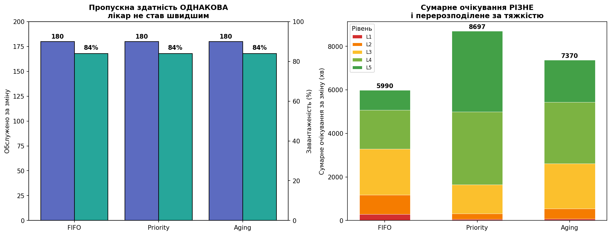

# Фаза 7. Висновки та пропускна здатність

> Розділ 08 · [↑ Зміст документації](README.md) · [↑ Головний README](../README.md)

[← Фаза 6. Візуалізація (Графіки 1–4)](07-visualizations.md)    [Механіка черги (push/pop, deque) →](08b-queue-mechanics.md)

---

## Фаза 7: Висновки

### 1. Головний результат
Черга з пріоритетами скорочує очікування критичних пацієнтів **у рази** (з годин до хвилин) — ціною незначного збільшення для легких. Це і є правильний етичний компроміс медицини: краще, щоб людина з подряпиною почекала, ніж людина з інфарктом.

### 2. Зворотний бік — голодування (starvation)
Чиста priority має ваду: легкий пацієнт може чекати **годинами**, бо його постійно обганяють тяжчі. У нашій симуляції максимальне очікування L5 під Priority перевищило час очікування під FIFO в декілька разів.

### 3. Як це вирішують насправді — aging
Реальні системи (і лікарні, і планувальники ОС) використовують **"дорослішання"**: що довше об'єкт чекає, то вищим стає його пріоритет. Це рятує легких від голодування, майже не шкодячи критичним. Наш `simulate_aging` це підтвердив — максимальне очікування L5 впало в рази при майже незмінному часі для L1.

### 4. Технічна родзинка
Одна структура даних — **черга з пріоритетами (купа)** — працює тут на кількох рівнях:
- FIFO — це купа з ключем за часом прибуття;
- Priority — купа з ключем за тяжкістю;
- сама симуляція оброблює події в порядку часу — теж робота купи.
- Aging — теж купа: статичний ключ тяжкість + прибуття/поріг (член «зараз» скорочується при порівнянні);

Кожна операція коштує $O(\log n)$ — саме тому цей підхід масштабується на тисячі пацієнтів.

### Як читати violin-діаграму

Кожна панель — один рівень тяжкості; у ній три "скрипки" (FIFO, Priority, Aging). Кожна скрипка показує:
- **ширина** на даній висоті = скільки пацієнтів чекали приблизно стільки (товще = більше людей);
- **горизонтальна лінія всередині** = середнє (те саме число, що ми звітували раніше);
- **верхня/нижня риски** = максимум і мінімум;
- **червона пунктирна лінія** = поріг небезпеки для цього рівня.

Тобто скрипка показує **всю форму**, а лінія середнього — ту єдину точку, якою ми описували все досі. Видно, **що ховалося** за середнім.


### Що розкриває форма (чого не видно в avg/max)

**L1 (критичні) — історія надійності.** Під FIFO скрипка **висока й широка** (від 38 до 116 хв) — як пощастить. Під Priority — **крихітна щільна** біля нуля (усі ~7 хв) — стабільно швидко. Те саме середнє нічого не сказало б про цю різницю у **передбачуваності**.

**L5 (легкі) — історія хвоста.** Під Priority скрипка має **довжелезний товстий хвіст** угору (до 703 хв) — голодування. Раніше "max=703" виглядав як один нещасливий випадок; violin показує, що це **не один пацієнт, а ціла маса** в зоні лиха. Під FIFO розподіл компактний.

**Перетин видно очима.** FIFO: вузько для легких, широко й високо для критичних. Priority: навпаки. Aging: помірно скрізь.

**Зв'язок зі шкодою (Фаза 11):** частка скрипки **над червоною лінією** — це буквально пацієнти "в небезпеці". Тепер видно не лише їхній відсоток, а й **наскільки далеко** за поріг вони зайшли.

### Це інший зріз мінливості, ніж Монте-Карло

Важливо не сплутати:
- **Violin (цей графік)** — розподіл **між пацієнтами** в один день: наскільки різний досвід людей.
- **Монте-Карло (Фаза 9)** — розподіл **між днями** зведеної цифри: наскільки сам день коливається.

Violin відповідає "що відбувається всередині типового дня", Монте-Карло — "наскільки передбачуваний день у цілому". Разом вони дають повну картину мінливості.

### Висновок

Форма розподілу багатша за дві цифри: вона показує **передбачуваність** (вузько чи широко), **хвости** (скільки невдах і як далеко), і **площу ризику** (маса за порогом). Головне підтвердження: перевага Priority для критичних — це не лише нижче середнє, а **набагато щільніший, передбачуваніший** розподіл; а його ціна для легких — не один максимум, а **товстий хвіст** голодування.

## Графік 5: Пропускна здатність — чи додає priority потужності?

### Важливий нюанс

Може скластися враження, що priority "пришвидшує" відділення. Це **не так**, і це варто показати явно. Лікар працює з однаковою швидкістю незалежно від порядку — priority лише **переставляє чергу**, а не додає рук.

Перевіримо це прямо: порахуємо для кожної дисципліни **пропускну здатність** (скільки обслужено, наскільки завантажений лікар) і **сумарне очікування**. Результат містить тонкий, але важливий висновок.

```python
N = 300
served_n = {disc: 0 for disc in ['fifo','priority','aging']}
util = {disc: [] for disc in ['fifo','priority','aging']}
sumwait_by_sev = {disc: {severity: 0.0 for severity in range(1,6)} for disc in ['fifo','priority','aging']}

for seed in range(N):
    base = generate_patients(seed=seed)
    first_arr = min(patient.arrival_time for patient in base)
    for disc, served in [('fifo',     simulate(copy.deepcopy(base), 'fifo')),
                         ('priority', simulate(copy.deepcopy(base), 'priority')),
                         ('aging',    simulate_aging(copy.deepcopy(base), 45))]:
        served_n[disc] += len(served)
        last = max(patient.start_time + patient.service_duration for patient in served)
        busy = sum(patient.service_duration for patient in served)
        util[disc].append(busy / (last - first_arr))
        for patient in served:
            sumwait_by_sev[disc][patient.severity] += patient.wait_time

discs = ['fifo','priority','aging']
print(f"{'Метрика':<22}{'FIFO':>10}{'Priority':>10}{'Aging':>10}")
print("-"*52)
print(f"{'Обслужено/зміну':<22}" + "".join(f"{served_n[disc]/N:>10.0f}" for disc in discs))
print(f"{'Завантаженість %':<22}" + "".join(f"{np.mean(util[disc])*100:>10.0f}" for disc in discs))
totals = {disc: sum(sumwait_by_sev[disc].values()) for disc in discs}
print(f"{'Сумарне очік. (хв)':<22}" + "".join(f"{totals[disc]/N:>10.0f}" for disc in discs))
print("\nСумарне очікування за тяжкістю (хв/зміну):")
print(f"{'Рівень':<7}{'FIFO':>9}{'Priority':>10}{'Aging':>9}")
for severity in range(1,6):
    print(f"L{severity:<6}" + "".join(f"{sumwait_by_sev[disc][severity]/N:>9.0f}{'':<1}" if disc!='priority' else f"{sumwait_by_sev[disc][severity]/N:>10.0f}" for disc in discs))
```


**Результат:**

```
Метрика                     FIFO  Priority     Aging
----------------------------------------------------
Обслужено/зміну              180       180       180
Завантаженість %              84        84        84
Сумарне очік. (хв)          5990      8697      7370

Сумарне очікування за тяжкістю (хв/зміну):
Рівень      FIFO  Priority    Aging
L1           285         56       76 
L2           893        252      461 
L3          2107       1336     2073 
L4          1787       3340     2819 
L5           918       3713     1941 
```

### Результат 1: пропускна здатність ОДНАКОВА

```
Метрика               FIFO   Priority   Aging
Обслужено/зміну        180       180      180
Завантаженість %        84        84       84
```

Усе ідентично: **той самий лікар обслуговує тих самих 180 пацієнтів за ту саму зміну з тією самою завантаженістю (84%)**. Priority не додає жодної хвилини потужності — він лише змінює **порядок**. Це підтверджує: пріоритезація не магія, вона не "пришвидшує" відділення.

(Технічно це закон збереження роботи: лікар-"роботяга" ніколи не простоює, коли є робота, тож тривалість зміни й завантаженість не залежать від порядку.)

```python
DL = ['FIFO','Priority','Aging']
SEVCOL = {1:'#d32f2f',2:'#f57c00',3:'#fbc02d',4:'#7cb342',5:'#43a047'}
fig, axes = plt.subplots(1, 2, figsize=(14, 5.5)); x = np.arange(3)

# Панель 1: пропускна здатність (однакова)
ax = axes[0]
served_avg = [served_n[disc]/N for disc in discs]; util_avg = [np.mean(util[disc])*100 for disc in discs]
ax.bar(x-0.2, served_avg, 0.4, label='обслужено/зміну', color='#5c6bc0', edgecolor='black')
ax2 = ax.twinx()
ax2.bar(x+0.2, util_avg, 0.4, label='завантаженість %', color='#26a69a', edgecolor='black')
ax.set_xticks(x); ax.set_xticklabels(DL); ax.set_ylabel('Обслужено за зміну'); ax2.set_ylabel('Завантаженість (%)')
ax.set_ylim(0,200); ax2.set_ylim(0,100)
for xi,v in zip(x-0.2,served_avg): ax.text(xi,v+3,f'{v:.0f}',ha='center',fontweight='bold')
for xi,v in zip(x+0.2,util_avg): ax2.text(xi,v+2,f'{v:.0f}%',ha='center',fontweight='bold')
ax.set_title('Пропускна здатність ОДНАКОВА\nлікар не став швидшим', fontweight='bold')

# Панель 2: сумарне очікування за тяжкістю (різне + перерозподіл)
ax = axes[1]; bottom = np.zeros(3)
for severity in range(1,6):
    vals = [sumwait_by_sev[disc][severity]/N for disc in discs]
    ax.bar(x, vals, 0.55, bottom=bottom, label=f'L{severity}', color=SEVCOL[severity], edgecolor='white', linewidth=0.5)
    bottom += vals
for xi,t in zip(x,[totals[disc]/N for disc in discs]): ax.text(xi,t+100,f'{t:.0f}',ha='center',fontweight='bold')
ax.set_xticks(x); ax.set_xticklabels(DL); ax.set_ylabel('Сумарне очікування за зміну (хв)')
ax.set_title('Сумарне очікування РІЗНЕ\nі перерозподілене за тяжкістю', fontweight='bold')
ax.legend(title='Рівень', fontsize=8, loc='upper left')
plt.tight_layout(); plt.show()
```


**Результат:**

```
<Figure size 1540x605 with 3 Axes>
```




### Результат 2 (несподіваний): сумарне очікування НЕ зберігається

Природно думати, що priority просто "перекладає" фіксовану суму очікування з тяжких на легких. **Але дані кажуть інше:**

```
Сумарне очікування за зміну:
  FIFO      5990 хв
  Priority  8697 хв   ← на 45% БІЛЬШЕ!
  Aging     7370 хв
```

Priority **не просто перерозподіляє — він збільшує** загальну суму очікування на ~45%! Чому? Priority ставить **тяжких першими**, а тяжкі лікуються **довго** (L1 = 25 хв). Поки лікар довго займається одним критичним, **багато** легких накопичуються в черзі → сумарне очікування росте. (Протилежна політика — "найкоротше першим" — мінімізувала б суму, але змусила б критичних чекати, що смертельно.)

**Як читати праву панель.** Висота стовпчика = сумарне очікування; кольори = внесок кожного рівня. Видно одразу дві речі:
- стовпчик Priority **найвищий** (загальна сума більша);
- але його низ (червоний L1, помаранчевий L2 — тяжкі) майже **порожній**, а верх (зелені L4–L5 — легкі) величезний. Очікування **перенесене** з тяжких на легких.

### Аналіз Графіка 5

Дві панелі — дві тези:
- **ліва:** пропускна здатність **однакова** (priority не додає потужності),
- **права:** сумарне очікування **різне й перерозподілене** (priority переносить очікування за тяжкістю).

### Панель 1 (ліва): потужність однакова

Для кожної дисципліни два стовпчики: синій — обслужено за зміну, бірюзовий — завантаженість лікаря. Усі три пари **ідентичні**: **180 обслужених, 84% завантаженості** скрізь.

**Що це означає:** той самий лікар обслуговує тих самих 180 пацієнтів за ту саму зміну незалежно від дисципліни. Priority **не додає рук** і не пришвидшує лікаря — лише змінює **порядок**. Це закон збереження роботи: лікар не простоює, поки є робота, тож сумарний виробіток від порядку не залежить.

### Панель 2 (права): сумарне очікування різне й перерозподілене

Висота стовпчика = сумарне очікування; кольори = внесок рівнів (червоний L1 знизу → зелений L5 згори). Дві несподіванки:

**1. Загальна висота різна — Priority НАЙВИЩИЙ:**
- FIFO: **5990 хв** • Priority: **8697 хв** (+45%!) • Aging: **7370 хв**

Priority **не просто перекладає** суму — він її **збільшує**: ставить тяжких (довгі випадки) першими, поки лікар ними зайнятий, легкі накопичуються.

**2. Склад розвертається:**
- **FIFO** — є помітні червоний (L1) і помаранчевий (L2) знизу: критичні теж чекають.
- **Priority** — низ майже порожній (тяжкі не чекають), верх — величезний зелений (L4, L5).

| Рівень | FIFO | Priority | Зміна |
|---|---|---|---|
| L1 критичні | 285 | **56** | у 5× менше |
| L2 невідкл. | 893 | 252 | у 3.5× менше |
| L5 легкі | 918 | **3713** | у 4× більше |

### Висновок: у чому справжня цінність priority

Зведемо три факти:
1. **Потужність фіксована** — priority не обслуговує більше людей і не пришвидшує лікаря.
2. **Сумарне очікування навіть зростає** (+45%) — бо тяжкі (довгі) випадки йдуть першими.
3. **Але очікування переноситься** з тяжких на легких.

Отже, цінність priority — **не** в тому, що він зменшує загальне страждання (він його навіть трохи збільшує). Цінність у тому, що він **перекладає очікування з тих, хто його не витримає (критичні), на тих, хто витримає (легкі)**.

> Priority не дає виграшу в хвилинах — він дає виграш у **тому, хто ці хвилини чекає**. Загальний час росте, але загальна **шкода** падає, бо хвилина очікування критичного коштує життя, а хвилина легкого — лише терпіння.

Це найточніше формулювання суті всього дослідження: **питання не "скільки чекати", а "кому чекати".**

---

[← Фаза 6. Візуалізація (Графіки 1–4)](07-visualizations.md)    [Механіка черги (push/pop, deque) →](08b-queue-mechanics.md)
