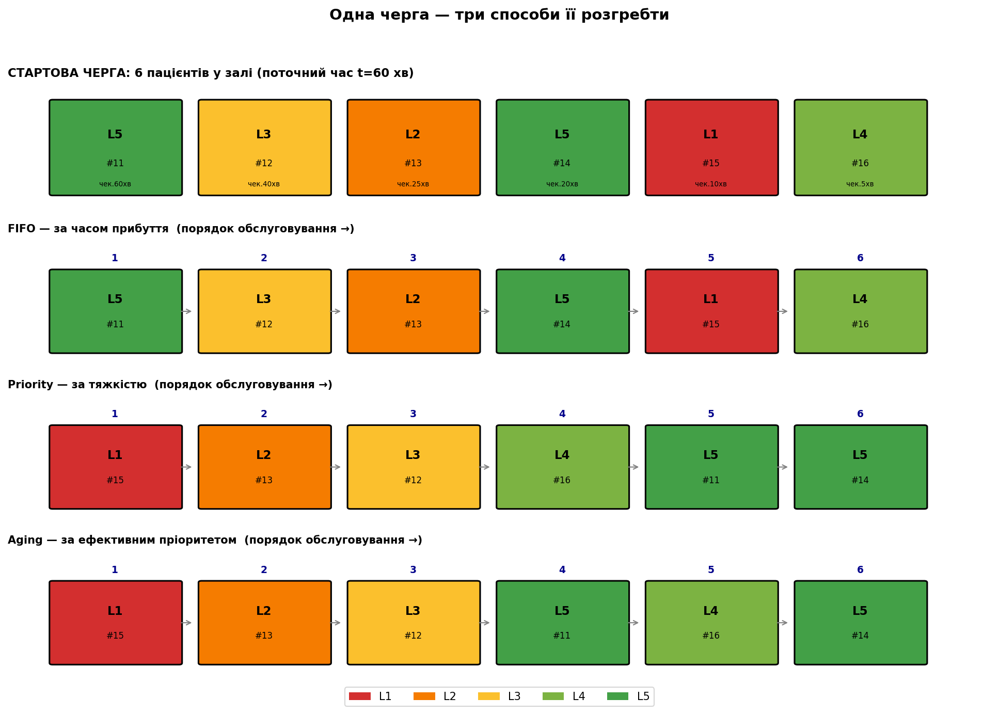
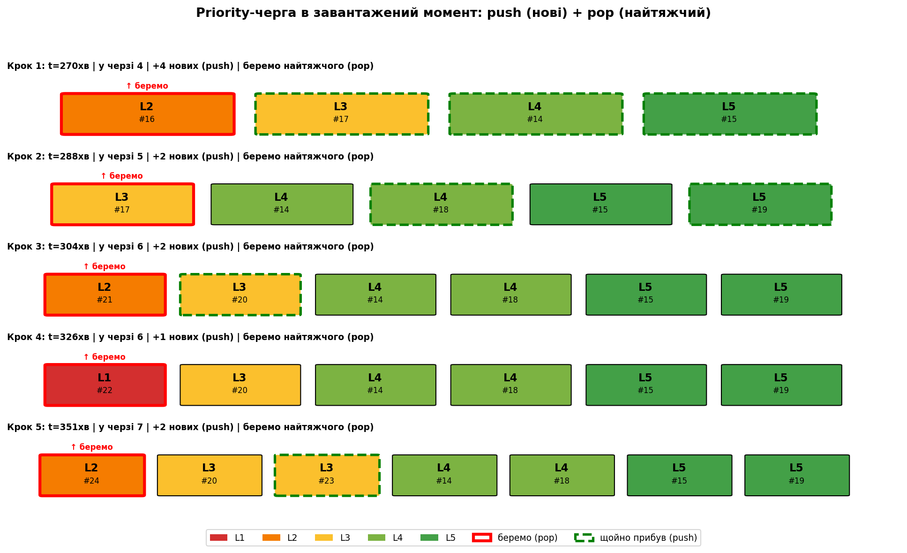

# Механіка черги: push/pop та FIFO через deque

> Розділ 08b · [↑ Зміст документації](README.md) · [↑ Головний README](../README.md)

[← Фаза 7. Висновки та пропускна здатність](08-throughput.md)    [Фаза 8.5. Валідація рушія (M/G/1, M/M/c) →](09-validation.md)

---

Розділ 08 показав *результати* роботи черги. Тут — сам *механізм* наживо (хто додається push і кого беруть pop на кожному кроці) і технічний відступ: для чистого FIFO купа не обов'язкова, її можна замінити на `deque` за O(1). Це показує, що купу для FIFO ми обрали свідомо — заради єдиного коду, а не від безвиході.

## Бонус: візуалізація роботи черги (push/pop)

Досі ми бачили *результати* роботи черги. Тут подивимось на **сам механізм** — хто додається (push) і кого беруть (pop) на кожному кроці.

### Спершу: чи FIFO — це теж купа?

**У нашому коді — так.** Обидві дисципліни в `simulate()` використовують один `heapq`, відрізняється лише ключ:
- **Priority**: ключ `(severity, ...)` → купа дає в корені найтяжчого;
- **FIFO**: ключ `(arrival_time, ...)` → купа дає в корені того, хто прийшов першим.

Тобто **FIFO — це купа, де "пріоритет" = час прибуття**.

**Концептуально** FIFO купи не потребує — звичайна черга (`deque`) робить те саме за $O(1)$. Купу для FIFO ми взяли, щоб **уніфікувати код** і показати, що FIFO та Priority — одна структура з різним ключем.

**А Aging — теж лягає на купу: статичний ключ `тяжкість + прибуття/поріг` дає той самий порядок за `O(log n)`. Список потрібен лише для нелінійних правил, де порядок справді змінюється з часом..

| Дисципліна | Структура | Ключ |
|---|---|---|
| FIFO | купа (можна й `deque`) | час прибуття |
| Priority | купа | тяжкість |
| Aging (лінійний) | купа зі статичним ключем | тяжкість + прибуття/поріг

### Наочно: одна черга — три способи її розгребти

Найкраще побачити різницю на **одному замороженому моменті**. Уявімо, що в залі вже сидять 6 пацієнтів різної тяжкості (поточний час t=60 хв), і подивимось, у якому **порядку** кожна дисципліна їх обслужить.

```python
from matplotlib.patches import FancyBboxPatch

# Заморожений момент: 6 пацієнтів у залі, поточний час t=60 хв
frozen = [
    Patient(id=11, arrival_time=0,  severity=5, service_duration=5),   # чекає найдовше (60 хв)
    Patient(id=12, arrival_time=20, severity=3, service_duration=12),
    Patient(id=13, arrival_time=35, severity=2, service_duration=18),
    Patient(id=14, arrival_time=40, severity=5, service_duration=5),
    Patient(id=15, arrival_time=50, severity=1, service_duration=25),  # критичний, прийшов недавно
    Patient(id=16, arrival_time=55, severity=4, service_duration=8),
]
NOW = 60
AGING_THR = 45

def order_for(discipline):
    pts = list(frozen)
    if discipline == 'fifo':
        return sorted(pts, key=lambda patient: patient.arrival_time)
    elif discipline == 'priority':
        return sorted(pts, key=lambda patient: (patient.severity, patient.arrival_time))
    else:  # aging
        return sorted(pts, key=lambda patient: (patient.severity - (NOW - patient.arrival_time) / AGING_THR,
                                          patient.arrival_time))

fig, axes = plt.subplots(4, 1, figsize=(13, 9))

# Стартова черга
ax = axes[0]
for idx, patient in enumerate(frozen):
    wait = NOW - patient.arrival_time
    ax.add_patch(FancyBboxPatch((idx, 0), 0.85, 1, boxstyle="round,pad=0.02",
                                fc=SEV_COLORS[patient.severity], ec='black', lw=1.5, zorder=2))
    ax.text(idx+0.42, 0.62, f"L{patient.severity}", ha='center', fontsize=11, fontweight='bold')
    ax.text(idx+0.42, 0.32, f"#{patient.id}", ha='center', fontsize=8)
    ax.text(idx+0.42, 0.08, f"чек.{wait}хв", ha='center', fontsize=6.5)
ax.set_xlim(-0.3, 6.3); ax.set_ylim(-0.2, 1.2); ax.axis('off')
ax.set_title(f'СТАРТОВА ЧЕРГА: 6 пацієнтів у залі (поточний час t={NOW} хв)',
             fontweight='bold', loc='left', fontsize=11)

# Порядок розгрібання для кожної дисципліни
for r, (disc, dname) in enumerate([('fifo', 'FIFO — за часом прибуття'),
                                   ('priority', 'Priority — за тяжкістю'),
                                   ('aging', 'Aging — за ефективним пріоритетом')], start=1):
    ax = axes[r]
    for pos, patient in enumerate(order_for(disc)):
        ax.add_patch(FancyBboxPatch((pos, 0), 0.85, 1, boxstyle="round,pad=0.02",
                                    fc=SEV_COLORS[patient.severity], ec='black', lw=1.5, zorder=2))
        ax.text(pos+0.42, 0.60, f"L{patient.severity}", ha='center', fontsize=11, fontweight='bold')
        ax.text(pos+0.42, 0.30, f"#{patient.id}", ha='center', fontsize=8)
        ax.text(pos+0.42, 1.12, f"{pos+1}", ha='center', fontsize=9, fontweight='bold', color='darkblue')
        if pos < 5:
            ax.annotate('', xy=(pos+0.95, 0.5), xytext=(pos+0.85, 0.5),
                        arrowprops=dict(arrowstyle='->', color='gray'))
    ax.set_xlim(-0.3, 6.3); ax.set_ylim(-0.2, 1.4); ax.axis('off')
    ax.set_title(f'{dname}  (порядок обслуговування →)', fontweight='bold', loc='left', fontsize=10)

legend = [Patch(facecolor=SEV_COLORS[severity], label=f"L{severity}") for severity in range(1, 6)]
fig.legend(handles=legend, loc='lower center', ncol=5, bbox_to_anchor=(0.5, -0.01))
fig.suptitle('Одна черга — три способи її розгребти', fontsize=14, fontweight='bold', y=1.0)
plt.tight_layout(rect=[0, 0.02, 1, 0.97])
plt.show()
```


**Результат:**

```
<Figure size 1430x990 with 4 Axes>
```




### Що видно на цьому графіку

Та сама стартова черга, але порядок обслуговування **кардинально різний**:

- **FIFO:** `L5#11 → L3#12 → L2#13 → L5#14 → L1#15 → ...` — критичний **#15 обслуговується аж 5-м**! Бо прийшов недавно, а черга йде строго за часом. Небезпечно.
- **Priority:** `L1#15 → L2#13 → L3#12 → L4#16 → L5#11 → ...` — критичний #15 **перший**. Але #11, що чекав 60 хв, аж 5-й — починається голодування.
- **Aging:** `L1#15 → L2#13 → L3#12 → L5#11 → ...` — критичний #15 **теж перший**, АЛЕ #11 (чекав найдовше) **піднявся на 4-те місце** замість 5-го. Aging "винагородив" його за довге очікування.

Це і є вся суть трьох дисциплін **в одній картинці**: FIFO ігнорує тяжкість, Priority ігнорує час очікування, Aging враховує обидва.

### Реальний завантажений момент із симуляції (push + pop)

Тепер подивимось на **справжній** момент із симуляції Priority, коли в залі багато пацієнтів. Тут видно і **pop** (беремо найтяжчого, червона рамка), і **push** (щойно прибулі, зелена пунктирна рамка).

```python
def simulate_trace_priority(patients, min_queue=4, want_steps=5):
    """Записує знімки Priority-черги лише коли вона завантажена (>= min_queue)."""
    arr = sorted(patients, key=lambda patient: patient.arrival_time)
    i = 0; waiting = []; now = 0.0; snapshots = []
    while i < len(arr) or waiting:
        newly = []
        while i < len(arr) and arr[i].arrival_time <= now:
            waiting.append(arr[i]); newly.append(arr[i].id); i += 1
        if not waiting:
            now = arr[i].arrival_time
            while i < len(arr) and arr[i].arrival_time <= now:
                waiting.append(arr[i]); newly.append(arr[i].id); i += 1
        waiting.sort(key=lambda patient: (patient.severity, patient.arrival_time))
        picked = waiting[0]
        if len(waiting) >= min_queue and len(snapshots) < want_steps:
            snapshots.append({'time': now, 'waiting': list(waiting),
                              'picked_id': picked.id, 'newly': list(newly)})
        waiting.pop(0)
        picked.start_time = now
        now += picked.service_duration
    return snapshots


snaps = simulate_trace_priority(copy.deepcopy(patients), min_queue=4, want_steps=5)

fig, axes = plt.subplots(len(snaps), 1, figsize=(13, len(snaps) * 1.5))
for r, snap in enumerate(snaps):
    ax = axes[r]
    wsorted = sorted(snap['waiting'], key=lambda patient: (patient.severity, patient.arrival_time))
    for idx, patient in enumerate(wsorted):
        if patient.id == snap['picked_id']:
            ec, lw, ls = 'red', 3, '-'
        elif patient.id in snap['newly']:
            ec, lw, ls = 'green', 2.5, '--'
        else:
            ec, lw, ls = 'black', 1, '-'
        ax.add_patch(FancyBboxPatch((idx, 0), 0.85, 1, boxstyle="round,pad=0.02",
                                    fc=SEV_COLORS[patient.severity], ec=ec, lw=lw, ls=ls, zorder=2))
        ax.text(idx+0.42, 0.58, f"L{patient.severity}", ha='center', fontsize=10, fontweight='bold')
        ax.text(idx+0.42, 0.28, f"#{patient.id}", ha='center', fontsize=7)
        if patient.id == snap['picked_id']:
            ax.text(idx+0.42, 1.15, '↑ беремо', ha='center', fontsize=8, color='red', fontweight='bold')
    ax.set_xlim(-0.3, len(wsorted)+0.3); ax.set_ylim(-0.2, 1.5); ax.axis('off')
    ax.set_title(f"Крок {r+1}: t={snap['time']:.0f}хв | у черзі {len(wsorted)} | "
                 f"+{len(snap['newly'])} нових (push) | беремо найтяжчого (pop)",
                 fontweight='bold', loc='left', fontsize=9)

legend = [Patch(facecolor=SEV_COLORS[severity], label=f"L{severity}") for severity in range(1, 6)]
legend += [Patch(facecolor='white', edgecolor='red', lw=3, label='беремо (pop)'),
           Patch(facecolor='white', edgecolor='green', lw=2.5, ls='--', label='щойно прибув (push)')]
fig.legend(handles=legend, loc='lower center', ncol=7, bbox_to_anchor=(0.5, -0.03), fontsize=9)
fig.suptitle('Priority-черга в завантажений момент: push (нові) + pop (найтяжчий)',
             fontsize=13, fontweight='bold', y=1.0)
plt.tight_layout(rect=[0, 0.04, 1, 0.96])
plt.show()
```


**Результат:**

```
<Figure size 1430x825 with 5 Axes>
```




### Що видно на завантаженому моменті

- На кожному кроці **червона рамка** = кого беремо (pop): завжди найтяжчий (найлівіший, бо черга відсортована за тяжкістю).
- **Зелена пунктирна рамка** = хто щойно прибув (push) на цьому кроці.
- **Найголовніше:** простежте легких пацієнтів **#14 (L4)** та **#15 (L5)** — вони з'являються на кроці 1 і **залишаються в черзі крок за кроком**, бо їх постійно обганяють новоприбулі тяжчі. Це **голодування, що формується на очах**.
- А коли на кроці 4 прибуває критичний **#22 (L1)** — його беруть **миттєво**, обігнавши всіх.

Це той самий механізм, що дав 703 хвилини голодування у Графіку 3 — тільки тут видно його **зсередини**, крок за кроком.

### Аналіз: анатомія голодування крок за кроком

П'ять послідовних рішень Priority-черги в завантажений період (t=270–351 хв). На кожному кроці:
- 🔴 **червона рамка** — кого беремо (pop) = завжди найтяжчий (найлівіший, бо черга відсортована за тяжкістю);
- 🟢 **зелена пунктирна** — хто щойно прибув (push) на цьому кроці;
- **чорна рамка** — хто вже чекав раніше.

### Покроковий аналіз

| Крок | Час | Беремо (pop) | Що відбувається |
|---|---|---|---|
| 1 | 270 | L2 #16 | прибули 4 пацієнти, беремо найтяжчого (L2) |
| 2 | 288 | L3 #17 | #16 пішов, тепер найтяжчий — #17 |
| 3 | 304 | L2 #21 | прибув новий L2 #21 — одразу найтяжчий, беремо його |
| 4 | 326 | **L1 #22** | прибув **критичний** — миттєво в обробку! |
| 5 | 351 | L2 #24 | знову новоприбулий L2 проскакує вперед |


### Два ключові патерни (найголовніше)

**Патерн 1: тяжкі "проскакують" майже миттєво.** Кого беремо на кожному кроці: `L2#16 → L3#17 → L2#21 → L1#22 → L2#24`. Це **завжди тяжкі (L1–L3)**, і часто — **щойно прибулі**. Наприклад, #21 (крок 3) і #24 (крок 5) прибули зеленим пунктиром і **того ж кроку** були взяті. Критичний #22 (крок 4) — взятий миттєво.

**Патерн 2: легкі НАКОПИЧУЮТЬСЯ і не рухаються.** Простежте легких #14 (L4) і #15 (L5) — вони з'явилися ще на **кроці 1** і **залишаються в черзі всі 5 кроків**! До них додаються #18, #19 (крок 2), які теж застрягають.

| Пацієнт | Тяжкість | З'явився | Стан після 5 кроків |
|---|---|---|---|
| #14 | L4 | крок 1 | **досі чекає** |
| #15 | L5 | крок 1 | **досі чекає** |
| #18 | L4 | крок 2 | **досі чекає** |
| #19 | L5 | крок 2 | **досі чекає** |

За 5 кроків обслужили **5 пацієнтів — і всі тяжкі**. Жоден легкий не зрушив з місця.

### Чому так відбувається — механізм голодування

Подивіться на **правий край** кожного рядка — там утворився "застряглий шар" зелених боксів (L4/L5), який лише **росте**: крок 1 — двоє, крок 2 — четверо, і далі вони нікуди не діваються.

Причина: **щоразу, коли лікар звільняється, прибуває хтось тяжчий** (новий L1/L2/L3), і черга з пріоритетами ставить його **попереду** застряглих легких. Легкі ніколи не доходять до голови черги, бо їх постійно "перестрибують" новоприбулі.

Зверніть увагу й на **розмір черги**: `4 → 5 → 6 → 6 → 7`. Вона **росте**, бо тяжкі приходять і йдуть, а легкі лишаються — баласт накопичується.


### Зв'язок із головним результатом

Це **той самий механізм**, що дав **703 хвилини голодування** у Графіку 3 — тільки тут видно його **зсередини, крок за кроком**. Якби ми продовжили трасування, #14 і #15 так і сиділи б, поки не настане затишшя (а воно, як видно, не настає — нові тяжкі все прибувають).

**Найдраматичніший момент — крок 4.** Прибуває критичний L1 #22 і його беруть **миттєво**, попри те, що #14, #15, #18, #19, #20 чекають довше. Для критичного це чудово (рятує життя). Але для легких це ще один "обгін" — їхнє очікування продовжує зростати. Це наочна ілюстрація, **чому** Priority так робить: заради таких миттєвих рятувань вона й жертвує легкими.


### Підсумок аналізу

Цей малюнок — **анатомія голодування**:
- тяжкі (червоні/помаранчеві) проходять крізь чергу як крізь воду — часто того ж кроку, що й прибули;
- легкі (зелені) осідають на дні й накопичуються, бо їх вічно перестрибують;
- черга росте, "застряглий шар" легких лише більшає;
- критичний #22 — наочна ілюстрація, чому Priority це робить: заради таких миттєвих рятувань вона й жертвує легкими.

Ідеальна послідовність для поста: спочатку показати число **703 хв** (Графік 3), а потім цей малюнок — "ось **як саме** воно утворюється, крок за кроком".

## Технічний відступ: FIFO через deque замість купи

У `simulate()` ми реалізували FIFO через купу (ключ = час прибуття), щоб уніфікувати код із Priority. Але FIFO — це **за визначенням** проста черга, для якої існує спеціальна структура `deque` зі складністю $O(1)$ (купа дає $O(\log n)$).

Подивимось, як виглядала б deque-реалізація, чи дає вона той самий результат, і наскільки вона швидша насправді.

> **Примітка щодо реалізації.** У пакеті обидві форми FIFO — це **політики** над одним драйвером `run_single_server`: `HeapPolicy` (купа) і `FifoDequePolicy` (deque). Дисципліна (порядок) відокремлена від структури (як зберігати) — `src/triage_sim/engines/`.

```python
from collections import deque

def simulate_fifo_deque(patients):
    """FIFO через deque — O(1) на операцію, без купи."""
    arrivals = sorted(patients, key=lambda patient: patient.arrival_time)
    i = 0
    waiting = deque()
    now = 0.0
    served = []

    while i < len(arrivals) or waiting:
        # реєструємо прибулих — додаємо в КІНЕЦЬ черги
        while i < len(arrivals) and arrivals[i].arrival_time <= now:
            waiting.append(arrivals[i])      # O(1)
            i += 1

        if not waiting:
            now = arrivals[i].arrival_time
            continue

        # беремо з ПОЧАТКУ черги — найранішого (FIFO)
        patient = waiting.popleft()                # O(1)
        patient.start_time = now
        now += patient.service_duration
        served.append(patient)

    return served


# Перевірка: чи дає той самий результат, що й FIFO через купу?
heap_fifo  = simulate(copy.deepcopy(patients), 'fifo')
deque_fifo = simulate_fifo_deque(copy.deepcopy(patients))

same_order = [patient.id for patient in heap_fifo] == [patient.id for patient in deque_fifo]
same_waits = all(abs(a.wait_time - b.wait_time) < 1e-9
                 for a, b in zip(heap_fifo, deque_fifo))
print(f"Однаковий порядок обслуговування: {same_order}")
print(f"Однаковий час очікування:          {same_waits}")
```


**Результат:**

```
Однаковий порядок обслуговування: True
Однаковий час очікування:          True
```

### Як працює deque-версія

Відмінність від купи — лише у двох рядках:

| Операція | Купа (`heapq`) | Deque |
|---|---|---|
| додати | `heappush(waiting, (key, p))` — O(log n) | `waiting.append(p)` — O(1) |
| взяти | `heappop(waiting)` — O(log n) | `waiting.popleft()` — O(1) |

**Чому deque дає правильний FIFO без жодного ключа.** Пацієнти додаються в чергу **в порядку прибуття** (бо масив `arrivals` відсортований за часом). Тому:
- `append` кладе кожного нового в **кінець**,
- `popleft` бере з **початку** — а там завжди найраніший.

Купі потрібен ключ `(arrival_time, counter)`, щоб упорядкувати. Deque упорядкована **сама собою** — за порядком додавання. Тому вона і простіша, і швидша для FIFO.

Перевірка вище підтверджує: **обидва підходи дають ІДЕНТИЧНИЙ результат** (той самий порядок, той самий час очікування).

```python
import time

def bench(fn, data, reps=3):
    t0 = time.perf_counter()
    for _ in range(reps):
        fn(copy.deepcopy(data))
    return (time.perf_counter() - t0) / reps * 1000  # мс

# 1. Ізольовані операції push/pop (теоретична різниця)
def only_heap(n):
    w = []
    for i in range(n): heapq.heappush(w, ((i, i), i))
    while w: heapq.heappop(w)

def only_deque(n):
    w = deque()
    for i in range(n): w.append(i)
    while w: w.popleft()

print("ЧИСТІ операції черги (push + pop), n=100000:")
t0=time.perf_counter(); only_heap(100000);  th=(time.perf_counter()-t0)*1000
t0=time.perf_counter(); only_deque(100000); td=(time.perf_counter()-t0)*1000
print(f"  купа:  {th:.1f} мс | deque: {td:.1f} мс | deque швидший у {th/td:.0f}x\n")

# 2. ПОВНА симуляція (практична різниця)
big = generate_patients(n=50000)
t_heap  = bench(lambda patient: simulate(patient, 'fifo'), big)
t_deque = bench(simulate_fifo_deque, big)
print("ПОВНА симуляція, n=50000 пацієнтів:")
print(f"  FIFO через купу:  {t_heap:.0f} мс")
print(f"  FIFO через deque: {t_deque:.0f} мс")
print(f"  deque швидший лише у {t_heap/t_deque:.1f}x")
```


**Результат:**

```
ЧИСТІ операції черги (push + pop), n=100000:
  купа:  186.1 мс | deque: 5.4 мс | deque швидший у 35x

ПОВНА симуляція, n=50000 пацієнтів:
  FIFO через купу:  446 мс
  FIFO через deque: 435 мс
  deque швидший лише у 1.0x
```

### Найцікавіший висновок: де ховається "вузьке місце"

Зверніть увагу на разючу різницю між двома бенчмарками:

| Що міряємо | deque швидший у |
|---|---|
| **Чисті** push/pop (ізольовано) | ~40 разів |
| **Повна** симуляція | лише ~1.2 раза |

Чому так? Бо в повній симуляції операції з чергою — **лише мала частина** роботи. Більшість часу йде на інше: початкове сортування `sorted(...)` (саме $O(n \log n)$), `deepcopy`, цикл, доступ до атрибутів пацієнтів. Купа vs deque "тоне" на тлі цієї роботи.

**Це класичний урок про оптимізацію:** теоретична перевага ($O(1)$ vs $O(\log n)$) реальна, але **проявляється лише якщо саме ця операція — вузьке місце**. Тут вона ним не є. Тому оптимізувати FIFO до deque заради швидкості в цьому проєкті — **передчасна оптимізація** (premature optimization).

### Підсумок: то яка реалізація правильніша?

**Однозначно правильної немає — це компроміс:**

| Критерій | Переможець |
|---|---|
| Чистота й канонічність ("FIFO = проста черга") | deque |
| Єдність коду (FIFO + Priority в одній функції) | купа |
| Реальна швидкість на цьому масштабі | нічия (різниця нікчемна) |
| Швидкість на мільйонах із вузьким місцем у черзі | deque |

**Для цього навчального ноутбука** вибір купи виправданий: він уніфікує код і підкреслює головну ідею — *FIFO це купа з пріоритетом = час прибуття*. А цей відступ показує, що ми **свідомо** обрали такий підхід і розуміємо альтернативу.

**Загальне правило:** для чистого FIFO у production бери `deque` ($O(1)$). Але не оптимізуй наосліп — спершу переконайся, що саме черга є вузьким місцем (як показав бенчмарк, тут це не так).

---

[← Фаза 7. Висновки та пропускна здатність](08-throughput.md)    [Фаза 8.5. Валідація рушія (M/G/1, M/M/c) →](09-validation.md)
