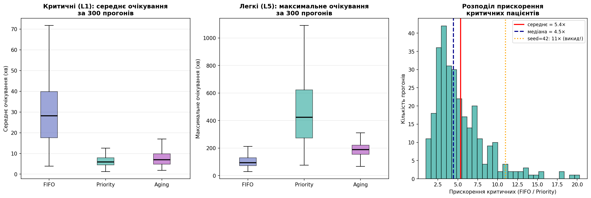
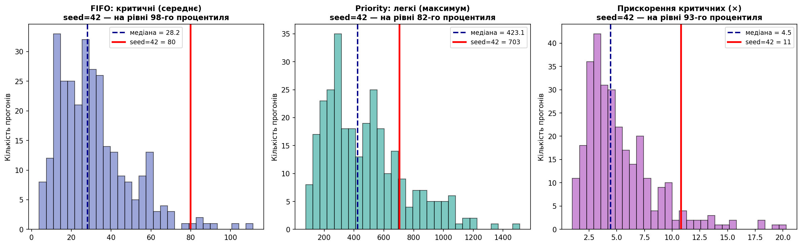

# Фаза 9. Монте-Карло: наскільки надійні числа

> Розділ 10 · [↑ Зміст документації](README.md) · [↑ Головний README](../README.md)

[← Фаза 8.5. Валідація рушія (M/G/1, M/M/c)](09-validation.md)    [Фаза 10. Чутливість до навантаження (sweep ρ) →](11-load-sensitivity.md)

---

## Фаза 9: Монте-Карло — наскільки надійні наші числа?

### Проблема одного прогону

Усі попередні числа (7 хв, 703 хв, 11×) отримані з **одного** набору пацієнтів (seed=42). Але це лише **одна** випадкова реалізація, і є питання, на яке один прогін **не може відповісти**:

> Це **типовий** результат — чи нам просто пощастило з конкретним набором пацієнтів?

seed=42 згенерував **одну конкретну** комбінацію: ці 180 пацієнтів прибули в ці моменти, з цими тяжкостями. Інший seed дав би **інших** пацієнтів — і, можливо, інше число. Може, 11× — рідкісний драматичний випадок, а зазвичай виходить 4× чи 6×? З одного прогону це **неможливо знати**.

Щоб це перевірити, проженемо симуляцію **300 разів** з різними seed і подивимось на **розподіл** результатів. Якщо перевага Priority стабільна — вона проявиться в усіх прогонах. Якщо ні — побачимо великий розкид.

### Що таке Монте-Карло і звідки назва

**Монте-Карло** — це метод, у якому замість розв'язання задачі формулою ми **багато разів моделюємо її з випадковими вхідними даними** і дивимось на **розподіл** результатів.

Назва — від казино в Монте-Карло (Монако): метод спирається на **випадковість**, як азартні ігри. Ми ніби "розігруємо" задачу багато разів і дивимось, що випадає найчастіше.

**Чому не формулою?** У нашій симуляції випадкові й переплетені: моменти прибуття (Пуассон), тяжкості, час лікування. Вивести формулу "середнє очікування критичного" аналітично майже неможливо. Монте-Карло обходить це: **просто змоделюй реальність багато разів і подивись.**

### Як він працює — крок за кроком

```
1. Прогнати симуляцію БАГАТО разів (у нас 300),
   кожен раз з ІНШИМ seed → інші пацієнти щоразу.

2. Кожен прогін дає свої числа
   (критичні чекали X хв, прискорення Y разів).

3. Зібрати всі 300 результатів → отримуємо РОЗПОДІЛ,
   а не одне число.

4. Порахувати статистику: середнє, розкид, 95% діапазон.

5. Тепер можна сказати "типово ~5×, діапазон 1.6–14×"
   замість одного нестійкого "11×".
```

Ключове слово — **розподіл**. Один прогін дає крапку. 300 прогонів дають **хмару крапок**, з якої видно і типове значення, і розкид.

### Чому це працює і чому в нас такий розкид

**Чому метод працює.** За **законом великих чисел**: чим більше незалежних прогонів, тим ближче їхнє середнє до **справжнього** значення, а випадкові коливання окремих прогонів взаємно гасяться. 300 прогонів дають набагато стійкішу оцінку, ніж 1.

**Чому результати окремих прогонів так коливаються.** У кожному прогоні лише ~9 критичних пацієнтів. Їхнє очікування сильно залежить від того, **коли саме** вони випадково прибули — у момент затору чи затишшя. На seed=42 вони "не пощастили" й прибули в затори (тому 80 хв). Усереднення по 300 прогонах згладжує цю удачу/невдачу.

**Суть:** Монте-Карло перетворює "у мене вийшло 11×" (можливо, випадковість) на "**типово ~5×, з діапазоном 1.6–14× за 300 симуляцій**" (наукове твердження). Це різниця між анекдотом і доказом.

Нижче — реалізація: проженемо 300 симуляцій і подивимось на розподіли 👇

```python
# Монте-Карло: 300 незалежних прогонів з різними seed
# (використовує generate_patients, simulate, simulate_aging, metrics_by_severity)

N_RUNS = 300
res = {k: [] for k in ['f_L1', 'p_L1', 'a_L1', 'f_L5', 'p_L5', 'a_L5', 'speedup']}
skipped = 0

for seed in range(N_RUNS):
    pts = generate_patients(n=180, arrival_rate=0.075, seed=seed)
    mf = metrics_by_severity(simulate(copy.deepcopy(pts), 'fifo'))
    mp = metrics_by_severity(simulate(copy.deepcopy(pts), 'priority'))
    ma = metrics_by_severity(simulate_aging(copy.deepcopy(pts), 45))
    # захист: рівні 1 і 5 мають бути присутні, критичні мають ненульове очікування
    if 1 not in mf or 1 not in mp or 5 not in mf or 5 not in mp or mp[1]['avg'] < 0.5:
        skipped += 1
        continue
    res['f_L1'].append(mf[1]['avg']); res['p_L1'].append(mp[1]['avg']); res['a_L1'].append(ma[1]['avg'])
    res['f_L5'].append(mf[5]['max']); res['p_L5'].append(mp[5]['max']); res['a_L5'].append(ma[5]['max'])
    res['speedup'].append(mf[1]['avg'] / mp[1]['avg'])

print(f"Виконано {N_RUNS} прогонів (пропущено {skipped})\n")

def summary(name, arr):
    arr = np.array(arr)
    p2, p97 = np.percentile(arr, [2.5, 97.5])
    print(f"{name:<14} {arr.mean():>7.1f} ± {arr.std():>5.1f} хв   (95%: {p2:.0f}–{p97:.0f})")

print("КРИТИЧНІ (L1), середнє очікування:")
summary("  FIFO", res['f_L1']); summary("  Priority", res['p_L1']); summary("  Aging", res['a_L1'])
print("\nЛЕГКІ (L5), максимальне очікування:")
summary("  FIFO", res['f_L5']); summary("  Priority", res['p_L5']); summary("  Aging", res['a_L5'])

sp = np.array(res['speedup'])
print(f"\nПРИСКОРЕННЯ критичних (FIFO/Priority):")
print(f"  середнє {sp.mean():.1f}× | медіана {np.median(sp):.1f}× | 95%: {np.percentile(sp,2.5):.1f}–{np.percentile(sp,97.5):.1f}×")
```


**Результат:**

```
Виконано 300 прогонів (пропущено 2)

КРИТИЧНІ (L1), середнє очікування:
  FIFO            31.4 ±  18.1 хв   (95%: 7–75)
  Priority         6.4 ±   2.7 хв   (95%: 2–13)
  Aging            8.3 ±   5.9 хв   (95%: 2–26)

ЛЕГКІ (L5), максимальне очікування:
  FIFO           102.5 ±  40.8 хв   (95%: 42–204)
  Priority       476.3 ± 266.7 хв   (95%: 121–1066)
  Aging          189.0 ±  49.4 хв   (95%: 104–297)

ПРИСКОРЕННЯ критичних (FIFO/Priority):
  середнє 5.4× | медіана 4.5× | 95%: 1.6–13.8×
```

### Розбір коду Монте-Карло

**Загальна мета:** прогнати симуляцію 300 разів з різними наборами пацієнтів і зібрати **розподіли** метрик — щоб бачити не одне (можливо випадкове) число, а типове значення з розкидом.

**Налаштування і цикл.** Словник `res` збирає результати у порожні списки за ключами: `f_L1`/`p_L1`/`a_L1` — середнє очікування критичних під **F**IFO/**P**riority/**A**ging; `f_L5`/`p_L5`/`a_L5` — максимум для легких; `speedup` — прискорення; `skipped` рахує пропущені. У циклі seed іде від 0 до 299, і **кожен seed дає ІНШИЙ набір 180 пацієнтів** (інші моменти прибуття, інші тяжкості) — це і є суть Монте-Карло: 300 різних "реальностей". Ті самі пацієнти проганяємо через три дисципліни (`deepcopy` — щоб кожна стартувала з чистими даними); `mf`, `mp`, `ma` — статистика по рівнях для FIFO, Priority, Aging.

**Захист від проблемних прогонів:**
```python
    if 1 not in mf or 1 not in mp or 5 not in mf or 5 not in mp or mp[1]['avg'] < 0.5:
        skipped += 1
        continue
```
Умова з **5 перевірок** через `or` — це **захист від падіння**. `metrics_by_severity` повертає ключ рівня **лише якщо в ньому є пацієнти**, тож якщо у випадковому наборі немає жодного критичного (L1) чи легкого (L5), звернення `mf[1]['avg']` до неіснуючого ключа викинуло б `KeyError` і зупинило весь цикл. Остання перевірка `mp[1]['avg'] < 0.5` ловить інший випадок: критичний під Priority чекав ~0 хв, і тоді ділення в `speedup` дало б нескінченність. У таких прогонах `continue` переходить до наступного seed.

На практиці спрацьовує рідко — **2 з 300**, і то саме через перевірку ділення на ~нуль (без жодного L1 не було жодного прогону: при ~9 критичних у середньому шанс мізерний, `0.95¹⁸⁰ ≈ 0.0001`). Порядок перевірок не випадковий: `1 not in mp` стоїть **перед** `mp[1]['avg']`, тож завдяки короткому замиканню `or` до звернення за ключем код не дійде, якщо ключа немає.

Зрозуміліша форма — **іменовані змінні** (поведінка точно та сама, ті самі 2 пропущені). Цим блоком можна замінити `if` у циклі вище:

```python
# Пропускаємо прогін, якщо в ньому бракує потрібних даних
no_critical = 1 not in mf or 1 not in mp          # немає критичних (L1)
no_light    = 5 not in mf or 5 not in mp          # немає легких (L5)
near_zero   = (1 in mp) and mp[1]['avg'] < 0.5    # критичні чекали ~0 (ділення впаде)

if no_critical or no_light or near_zero:
    skipped += 1
    continue
```

`(1 in mp) and` у `near_zero` гарантує, що `mp[1]['avg']` обчислюється **лише** якщо ключ `1` існує (явне коротке замикання).

**Збір і статистика.** Результати кожного прогону додаються у списки; `speedup` — просте ділення (у скільки разів очікування критичних під FIFO більше, ніж під Priority). Функція `summary` для кожної метрики виводить `mean()` — середнє по прогонах, `std()` — стандартне відхилення (розкид), і `percentile([2.5, 97.5])` — 95% діапазон. Тож у результаті **"± 18.1"** — це розкид (чим більше, тим менш стабільно; більшість прогонів у межах ±1 відхилення), а **"(95%: 7–75)"** — у 95% прогонів значення було між 7 і 75.

### Головне відкриття: один прогін нас обманув

Порівняйте результат одного прогону (seed=42) із 300 прогонами:

| Метрика | seed=42 (один прогін) | 300 прогонів (надійно) |
|---|---|---|
| Критичні FIFO | 80 хв | **31 ± 18 хв** |
| Критичні Priority | 7 хв | **6 ± 3 хв** |
| Прискорення | **11×** | **≈5× (медіана 4.5×, 95%: 1.6–14×)** |

**Виявилося, що seed=42 був драматичним викидом!** Очікування критичних під FIFO на ньому (80 хв) — майже вдвічі вище за типове (31 хв). Тому "11× швидше" — щасливий збіг, а **чесна оцінка ближча до 5×**.

Це і є вся цінність Монте-Карло: він **рятує від хибних висновків** на основі однієї випадкової реалізації. Тепер ми можемо казати не "11×" (нестійке), а "**типово ~5×, з діапазоном 1.6–14×**" — і це твердження надійне.

Читаючи числа з результату вище: для критичних (L1) FIFO дає високе очікування й **величезний розкид** (31.4 ± 18.1, від 7 до 75 — лотерея), тоді як Priority (6.4 ± 2.7) і Aging (8.3 ± 5.9) низькі й стабільні. Для легких (L5) картина протилежна: FIFO помірний і стабільний (102.5 ± 40.8), Priority **дико непередбачуваний** (476.3 ± 266.7, аж до 1066 хв), а Aging низький і вузький (189.0 ± 49.4). Прискорення: середнє 5.4× більше за медіану 4.5× — **скошений вправо** розподіл, де кілька прогонів (як seed=42 з 11×) тягнуть середнє вгору; медіана 4.5× — чесніше "типове" значення, а Priority завжди швидший (мінімум 1.6×). Малий розкид (як у Aging) — це **окрема цінність**: дисципліна зі стабільним результатом краща за ту, що інколи блискуча, а інколи катастрофічна.

Нижче ці самі розподіли — на box-plot'ах 👇

```python
D = {'FIFO': '#5c6bc0', 'Priority': '#26a69a', 'Aging': '#ab47bc'}
fig, axes = plt.subplots(1, 3, figsize=(16, 5.5))

# Панель 1: критичні L1 (середнє)
bp = axes[0].boxplot([res['f_L1'], res['p_L1'], res['a_L1']], patch_artist=True, showfliers=False)
axes[0].set_xticklabels(['FIFO', 'Priority', 'Aging'])
for patch, c in zip(bp['boxes'], D.values()): patch.set_facecolor(c); patch.set_alpha(0.6)
for med in bp['medians']: med.set_color('black'); med.set_linewidth(2)
axes[0].set_ylabel('Середнє очікування (хв)')
axes[0].set_title('Критичні (L1): середнє очікування\nза 300 прогонів', fontweight='bold')
axes[0].grid(axis='y', alpha=0.3)

# Панель 2: легкі L5 (максимум)
bp = axes[1].boxplot([res['f_L5'], res['p_L5'], res['a_L5']], patch_artist=True, showfliers=False)
axes[1].set_xticklabels(['FIFO', 'Priority', 'Aging'])
for patch, c in zip(bp['boxes'], D.values()): patch.set_facecolor(c); patch.set_alpha(0.6)
for med in bp['medians']: med.set_color('black'); med.set_linewidth(2)
axes[1].set_ylabel('Максимальне очікування (хв)')
axes[1].set_title('Легкі (L5): максимальне очікування\nза 300 прогонів', fontweight='bold')
axes[1].grid(axis='y', alpha=0.3)

# Панель 3: розподіл прискорення
sp = np.array(res['speedup'])
axes[2].hist(sp, bins=30, color='#26a69a', alpha=0.7, edgecolor='black')
axes[2].axvline(sp.mean(), color='red', lw=2, label=f'середнє = {sp.mean():.1f}×')
axes[2].axvline(np.median(sp), color='darkblue', lw=2, ls='--', label=f'медіана = {np.median(sp):.1f}×')
axes[2].axvline(11, color='orange', lw=2, ls=':', label='seed=42: 11× (викид!)')
axes[2].set_xlabel('Прискорення критичних (FIFO / Priority)')
axes[2].set_ylabel('Кількість прогонів')
axes[2].set_title('Розподіл прискорення\nкритичних пацієнтів', fontweight='bold')
axes[2].legend(fontsize=9)

plt.tight_layout()
plt.show()
```


**Результат:**



### Як читати ці графіки

Box-plot ("ящик з вусами") показує **весь розподіл** одним компактним малюнком:

```
        ┬   ← верхній "вус" (майже максимум)
    ┌───┴───┐  ← верх ящика = 75-й процентиль
    ├───────┤  ← лінія всередині = МЕДІАНА (типове значення)
    └───┬───┘  ← низ ящика = 25-й процентиль
        ┴   ← нижній "вус" (майже мінімум)
```

- **Ящик** = "серединні" 50% прогонів (від 25-го до 75-го процентиля).
- **Лінія в ящику** = медіана.
- **Вуса** = решта діапазону.

**Ключове правило:** висота ящика = **мінливість**. Високий ящик → результат **непередбачуваний** (стрибає від прогону до прогону). Низький ящик → результат **стабільний**.


### Панель 1: Критичні (L1), середнє очікування

```
FIFO     — ящик високий (≈18–40), медіана ~28, вуса до 72
Priority — ящик низький і вузький (≈5–8), медіана ~6
Aging    — ящик низький і вузький (≈5–10), медіана ~7
```

- **FIFO: високий, широкий ящик.** Критичні під FIFO не лише чекають довго, а й **непередбачувано** — в одному прогоні 18 хв, в іншому 40, інколи аж 72. Доля критичного — лотерея.
- **Priority і Aging: низькі, вузькі ящики.** Стабільно ~6–7 хв у будь-якому прогоні.

**Висновок:** priority/aging не просто швидші — вони **передбачуваніші**. Критичний завжди отримає допомогу швидко, а не "як пощастить".

### Панель 2: Легкі (L5), максимальне очікування

```
FIFO     — ящик низький і вузький (≈75–120), медіана ~95
Priority — ящик ДУЖЕ високий і широкий (≈270–620), медіана ~420, вус до 1090
Aging    — ящик низький і вузький (≈160–210), медіана ~190
```

Найдраматичніша картина:
- **FIFO: низький, стабільний.** Легкі чекають помірно й передбачувано.
- **Priority: величезний, широкий ящик.** Найгірше очікування легких — і високе (медіана 420), і **дико непередбачуване** (від 270 до 620 в ящику, аж до 1090 у вусі). Голодування — це **катастрофа-лотерея**: комусь пощастить, а хтось чекатиме 18 годин.
- **Aging: низький, вузький.** Надійно тримає голодування під контролем (~190), причому **стабільно**.

**Висновок:** Aging — не просто компроміс, а **найнадійніша** дисципліна. Її вузький ящик означає: вона працює добре **завжди**, а не лише в середньому.

### Панель 3: Розподіл прискорення критичних

Це **гістограма** (не box-plot): по горизонталі — прискорення (у скільки разів priority швидший за FIFO), по вертикалі — скільки прогонів дали таке прискорення.

- **Основна маса** — між 2.5 і 7× (типові значення).
- 🔴 **Червона лінія** — середнє = 5.4×.
- 🔵 **Синя пунктирна** — медіана = 4.5×.
- 🟠 **Помаранчева пунктирна** — seed=42 = 11×.

Два важливі спостереження:
1. **Середнє (5.4) праворуч від медіани (4.5)** — ознака **скошеного вправо** розподілу: кілька прогонів із дуже високим прискоренням "тягнуть" середнє вгору. Медіана (4.5×) — чесніше "типове" значення.
2. **seed=42 (11×) — у правому хвості**, далеко від основної маси. Видно на власні очі: "вражаючий" результат був **рідкісним викидом**, а не нормою.

### Головний висновок із трьох графіків

| Графік | Що показує |
|---|---|
| Панель 1 | Priority/Aging роблять критичних швидкими **і стабільними**; FIFO — повільний і непередбачуваний |
| Панель 2 | Priority робить голодування легких **катастрофічним і непередбачуваним**; Aging надійно його стримує |
| Панель 3 | Типове прискорення ~4.5–5×; "11×" із seed=42 — рідкісний викид |

**Найважливіша ідея, яку дають саме box-plot'и:** має значення не лише **де** стоїть результат (висота), а й **наскільки він стабільний** (висота ящика). Aging виграє не тим, що "найкращий у середньому", а тим, що **надійний** — вузькі ящики й для критичних, і для легких. Priority ж блискучий для критичних, але непередбачувано-катастрофічний для легких (величезний ящик на Панелі 2).

### Оновлені, надійні висновки

Після 300 прогонів ми можемо стверджувати **зі статистичною впевненістю**:

1. **Priority стабільно прискорює критичних** — типово у ~5 разів (медіана 4.5×, 95%: 1.6–14×). Перевага є **завжди**, лише її величина коливається.

2. **Голодування під Priority — реальне й непередбачуване.** Максимум очікування легких у середньому ~480 хв, але в найгірших прогонах перевищує 1000 хв (18 годин!).

3. **Aging — найнадійніша дисципліна.** Це єдиний варіант, що добрий одночасно на обох кінцях: тримає критичних швидкими (~8 хв, майже як Priority) і водночас не дає легким голодувати (максимум ~190 хв проти ~480 у Priority). Головне — у нього немає катастрофічного хвоста: у Priority максимум для легких розлітається (±267, у найгірших прогонах понад 1000 хв — 18 годин), а в Aging лишається обмеженим (±49). Тобто Aging не виграє в жодній окремій метриці (для L1 Priority і швидший, і стабільніший — 6.4±2.7 проти 8.3±5.9), але єдиний не платить катастрофічну ціну на іншому кінці.

**Головний урок методології:** одна симуляція може ввести в оману. Число "11×" з seed=42 виглядало вражаюче, але було викидом. Чесна наука вимагає **багатьох прогонів** — і тоді висновки стають надійними.

### Порівняння: seed=42 проти 300 прогонів

Ми отримали ефектні числа на seed=42 (критичні 80 хв, прискорення 11×). Монте-Карло дав інші (медіана критичних FIFO 28 хв, прискорення ~5×). Питання: **наскільки нетиповим був seed=42?** Щоб відповісти точно, обчислимо **процентиль** кожного нашого числа серед 300 прогонів.

### Що таке процентиль і як він рахується

**Процентиль** показує, яку частку прогонів ваше значення **перевищує**. Наприклад, "98-й процентиль" означає: лише 2% прогонів мали значення ще більше.

**Формула проста** — три кроки:
1. Для кожного прогону питаємо: його значення **менше** за наше (seed=42)? → отримуємо масив `True`/`False`.
2. Рахуємо **частку** `True`. У Python `True=1`, `False=0`, тому `.mean()` від булевого масиву = частка одиниць.
3. Множимо на 100 → відсотки.

```python
percentile = (arr < val).mean() * 100
```

Подивимось це покроково на конкретному прикладі 👇

```python
# ЯК РАХУЄТЬСЯ ПРОЦЕНТИЛЬ — покроково (на прикладі FIFO критичних)
arr = np.array(res['f_L1'])   # усі значення FIFO-критичних з 300 прогонів
val = 80                       # значення seed=42

less = arr < val               # масив True/False: де прогін менший за 80?
fraction = less.mean()         # частка True (бо True=1, False=0)
percentile = fraction * 100    # у відсотки

print(f"Значення seed=42:          {val} хв")
print(f"Усього прогонів:           {len(arr)}")
print(f"З них МЕНШЕ за {val}:        {less.sum()} прогонів")
print(f"Частка:                    {less.sum()}/{len(arr)} = {fraction:.2f}")
print(f"Процентиль:                {percentile:.0f}%")
print(f"\n=> seed=42 більший за {percentile:.0f}% усіх прогонів — майже найгірший випадок")
```


**Результат:**

```
Значення seed=42:          80 хв
Усього прогонів:           298
З них МЕНШЕ за 80:        292 прогонів
Частка:                    292/298 = 0.98
Процентиль:                98%

=> seed=42 більший за 98% усіх прогонів — майже найгірший випадок
```

```python
# Обчислюємо результати seed=42 свіжо
pts42 = generate_patients(n=180, arrival_rate=0.075, seed=42)
mf42 = metrics_by_severity(simulate(copy.deepcopy(pts42), 'fifo'))
mp42 = metrics_by_severity(simulate(copy.deepcopy(pts42), 'priority'))
ma42 = metrics_by_severity(simulate_aging(copy.deepcopy(pts42), 45))

s42 = {
    'f_L1': mf42[1]['avg'], 'p_L1': mp42[1]['avg'], 'a_L1': ma42[1]['avg'],
    'f_L5': mf42[5]['max'], 'p_L5': mp42[5]['max'], 'a_L5': ma42[5]['max'],
    'speedup': mf42[1]['avg'] / mp42[1]['avg'],
}

def pct_of(a, v):
    return (np.array(a) < v).mean() * 100

labels = {'f_L1':'FIFO критичні (avg)', 'p_L1':'Priority критичні', 'a_L1':'Aging критичні',
          'f_L5':'FIFO легкі (max)', 'p_L5':'Priority легкі (max)', 'a_L5':'Aging легкі (max)',
          'speedup':'Прискорення (x)'}

print(f"{'Метрика':<24}{'seed=42':>9}{'медіана':>10}{'процентиль':>13}")
print("-" * 56)
for k in ['f_L1','p_L1','a_L1','f_L5','p_L5','a_L5','speedup']:
    print(f"{labels[k]:<24}{s42[k]:>9.0f}{np.median(res[k]):>10.1f}{pct_of(res[k], s42[k]):>12.0f}%")
```


**Результат:**

```
Метрика                   seed=42   медіана   процентиль
--------------------------------------------------------
FIFO критичні (avg)            80      28.2          98%
Priority критичні               7       5.9          68%
Aging критичні                 17       6.9          93%
FIFO легкі (max)              163      92.6          92%
Priority легкі (max)          703     423.1          82%
Aging легкі (max)             246     188.9          89%
Прискорення (x)                11       4.5          93%
```

```python
fig, axes = plt.subplots(1, 3, figsize=(16, 5))
panels = [
    ('f_L1', 'FIFO: критичні (середнє)', s42['f_L1'], '#5c6bc0'),
    ('p_L5', 'Priority: легкі (максимум)', s42['p_L5'], '#26a69a'),
    ('speedup', 'Прискорення критичних (×)', s42['speedup'], '#ab47bc'),
]
for ax, (k, title, val, color) in zip(axes, panels):
    arr = np.array(res[k])
    ax.hist(arr, bins=30, color=color, alpha=0.6, edgecolor='black')
    ax.axvline(np.median(arr), color='darkblue', lw=2, ls='--',
               label=f'медіана = {np.median(arr):.1f}')
    ax.axvline(val, color='red', lw=2.5, label=f'seed=42 = {val:.0f}')
    pr = (arr < val).mean() * 100
    ax.set_title(f'{title}\nseed=42 — на рівні {pr:.0f}-го процентиля', fontweight='bold', fontsize=11)
    ax.legend(fontsize=9)
    ax.set_ylabel('Кількість прогонів')
plt.tight_layout()
plt.show()
```


**Результат:**



### Головне відкриття: seed=42 був "поганим днем у лікарні"

Подивіться на колонку процентилів у таблиці вище — **майже всі** числа seed=42 у **верхньому хвості** (90%+): FIFO критичні на 98-му процентилі, Aging критичні на 93-му, FIFO легкі на 92-му, прискорення на 93-му. Це означає, що seed=42 згенерував **незвично завантажений** сценарій: щільніші прибуття, довші черги, **усі чекали більше за типове**. На графіку червоні лінії (seed=42) стоять далеко праворуч від основної маси прогонів.

### Що "вистояло", а що було роздуте

**Єдине стабільне число — Priority критичні (68-й процентиль):** 7 хв проти медіани 6. Чому? Бо **priority захищає критичних незалежно від завантаженості** — навіть у "поганий день" критичний іде першим. Це число надійне.

**Усе інше роздулося завантаженістю:**
- **FIFO критичні (98%)** — 80 хв замість типових 28, бо в затори FIFO змушує критичного чекати за всіма.
- **Прискорення (93%)** — оскільки чисельник (FIFO=80) роздувся, а знаменник (Priority=7) лишився стабільним, відношення вистрілило до 11× замість типових ~4.5×.


### Висновок

**seed=42 не був типовим** — це був незвично завантажений сценарій (верхні 2–10% за більшістю метрик), який зробив усі контрасти драматичнішими, ніж насправді.

- **Якісно все правильно:** priority прискорює критичних, створює голодування легких, aging балансує. Ці факти стабільні.
- **Кількісно числа з seed=42 завищені:** "11×" — майже найкращий можливий випадок (93-й процентиль), а не типовий.

**Висновок:** ефектне, але нестійке "11×" варто замінити на чесне **"у середньому ~5× (за 300 симуляцій, діапазон 1.6–14×)"**. Парадокс: менш ефектне число **переконливіше**, бо підкріплене 300 прогонами й демонструє статистичну зрілість. Сам шлях «спершу 11×, та перевірка на 300 прогонах показала ~5×» — і є демонстрацією методологічної чесності.


---

[← Фаза 8.5. Валідація рушія (M/G/1, M/M/c)](09-validation.md)    [Фаза 10. Чутливість до навантаження (sweep ρ) →](11-load-sensitivity.md)
