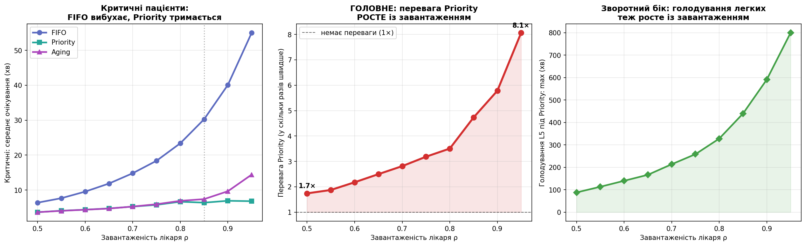

# Фаза 10. Чутливість до навантаження (sweep ρ)

> Розділ 11 · [↑ Зміст документації](README.md) · [↑ Головний README](../README.md)

[← Фаза 9. Монте-Карло: наскільки надійні числа](10-monte-carlo.md)    [Фаза 11. Метрика шкоди: від хвилин до життів →](12-harm-metric.md)

---

## Фаза 10: Чутливість до навантаження (sweep по ρ)


### Довідка: що означає "sweep по ρ"

**"Sweep"** (англ. "проходити, обводити") — це техніка, коли ми **систематично змінюємо один параметр** по всьому діапазону, крок за кроком, і на кожному значенні запускаємо експеримент, щоб побачити, **як змінюється результат**. Замість одного значення — "проходимось" по багатьох, від мінімуму до максимуму.

**Аналогія:** уявіть, що повільно крутите ручку гучності від 1 до 10 і на кожній позначці слухаєте, як звучить. Це sweep по гучності — ви "розгортаєте" весь діапазон, а не тестуєте одну позицію.

Термін поширений усюди: parameter sweep у симуляціях, frequency sweep в електроніці, hyperparameter sweep у машинному навчанні. Суть скрізь одна — **варіювати параметр і дивитись на залежність**.

### Що таке ρ (ро)

**ρ** — грецька літера "ро", стандартне позначення в **теорії черг** для **завантаженості** (частки часу, коли сервер — у нас лікар — зайнятий):
```
ρ = arrival_rate × avg_service
```
- ρ = 0.5 → лікар зайнятий половину часу (черги майже нема),
- ρ = 0.85 → зайнятий 85% часу (черга утворюється — наша робоча точка),
- ρ = 0.95 → майже завжди зайнятий (черги довгі),
- ρ ≥ 1 → перевантаження (черга росте нескінченно).

### "Sweep по ρ" разом

Отже, **"sweep по ρ"** = "**розгортка по завантаженості**" = систематично перебрати ρ від 0.5 до 0.95 (з кроком 0.05) і на **кожному** значенні прогнати симуляцію, щоб побудувати графік "результат **залежно від** навантаження".

```python
rho_values = np.arange(0.50, 0.96, 0.05)   # значення для перебору
for rho in rho_values:                      # "проходимось" по кожному
    arrival_rate = rho / avg_service         # налаштовуємо систему під це ρ
    # ... прогнати симуляцію, зібрати результат
```

**Навіщо це корисно.** Один прогін (при ρ=0.85) дає **одну точку**. Sweep дає **всю криву** — як результат залежить від навантаження загалом. Це переводить висновок з "при наших умовах вийшло X" на "**ось загальна закономірність**: чим завантаженіша система, тим більша перевага Priority". Друге — набагато сильніше твердження.

| Термін | Значення |
|---|---|
| **sweep** | систематично перебрати параметр по діапазону й дивитись на залежність |
| **ρ** | завантаженість лікаря (частка часу, коли він зайнятий) |
| **sweep по ρ** | прогнати симуляцію для багатьох рівнів навантаження, щоб побачити залежність результату від завантаженості |

### Питання

Досі ми працювали при одному навантаженні (ρ=0.85). Але цікаве питання: **як змінюється перевага Priority залежно від завантаженості лікаря?** Щоб задати потрібне ρ, обчислюємо `arrival_rate = ρ / avg_service`.

**Гіпотеза:** при малому навантаженні (ρ=0.5) черги майже немає, тому FIFO і Priority дадуть схожий результат. Що вище навантаження — то довша черга — то більше Priority має переставляти, отже й більша його перевага. Перевіримо, прогнавши симуляцію для ρ від 0.5 до 0.95 (по 40 прогонів на кожне значення для надійності).

```python
# Sweep: проганяємо симуляцію для різних рівнів навантаження ρ
avg_service = sum({1:0.05,2:0.15,3:0.35,4:0.30,5:0.15}[s] * {1:25,2:18,3:12,4:8,5:5}[s]
                  for s in range(1, 6))   # ≈ 11.3 хв

rho_values = np.arange(0.50, 0.96, 0.05)
SEEDS_PER_RHO = 40

data = {'rho': [], 'fifo_L1': [], 'prio_L1': [], 'aging_L1': [], 'prio_L5max': [], 'speedup': []}

for rho in rho_values:
    arrival_rate = rho / avg_service          # підбираємо частоту під потрібне ρ
    f1, p1, a1, p5 = [], [], [], []
    for seed in range(SEEDS_PER_RHO):
        pts = generate_patients(n=180, arrival_rate=arrival_rate, seed=seed)
        mf = metrics_by_severity(simulate(copy.deepcopy(pts), 'fifo'))
        mp = metrics_by_severity(simulate(copy.deepcopy(pts), 'priority'))
        ma = metrics_by_severity(simulate_aging(copy.deepcopy(pts), 45))
        if 1 not in mf or 1 not in mp or 5 not in mp or mp[1]['avg'] < 0.3:
            continue
        f1.append(mf[1]['avg']); p1.append(mp[1]['avg'])
        a1.append(ma[1]['avg'] if 1 in ma else mp[1]['avg'])
        p5.append(mp[5]['max'])
    data['rho'].append(rho)
    data['fifo_L1'].append(np.mean(f1)); data['prio_L1'].append(np.mean(p1))
    data['aging_L1'].append(np.mean(a1)); data['prio_L5max'].append(np.mean(p5))
    data['speedup'].append(np.mean(f1) / np.mean(p1))

print(f"{'ρ':>5}{'FIFO крит':>11}{'Prio крит':>11}{'прискор.':>10}{'Prio L5 max':>13}")
print("-" * 50)
for i in range(len(data['rho'])):
    print(f"{data['rho'][i]:>5.2f}{data['fifo_L1'][i]:>11.1f}{data['prio_L1'][i]:>11.1f}"
          f"{data['speedup'][i]:>9.1f}×{data['prio_L5max'][i]:>13.0f}")
```


**Результат:**

```
    ρ  FIFO крит  Prio крит  прискор.  Prio L5 max
--------------------------------------------------
 0.50        6.4        3.7      1.7×           88
 0.55        7.7        4.1      1.9×          113
 0.60        9.6        4.4      2.2×          140
 0.65       11.9        4.8      2.5×          167
 0.70       14.8        5.3      2.8×          214
 0.75       18.4        5.8      3.2×          259
 0.80       23.4        6.7      3.5×          328
 0.85       30.3        6.4      4.7×          440
 0.90       40.1        6.9      5.8×          591
 0.95       55.0        6.8      8.1×          800
```

### Що показує таблиця

| ρ | FIFO критичні | Priority критичні | Прискорення |
|---|---|---|---|
| 0.50 | 6.4 хв | 3.7 хв | **1.7×** |
| 0.85 | 30.3 хв | 6.4 хв | **4.7×** |
| 0.95 | 55.0 хв | 6.8 хв | **8.1×** |

Дві речі впадають в око:
1. **FIFO критичні вибухають** із навантаженням: 6 → 55 хв (у 9 разів!).
2. **Priority критичні майже не змінюються**: 3.7 → 6.8 хв (тримається стабільно низько).

Саме тому **прискорення росте** — чисельник (FIFO) злітає, а знаменник (Priority) лишається пласким.

```python
rho = data['rho']
fig, axes = plt.subplots(1, 3, figsize=(17, 5.3))

# Панель 1: критичне очікування за навантаженням
ax = axes[0]
ax.plot(rho, data['fifo_L1'], 'o-', color='#5c6bc0', lw=2.5, ms=7, label='FIFO')
ax.plot(rho, data['prio_L1'], 's-', color='#26a69a', lw=2.5, ms=7, label='Priority')
ax.plot(rho, data['aging_L1'], '^-', color='#ab47bc', lw=2.5, ms=7, label='Aging')
ax.set_xlabel('Завантаженість лікаря ρ')
ax.set_ylabel('Критичні: середнє очікування (хв)')
ax.set_title('Критичні пацієнти:\nFIFO вибухає, Priority тримається', fontweight='bold')
ax.legend(); ax.grid(alpha=0.3)
ax.axvline(0.85, color='gray', ls=':', alpha=0.6)

# Панель 2: перевага Priority за навантаженням (головний графік)
ax = axes[1]
ax.plot(rho, data['speedup'], 'o-', color='#d32f2f', lw=3, ms=8)
ax.fill_between(rho, 1, data['speedup'], alpha=0.12, color='#d32f2f')
ax.axhline(1, color='black', ls='--', lw=1, alpha=0.6, label='немає переваги (1×)')
ax.set_xlabel('Завантаженість лікаря ρ')
ax.set_ylabel('Перевага Priority (у скільки разів швидше)')
ax.set_title('ГОЛОВНЕ: перевага Priority\nРОСТЕ із завантаженням', fontweight='bold')
ax.legend(loc='upper left'); ax.grid(alpha=0.3)
for x, y in [(rho[0], data['speedup'][0]), (rho[-1], data['speedup'][-1])]:
    ax.annotate(f'{y:.1f}×', xy=(x, y), xytext=(0, 8), textcoords='offset points',
                ha='center', fontweight='bold', fontsize=10)

# Панель 3: голодування легких теж росте
ax = axes[2]
ax.plot(rho, data['prio_L5max'], 'D-', color='#43a047', lw=2.5, ms=7)
ax.fill_between(rho, 0, data['prio_L5max'], alpha=0.12, color='#43a047')
ax.set_xlabel('Завантаженість лікаря ρ')
ax.set_ylabel('Голодування L5 під Priority: max (хв)')
ax.set_title('Зворотний бік: голодування легких\nтеж росте із завантаженням', fontweight='bold')
ax.grid(alpha=0.3)

plt.tight_layout()
plt.show()
```


**Результат:**



### Розбір графіків чутливості до навантаження

Ми прогнали симуляцію для різних рівнів **завантаженості лікаря ρ** (від 0.5 — напіввільний, до 0.95 — майже перевантажений) і подивились, як змінюється поведінка дисциплін. По горизонталі скрізь — **ρ** (частка часу, коли лікар зайнятий).

### Панель 1: Критичні — FIFO вибухає, Priority тримається

По вертикалі — середнє очікування **критичних (L1)**.

- 🔵 **FIFO круто злітає** (6 → 55 хв). Що завантаженіший лікар — то **довша черга**. FIFO обслуговує строго за порядком, тож критичний (прибуває у випадковий момент) застряє **за всіма**, хто прийшов раніше. Довша черга → довше чекає.
- 🟢 **Priority майже плаский** (3.7 → 6.8 хв). Priority **завжди ставить критичного на початок**, незалежно від довжини черги. Хоч 5 людей, хоч 50 — критичний наступний. Тому навантаження майже не впливає.
- 🟣 **Aging тримається низько, під кінець трохи росте** (до ~14 хв). При дуже високому навантаженні накопичується багато легких, що чекали довго; "дорослішання" інколи пропускає їх вперед, трохи затримуючи критичного. Це свідома плата Aging за справедливість.

Пунктирна вертикальна лінія на ρ=0.85 — робоча точка з основного дослідження.

### Панель 2: ГОЛОВНЕ — перевага Priority росте із завантаженням

По вертикалі — **у скільки разів Priority швидший за FIFO** для критичних (це FIFO ÷ Priority з Панелі 1).

Червона лінія росте від **1.7× при ρ=0.5** до **8.1× при ρ=0.95**. Чорна пунктирна знизу (1×) — рівень "немає різниці".

**Чому росте?** Прямий наслідок Панелі 1: чисельник (FIFO) **вибухає**, а знаменник (Priority) **стоїть на місці**. Ділення великого на стале → результат росте.

**Неочевидний висновок (головна теза):**
> Priority потрібен **тим більше, чим завантаженіша система.** При вільному лікарі (ρ=0.5) FIFO і Priority майже однакові — черги немає, нема чого переставляти. Але в години пік (ρ=0.95) Priority стає **критично важливим**: різниця між 7 і 55 хвилинами для критичного може бути різницею між життям і смертю.

### Панель 3: Зворотний бік — голодування легких теж росте

По вертикалі — **максимальне очікування легких (L5) під Priority** (голодування).

Зелена лінія росте від ~88 до ~800 хв. **Чому?** Чим вище навантаження — тим більше тяжких прибуває, тим частіше вони обганяють легких. При ρ=0.95 легкий може застрягти майже на **13 годин**.

**Що це означає:** компроміс Priority **загострюється** з навантаженням — і вигода (швидші критичні), і шкода (голодування легких) ростуть разом. Це ще один аргумент за **Aging** у завантажених системах: він дає вигоду без катастрофічного голодування.

### Велика картина — головний інсайт

| Панель | Що показує |
|---|---|
| 1 | FIFO робить критичних усе повільнішими з навантаженням; Priority/Aging тримають їх швидкими |
| 2 | перевага Priority **росте** з навантаженням (1.7× → 8×) |
| 3 | але й голодування легких під Priority **росте** з навантаженням |

**Ключова ідея:** дисципліна черги **майже не важлива при малому навантаженні** (черги немає — всі рівні), але стає **вирішальною при високому**. Саме в години пік FIFO стає небезпечним, а Priority/Aging рятують. Це відповідь на питання **"коли саме потрібні пріоритетні черги?"** — коли система завантажена.

### Висновки Фази 10

1. **Перевага Priority не стала, а залежить від навантаження** — від ~1.7× (вільна система) до ~8× (перевантажена).
2. **При низькому навантаженні дисципліна черги майже не важлива** — черги немає, всі швидко проходять.
3. **При високому навантаженні вибір дисципліни — критичний** — саме тоді FIFO стає небезпечним для критичних, а Priority/Aging рятують.
4. **Компроміс загострюється з навантаженням:** і вигода (швидші критичні), і шкода (голодування легких) ростуть разом.

**Практичний сенс:** невелика клініка з малим потоком може дозволити собі просту FIFO. Завантаженому міському приймальному відділенню Priority (а краще Aging) — життєво необхідні.


---

[← Фаза 9. Монте-Карло: наскільки надійні числа](10-monte-carlo.md)    [Фаза 11. Метрика шкоди: від хвилин до життів →](12-harm-metric.md)
