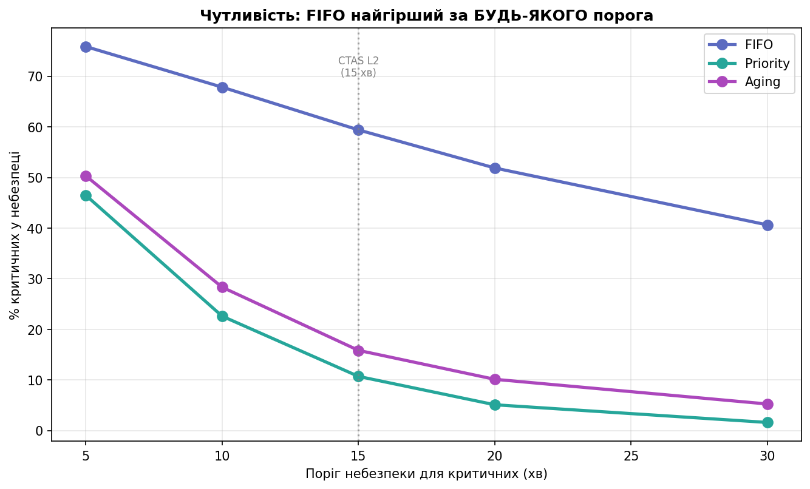
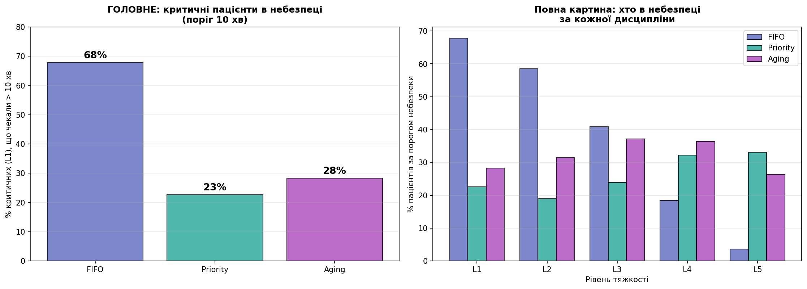

# Фаза 11. Метрика шкоди: від хвилин до життів

> Розділ 13 · [↑ Зміст документації](README.md) · [↑ Головний README](../README.md)

[← Фаза 10. Чутливість до навантаження (sweep ρ)](12-load-sensitivity.md)    [Фаза 12. Reneging: пацієнти йдуть, не дочекавшись (LWBS) →](14-reneging-lwbs.md)

---

## Фаза 11: Метрика шкоди — від хвилин до життів

### Чому хвилини — недостатня метрика

Досі ми міряли очікування **у хвилинах**. Але хвилини — лише проксі. Реальна ставка інша: критичний пацієнт, що чекає 80 хв, може **померти**; легкий, що чекає 300 хв, просто роздратований. Наша модель ставиться до цих хвилин однаково — а це неправильно.

### Поріг небезпеки — на основі реального стандарту CTAS

Пороги небезпеки взято з **Канадської шкали тріажу (CTAS)** — реальної системи з офіційними цільовими часами "до огляду лікарем":

| Рівень | Поріг (хв) | Джерело (CTAS) |
|---|---|---|
| L1 Критичний | 10 | "негайно" (операціоналізуємо як 10 хв, бо 0 недосяжний) |
| L2 Невідкладний | 15 | 15 хв |
| L3 Терміновий | 30 | 30 хв |
| L4 Менш терміновий | 60 | 60 хв |
| L5 Нетерміновий | 120 | 120 хв |

> Джерело: Canadian Triage and Acuity Scale (CTAS), National Guidelines. Цільові часи: L1 — негайно, L2 — 15 хв, L3 — 30 хв, L4 — 60 хв, L5 — 120 хв.

**Важлива примітка:** наші розділи згадують шкалу ESI, але ESI **не встановлює** фіксованих часових лімітів для рівнів 3–5 — їх має саме CTAS. Нумерація в обох однакова (1 = найтяжчий), тож напрямок збігається; для часових порогів коректно посилатися на CTAS.

Пороги — це **клінічне рішення**. Нижче (аналіз чутливості, графік [`20_harm_threshold_sensitivity.png`](../figures/20_harm_threshold_sensitivity.png)) ми покажемо, що головний висновок **не залежить** від конкретного вибору.

Тепер питання не "скільки хвилин у середньому", а **"скільки пацієнтів перетнули межу небезпеки"** — тобто скільки життів під загрозою. Пороги — це **клінічне/політичне рішення** (як і поріг aging); інші значення дадуть інші числа, але ранжування дисциплін стійке.

```python
# Пороги небезпеки на основі CTAS (L1 "негайно" → 10 хв як практичний проксі)
DANGER = {1: 10, 2: 15, 3: 30, 4: 60, 5: 120}

def count_in_danger(served):
    """Скільки пацієнтів кожного рівня перевищили свій поріг небезпеки."""
    danger = {severity: 0 for severity in range(1, 6)}
    total  = {severity: 0 for severity in range(1, 6)}
    for patient in served:
        total[patient.severity] += 1
        if patient.wait_time > DANGER[patient.severity]:
            danger[patient.severity] += 1
    return danger, total

N = 300
acc = {disc: {severity: {'danger': [], 'total': []} for severity in range(1, 6)} for disc in ['fifo','priority','aging']}
for seed in range(N):
    pts = generate_patients(seed=seed)
    for disc, served in [('fifo',     simulate(copy.deepcopy(pts), 'fifo')),
                         ('priority', simulate(copy.deepcopy(pts), 'priority')),
                         ('aging',    simulate_aging(copy.deepcopy(pts), 45))]:
        danger_counts, total_counts = count_in_danger(served)
        for severity in range(1, 6):
            acc[disc][severity]['danger'].append(danger_counts[severity]); acc[disc][severity]['total'].append(total_counts[severity])

print("КРИТИЧНІ (L1), що перевищили поріг 10 хв — у середньому на прогін:\n")
for disc in ['fifo','priority','aging']:
    ad = np.mean(acc[disc][1]['danger']); at = np.mean(acc[disc][1]['total'])
    print(f"  {disc:<10}: {ad:.1f} з {at:.1f} критичних у небезпеці  ({100*ad/at:.0f}%)")

print("\nЧастка в небезпеці за рівнями (%) — CTAS-пороги:")
print(f"{'Рівень':<8}{'FIFO':>8}{'Priority':>10}{'Aging':>8}")
for severity in range(1, 6):
    rates = [100*np.sum(acc[disc][severity]['danger'])/np.sum(acc[disc][severity]['total']) for disc in ['fifo','priority','aging']]
    print(f"L{severity:<7}{rates[0]:>7.0f}%{rates[1]:>9.0f}%{rates[2]:>7.0f}%")
```


**Результат:**

```
КРИТИЧНІ (L1), що перевищили поріг 10 хв — у середньому на прогін:

  fifo      : 5.9 з 8.7 критичних у небезпеці  (68%)
  priority  : 2.0 з 8.7 критичних у небезпеці  (23%)
  aging     : 2.5 з 8.7 критичних у небезпеці  (28%)

Частка в небезпеці за рівнями (%) — CTAS-пороги:
Рівень      FIFO  Priority   Aging
L1           68%       23%     28%
L2           59%       19%     32%
L3           41%       24%     37%
L4           18%       32%     36%
L5            4%       33%     26%
```

### Результати (CTAS-пороги)

**Критичні (L1) у небезпеці:** FIFO **68%**, Priority **23%**, Aging **28%** — той самий разючий розрив (поріг L1 = 10 хв незмінний).

**Повна картина за рівнями:**

| Рівень | FIFO | Priority | Aging |
|---|---|---|---|
| L1 Критичний | 68% | 23% | 28% |
| L2 Невідкладний | 59% | 19% | 32% |
| L3 Терміновий | 41% | 24% | 37% |
| L4 Менш терм. | 18% | 32% | 36% |
| L5 Нетерміновий | 4% | 33% | 26% |

**Як читати (важливий нюанс):** "у небезпеці" означає різне для різних рівнів. Для **L1 це загроза життю**, для L5 — радше незручність. Тому головний меседж — про **критичних (L1)**: під FIFO 68% критичних у небезпеці, під Priority — 23%.

За суворішими CTAS-порогами видно й фундаментальний компроміс: FIFO зберігає легких (L5: лише 4%), але прирікає тяжких (L1: 68%); Priority навпаки. Aging — посередині скрізь, без катастрофи в жодній групі, але й не найкращий ніде.

```python
# Чи залежить висновок від вибору порога для критичних?
thresholds = [5, 10, 15, 20, 30]
sims = {'fifo': lambda patient: simulate(patient, 'fifo'),
        'priority': lambda patient: simulate(patient, 'priority'),
        'aging': lambda patient: simulate_aging(patient, 45)}
C = {'fifo':'#5c6bc0', 'priority':'#26a69a', 'aging':'#ab47bc'}
L = {'fifo':'FIFO', 'priority':'Priority', 'aging':'Aging'}

# кешуємо обслужених, щоб не ганяти симуляцію для кожного порога заново
served_cache = {disc: [sims[disc](copy.deepcopy(generate_patients(seed=seed))) for seed in range(300)]
                for disc in sims}

sens = {disc: [] for disc in sims}
for thr in thresholds:
    for disc in sims:
        dt = ct = 0
        for served in served_cache[disc]:
            for patient in served:
                if patient.severity == 1:
                    ct += 1
                    if patient.wait_time > thr:
                        dt += 1
        sens[disc].append(100 * dt / ct)

fig, ax = plt.subplots(figsize=(9, 5.5))
for disc in ['fifo','priority','aging']:
    ax.plot(thresholds, sens[disc], 'o-', color=C[disc], lw=2.5, ms=8, label=L[disc])
ax.axvline(15, color='gray', ls=':', alpha=0.7)
ax.annotate('CTAS L2\n(15 хв)', xy=(15, 70), fontsize=8, color='gray', ha='center')
ax.set_xlabel('Поріг небезпеки для критичних (хв)')
ax.set_ylabel('% критичних у небезпеці')
ax.set_title('Чутливість: FIFO найгірший за БУДЬ-ЯКОГО порога', fontweight='bold')
ax.legend(); ax.grid(alpha=0.3)
plt.tight_layout()
plt.show()
```


**Результат:**

```
<Figure size 990x605 with 1 Axes>
```




### Чому це знімає питання "а ви не підібрали пороги?"

Графік показує % критичних у небезпеці за різних порогів (5–30 хв):

| Поріг | FIFO | Priority | Aging |
|---|---|---|---|
| 5 хв | 76% | 46% | 50% |
| 10 хв | 68% | 23% | 28% |
| 15 хв (CTAS) | 59% | 11% | 16% |
| 20 хв | 52% | 5% | 10% |
| 30 хв | 41% | 2% | 5% |

**За будь-якого розумного порога FIFO у 2–5 разів небезпечніший за Priority.** Конкретний відсоток залежить від порога, але **якісний висновок стійкий** — синя лінія (FIFO) завжди вгорі. Це доводить, що результат не є артефактом "зручно підібраного" числа.

Цікаво: при реальному CTAS-порозі 15 хв розрив **ще драматичніший** — 59% проти 11% (у 5 разів). Тобто наш базовий поріг 10 хв дає навіть **консервативну** оцінку.

### Розбір графіка чутливості

Це **аналіз чутливості** — він відповідає на скептичне питання: *"А ви не підібрали поріг 10 хв спеціально, щоб FIFO виглядав погано?"*

Щоб це спростувати, ми перебрали **різні пороги** небезпеки для критичних (від 5 до 30 хв) і подивились, чи змінюється висновок.

- по горизонталі — **поріг небезпеки** (скільки максимум критичний може чекати, щоб не бути "в небезпеці"),
- по вертикалі — **% критичних, що перевищили цей поріг**,
- три лінії — FIFO, Priority, Aging,
- сіра пунктирна на 15 хв — реальний стандарт CTAS (рівень L2).

### Як читати: чому всі лінії спадають

Усі три лінії йдуть **униз** зліва направо. Це механічно: що **м'якший** поріг (30 хв замість 5), то **менше** пацієнтів його перевищують, отже менший і "% у небезпеці". Рухаючись вправо, ми просто послаблюємо означення "небезпеки".

Це **не** головне. Головне — **взаємне розташування** ліній.

### Головне: FIFO завжди вгорі

За **будь-якого** порога синя лінія (FIFO) — **найвища**, тобто найбільше критичних у небезпеці. Priority і Aging завжди далеко внизу. Ранжування **ніколи не змінюється**:

| Поріг | FIFO | Priority | Розрив |
|---|---|---|---|
| 5 хв | 76% | 46% | 1.7× |
| 10 хв | 68% | 23% | 3× |
| 15 хв (CTAS) | 59% | 11% | 5× |
| 20 хв | 52% | 5% | 10× |
| 30 хв | 41% | 2% | 20× |

**Суть графіка:** хоч би який поріг ви обрали, FIFO завжди небезпечніший для критичних. Висновок **не залежить** від конкретного числа.

### Цікаво: розрив РОСТЕ з послабленням порога

Кратність (остання колонка) зростає від 1.7× при 5 хв до **20× при 30 хв**. Чому?

- При **суворому** порозі (5 хв) навіть Priority часто не встигає (46% у небезпеці) — критичний міг прибути, коли лікар у розпалі іншої операції. Розрив малий.
- При **м'якому** порозі (30 хв) Priority майже завжди встигає (лише 2%), а FIFO усе одно провалюється (41%) — у довгій черзі критичний застрягає надовго. Розрив величезний.

Чим більше "запасу часу" ми даємо, тим очевидніша перевага Priority: вона цей запас використовує, а FIFO — ні.

### Стандарт CTAS і що доводить графік

Пунктирна лінія на 15 хв позначає реальну клінічну ціль (CTAS: рівень L2 — огляд за 15 хв). Саме в цій, **науково обґрунтованій** точці: FIFO 59% проти Priority 11% — розрив у **5 разів**. Це робить базовий поріг 10 хв навіть **консервативним**.

| Питання | Відповідь графіка |
|---|---|
| Чи залежить висновок від вибору порога? | **Ні** — FIFO найгірший за будь-якого |
| Чи не підібрано поріг спеціально? | Ні — перевірено 5 порогів, ранжування стійке |
| Що при реальному стандарті (CTAS 15 хв)? | Розрив навіть більший (5×) |

**Підсумок:** цей графік не дає нового числа — він **захищає** головний результат від критики: висновок "FIFO небезпечний для критичних" не є артефактом зручно обраного порога, він тримається для всього розумного діапазону.

```python
D = {'fifo':'#5c6bc0','priority':'#26a69a','aging':'#ab47bc'}
DL = {'fifo':'FIFO','priority':'Priority','aging':'Aging'}
frac = {disc: [100*np.sum(acc[disc][severity]['danger'])/np.sum(acc[disc][severity]['total']) for severity in range(1,6)]
        for disc in ['fifo','priority','aging']}
discs = ['fifo','priority','aging']

fig, axes = plt.subplots(1, 2, figsize=(15, 5.5))

# Панель 1: критичні в небезпеці (головне)
ax = axes[0]
crit = [frac[disc][0] for disc in discs]
bars = ax.bar([DL[disc] for disc in discs], crit, color=[D[disc] for disc in discs], alpha=0.8, edgecolor='black')
for b, v in zip(bars, crit):
    ax.text(b.get_x()+b.get_width()/2, v+1.5, f'{v:.0f}%', ha='center', fontweight='bold', fontsize=13)
ax.set_ylabel('% критичних (L1), що чекали > 10 хв')
ax.set_title('ГОЛОВНЕ: критичні пацієнти в небезпеці\n(поріг 10 хв)', fontweight='bold')
ax.set_ylim(0, 80); ax.grid(axis='y', alpha=0.3)

# Панель 2: усі рівні
ax = axes[1]
x = np.arange(5); w = 0.26
for j, disc in enumerate(discs):
    ax.bar(x+(j-1)*w, frac[disc], w, label=DL[disc], color=D[disc], alpha=0.8, edgecolor='black')
ax.set_xticks(x); ax.set_xticklabels(['L1','L2','L3','L4','L5'])
ax.set_ylabel('% пацієнтів за порогом небезпеки')
ax.set_xlabel('Рівень тяжкості')
ax.set_title('Повна картина: хто в небезпеці\nза кожної дисципліни', fontweight='bold')
ax.legend(); ax.grid(axis='y', alpha=0.3)

plt.tight_layout()
plt.show()
```


**Результат:**

```
<Figure size 1650x605 with 2 Axes>
```




### Як читати графіки та повна картина

**Панель 1 (головна).** Частка критичних, що перетнули поріг небезпеки 10 хв: FIFO **68%**, Priority **23%**, Aging **28%**. Висота стовпчика = частка життів під загрозою. FIFO втричі небезпечніший за Priority.

**Панель 2 (повна картина за рівнями).** Тут видно, що кожна дисципліна "переносить" небезпеку на різні групи:
- **FIFO** небезпечний для **тяжких** (L1: 68%, L2: 40%), але легкі (L4, L5) — у повній безпеці (0–3%).
- **Priority** захищає тяжких (L1: 23%), але створює небезпеку для **легких** (L5: 20% — через голодування!).
- **Aging** — **найрівніший профіль**: ніде немає катастрофи. Тяжких захищає майже як Priority (L1: 28%), а легких — майже як FIFO (L5: 2%).

**Ключовий інсайт:** небезпека нікуди не зникає — вона **перерозподіляється**. FIFO жертвує тяжкими, Priority — легкими, а Aging розподіляє ризик найрівніше.

### Розбір графіка метрики шкоди

Це **метрика шкоди**: не хвилини, а **частка пацієнтів, що перевищили поріг небезпеки** для свого рівня — тобто скільки людей чекали довше, ніж безпечно.

### Панель 1 (ліва): критичні в небезпеці

Три стовпчики — частка **критичних (L1)**, що чекали понад 10 хв:
- **FIFO: 68%** — майже двоє з трьох критичних у небезпеці!
- **Priority: 23%**
- **Aging: 28%**

Головний меседж: під звичайною чергою **68% критичних пацієнтів** чекають небезпечно довго. Priority знижує це **майже втричі**. Висота стовпчика = частка життів під загрозою.

### Панель 2 (права): повна картина за рівнями

Для кожного рівня тяжкості — % у небезпеці під трьома дисциплінами. Зверніть увагу на **патерн, що розвертається**:

| Рівень | FIFO | Priority | Aging |
|---|---|---|---|
| L1 Критичний | **68%** | 23% | 28% |
| L2 Невідкладний | **59%** | 19% | 32% |
| L3 Терміновий | 41% | 24% | 37% |
| L4 Менш терм. | 19% | 32% | 36% |
| L5 Нетерміновий | **4%** | 33% | 27% |

**Дивіться на сині стовпчики (FIFO):**
- для **тяжких** (L1, L2) вони **найвищі** — FIFO найнебезпечніший;
- для **легких** (L4, L5) вони **найнижчі** — FIFO найбезпечніший!

Priority/Aging — навпаки: захищають тяжких, але створюють небезпеку для легких. Десь біля L3 лінії **перетинаються**.

### Чому так — механізм

- **FIFO** обслуговує за порядком приходу. Легких багато, вони рівномірно "течуть" крізь чергу — тож майже ніхто не застрягає (L5: 4%). Але тяжкі стоять нарівні з усіма й застрягають (L1: 68%).
- **Priority** проштовхує тяжких уперед (L1: 23%), а легких відсуває — вони накопичуються й перевищують поріг (L5: 33%, голодування).
- **Aging** — посередині скрізь: тяжких захищає майже як Priority, легких рятує краще за Priority, але середні рівні (L2–L4) трохи "просідають".

### Найважливіше: хто в небезпеці важливіше за скільки

Легко зробити хибний висновок: "Priority має 33% L5 у небезпеці, а FIFO лише 4% — отже FIFO кращий для легких". Формально так. **Але це пастка.**

"У небезпеці" означає **різне** для різних рівнів:
- критичний (L1) у небезпеці = **можлива смерть**,
- легкий (L5) у небезпеці = чекав задовго, роздратований.

**FIFO кладе небезпеку саме на тих, хто найменше може її витримати** — на критичних. Priority/Aging переносять її на легких, де ціна помилки незрівнянно нижча. Тому **рахувати голови недостатньо — треба зважати на тяжкість**. 33% роздратованих легких — прийнятна ціна за порятунок критичних; 68% критичних у небезпеці — ні.

### Підсумок

| Панель | Що показує |
|---|---|
| Ліва (головна) | FIFO лишає 68% критичних у небезпеці; Priority — 23% (втричі менше) |
| Права (повна) | небезпека **перерозподіляється**: FIFO вантажить її на тяжких, Priority/Aging — на легких |

**Ключова думка:** небезпека не зникає — вона переноситься між групами. Питання не "скільки людей у небезпеці", а "**хто саме**". FIFO ставить під загрозу тих, для кого затримка смертельна. У цьому й полягає аргумент за пріоритетну чергу — не у швидкості, а в тому, що вона захищає **правильних** людей.

### Висновки Фази 11

1. **Найсильніший аргумент проти FIFO:** під ним **68% критичних** пацієнтів чекають небезпечно довго. Це не хвилини — це життя.
2. **Priority втричі знижує ризик для критичних** (68% → 23%), але ціною небезпеки для легких (голодування виштовхує 20% L5 за поріг).
3. **Aging — найбезпечніша дисципліна загалом:** найрівніший профіль шкоди, без катастрофи в жодній групі.
4. **Зміни дисципліни недостатньо для нуля ризику** — навіть Priority лишає 23% критичних у небезпеці. Потрібен і додатковий персонал.

**Для поста:** замість "у 5 разів швидше" сильніше звучить **"під звичайною чергою 2 з 3 критичних пацієнтів чекають небезпечно довго; пріоритетна черга знижує це втричі"**. Хвилини абстрактні — життя під загрозою ні.


---

[← Фаза 10. Чутливість до навантаження (sweep ρ)](12-load-sensitivity.md)    [Фаза 12. Reneging: пацієнти йдуть, не дочекавшись (LWBS) →](14-reneging-lwbs.md)
