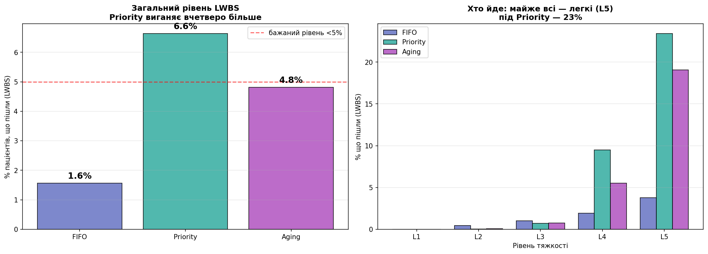

# Фаза 12. Reneging: пацієнти йдуть, не дочекавшись (LWBS)

> Розділ 13 · [↑ Зміст документації](README.md) · [↑ Головний README](../README.md)

[← Фаза 11. Метрика шкоди: від хвилин до життів](12-harm-metric.md)    [Фаза 13. Динамічна тяжкість: погіршення і смерть →](14-dynamic-severity.md)

---

## Фаза 12: Reneging — пацієнти йдуть, не дочекавшись (LWBS)

### Проблема "ідеально терплячих" пацієнтів

Досі наша модель припускала, що пацієнти чекають **скільки завгодно**. Реальність інша: люди йдуть, не дочекавшись — це метрика **LWBS** ("left without being seen", "пішли без огляду").

> **Примітка щодо реалізації.** `simulate_reneging` показано «розгорнуто». У пакеті цикл винесено в спільний драйвер `run_with_departures(patients, sort_key, review)`, де `review` відсіює тих, хто пішов; поведінка ідентична (`src/triage_sim/reneging.py`).

**Що каже реальність:**
- Загальний рівень LWBS у відділеннях — від ~2% до ~10%; бажаним вважається **нижче 5%**.
- Йдуть переважно **легкі**: у одному дослідженні дві третини тих, хто пішов, були найлегшого рівня (L5), і майже ніхто — критичного.
- Критична точка — **очікування понад 1–2 години**: після неї рівень LWBS різко зростає.
- **Це питання безпеки:** 1.3–7.3% тих, хто пішов, згодом потребували госпіталізації — тобто частина "легких" насправді була хворішою.

> Джерела: дослідження LWBS у відділеннях невідкладної допомоги (CTAS), 2011–2025.

**Гіпотеза:** під Priority легкі чекають найдовше → найбільше з них піде. Перевіримо — і побачимо ще один прихований бік пріоритетної черги.

### Ключові моменти, які треба врахувати

Перш ніж кодувати, зафіксуємо модельні рішення — у reneging вони неочевидні й сильно впливають на результат.

**1. Хто йде і коли — поріг терпіння залежить від тяжкості.** Критичні (L1) **ніколи** не йдуть. Легкі (L5) йдуть найчастіше. Тому поріг спадає з тяжкістю:

| Рівень | Середній поріг терпіння |
|---|---|
| L1 | ніколи (∞) |
| L2 | 240 хв |
| L3 | 180 хв |
| L4 | 150 хв |
| L5 | 120 хв (≈ реальні 2 год) |

**2. Випадковий, а не фіксований поріг.** Якби всі L5 йшли рівно на 120-й хвилині — нереалістично. Реальне терпіння **різне**, тому кожному пацієнту даємо **свій** поріг із розподілу навколо середнього для його рівня (нормальний, ±30%).

**3. Ефект "клапана" (найважливіше!).** Коли легкі йдуть, черга **коротшає** → менше затору → ті, хто лишився, обслуговуються **швидше**. Це означає, що **катастрофічне голодування (703 хв) зникає**: довгочекаючий L5 тепер **піде на ~120-й хвилині**, а не чекатиме півдня. Шкода трансформується з "чекав 703 хв" на "**пішов без допомоги**".

**4. Що міряємо:** рівень LWBS загалом, за рівнями, за дисциплінами; ефект клапана (max очікування обслужених).

**5. Етичний нюанс:** ми вважаємо тріаж ідеальним. Та в реальності частина тих, хто пішов, насправді потребувала допомоги — тож LWBS це не лише незручність, а **реальний ризик**.

```python
# Середній поріг терпіння (хв); L1 ніколи не йде
PATIENCE_MEAN = {1: None, 2: 240, 3: 180, 4: 150, 5: 120}

def assign_patience(patients, seed=0):
    """Кожному пацієнту — свій випадковий поріг терпіння (нормальний, ±30%)."""
    rng = np.random.default_rng(seed + 10000)   # окремий seed, щоб не корелювати з потоком
    for patient in patients:
        mean_patience = PATIENCE_MEAN[patient.severity]
        patient.patience = float('inf') if mean_patience is None else max(15.0, rng.normal(mean_patience, mean_patience * 0.3))
    return patients
```

`assign_patience` додає кожному пацієнту властивість `patient.patience` — його особистий поріг:
- `mean_patience = PATIENCE_MEAN[patient.severity]` — середнє для рівня цього пацієнта.
- `float('inf') if mean_patience is None` — для L1 терпіння = нескінченність (ніколи не піде).
- `rng.normal(mean_patience, mean_patience * 0.3)` — інакше випадкове число навколо `mean_patience` з розкидом ±30%.
- `max(15.0, ...)` — підлога 15 хв: ніхто не йде в перші 15 хвилин.

**Три "чому":**
1. **Випадковий поріг** — реалістично: у людей різне терпіння (комусь L5 випаде 90 хв, комусь 160).
2. **`+ 10000` у seed** — щоб генератор терпіння не корелював із генератором потоку пацієнтів.
3. **Підлога 15** — нормальний розподіл інколи дає малі чи від'ємні числа, а від'ємне терпіння безглузде.

```python
def simulate_reneging(patients, discipline, aging_thr=45):
    """Як simulate, але пацієнт іде (LWBS), якщо його поріг терпіння сплив до обслуговування."""
    arr = sorted(patients, key=lambda patient: patient.arrival_time)
    i = 0; waiting = []; now = 0.0; served = []; reneged = []
    while i < len(arr) or waiting:
        while i < len(arr) and arr[i].arrival_time <= now:
            waiting.append(arr[i]); i += 1
        if not waiting:
            now = arr[i].arrival_time; continue
        # хто пішов, не дочекавшись (поріг сплив до моменту, коли лікар звільнився)
        still = []
        for patient in waiting:
            if patient.arrival_time + patient.patience <= now:
                patient.leave_time = patient.arrival_time + patient.patience; reneged.append(patient)
            else:
                still.append(patient)
        waiting = still
        if not waiting:
            if i < len(arr): now = arr[i].arrival_time; continue
            else: break
        # обираємо за дисципліною
        if discipline == 'priority':   waiting.sort(key=lambda patient: (patient.severity, patient.arrival_time))
        elif discipline == 'fifo':     waiting.sort(key=lambda patient: patient.arrival_time)
        else:                          waiting.sort(key=lambda patient: (patient.severity - (now - patient.arrival_time)/aging_thr, patient.arrival_time))
        patient = waiting.pop(0); patient.start_time = now; now += patient.service_duration; served.append(patient)
    return served, reneged
```

**симуляція з виходом із черги.** Це той самий `simulate`, плюс **блок "хто пішов"**. Ось він — ключова новинка:

```python
still = []
for patient in waiting:
    if patient.arrival_time + patient.patience <= now:
        patient.leave_time = patient.arrival_time + patient.patience; reneged.append(patient)
    else:
        still.append(patient)
waiting = still
```

Перед тим як обрати наступного пацієнта, перевіряємо кожного в залі:
- `patient.arrival_time + patient.patience` — момент, коли пацієнт **піде** (прибув + скільки готовий чекати).
- Якщо цей момент `<= now` (настав **раніше**, ніж лікар звільнився) → пацієнт **уже пішов**: у `reneged`.
- Інакше **ще чекає** → лишається в `still`.

Решта циклу — як у звичайному `simulate`: додати прибулих, відсортувати за дисципліною, взяти першого, обслужити. Наприкінці повертаємо **два** списки: `served` (обслужені) і `reneged` (ті, що пішли).

### Конкретний приклад перевірки виходу

Пацієнт L5 прибув у **t=100**, терпіння **120 хв** → піде в **t=220**.

- Лікар звільнюється в **t=200**: `100 + 120 = 220 > 200` → пацієнт **ще чекає**, може бути обслужений.
- Лікар зайнятий аж до **t=250**: `100 + 120 = 220 <= 250` → пацієнт **уже пішов** у t=220 → в `reneged`.

Саме так під Priority легкі "вимиваються": лікар довго зайнятий тяжкими, поріг легкого спливає — і той іде.

### Чому список, а не купа

Тут `waiting` — звичайний **список** (як в Aging), а не купа. Бо щокроку треба **перебрати всіх** і викинути тих, хто пішов. Купа дає швидкий доступ лише до кореня, а видаляти з її середини незручно. Список легко відфільтрувати (`still`).

### Підсумок

| Частина | Що робить | Навіщо |
|---|---|---|
| `PATIENCE_MEAN` | середнє терпіння за рівнями | задає, хто скільки готовий чекати |
| `assign_patience` | роздає кожному випадковий поріг | реалістичний розкид терпіння |
| `simulate_reneging` | симуляція + блок "хто пішов" | моделює реальний вихід із черги (LWBS) |

**Суть:** на кожному кроці, перед вибором наступного пацієнта, код перевіряє, чи не сплив у когось поріг терпіння. Хто не дочекався — іде в `reneged` замість `served`. Це й перетворює абстрактне "довго чекав" на реальне "пішов без допомоги".

```python
N = 300
lwbs    = {disc: {severity: {'left':0,'total':0} for severity in range(1,6)} for disc in ['fifo','priority','aging']}
overall = {disc: {'left':0,'total':0} for disc in ['fifo','priority','aging']}

for seed in range(N):
    base = generate_patients(seed=seed)
    for disc in ['fifo','priority','aging']:
        pts = assign_patience(copy.deepcopy(base), seed=seed)
        served, reneged = simulate_reneging(pts, disc)
        for patient in served:
            overall[disc]['total'] += 1; lwbs[disc][patient.severity]['total'] += 1
        for patient in reneged:
            overall[disc]['total'] += 1; overall[disc]['left'] += 1
            lwbs[disc][patient.severity]['total'] += 1; lwbs[disc][patient.severity]['left'] += 1

print("Загальний рівень LWBS:")
for disc in ['fifo','priority','aging']:
    disc_overall = overall[disc]; print(f"  {disc:<10}: {100*disc_overall['left']/disc_overall['total']:.1f}%")

print("\nРівень LWBS за рівнями тяжкості (%):")
print(f"{'Рівень':<7}{'FIFO':>8}{'Priority':>10}{'Aging':>8}")
for severity in range(1,6):
    rates = [100*lwbs[disc][severity]['left']/lwbs[disc][severity]['total'] if lwbs[disc][severity]['total'] else 0 for disc in ['fifo','priority','aging']]
    print(f"L{severity:<6}{rates[0]:>7.1f}%{rates[1]:>9.1f}%{rates[2]:>7.1f}%")
```


**Результат:**

```
Загальний рівень LWBS:
  fifo      : 1.6%
  priority  : 6.6%
  aging     : 4.8%

Рівень LWBS за рівнями тяжкості (%):
Рівень     FIFO  Priority   Aging
L1         0.0%      0.0%    0.0%
L2         0.4%      0.0%    0.1%
L3         1.0%      0.7%    0.8%
L4         1.9%      9.5%    5.5%
L5         3.8%     23.4%   19.1%
```

### Розбір коду Монте-Карло LWBS

**Мета:** прогнати симуляцію з reneging 300 разів і порахувати, **яка частка пацієнтів пішла** — загалом і за кожним рівнем тяжкості.

**Частина 1 — акумулятори (вкладені словники):**
```python
N = 300
lwbs    = {disc: {severity: {'left':0,'total':0} for severity in range(1,6)} for disc in ['fifo','priority','aging']}
overall = {disc: {'left':0,'total':0} for disc in ['fifo','priority','aging']}
```
- `overall` — простий словник "дисципліна → {скільки пішло, скільки всього}".
- `lwbs` — **трирівневий** словник. Зсередини назовні: `{'left':0,'total':0}` (два лічильники) → по набору на кожен рівень L1–L5 → і так для кожної дисципліни.

Наприклад, `lwbs['priority'][5]['left']` = скільки L5 пішло під Priority (за всі прогони). Усе стартує з 0.

**Частина 2 — головний цикл:**
```python
for seed in range(N):
    base = generate_patients(seed=seed)
    for disc in ['fifo','priority','aging']:
        pts = assign_patience(copy.deepcopy(base), seed=seed)
        served, reneged = simulate_reneging(pts, disc)
```
- Зовнішній цикл: 300 разів, кожен seed дає **інший** набір пацієнтів.
- Внутрішній: ті самі пацієнти через **три дисципліни**.
- `copy.deepcopy(base)` — свіжа копія для кожної дисципліни (щоб одна не псувала дані іншій).
- `assign_patience(..., seed=seed)` — **той самий seed** означає, що один пацієнт має **однаковий** поріг терпіння у всіх трьох дисциплінах → чесне порівняння.
- `simulate_reneging` → повертає `served` (обслужені) і `reneged` (ті, що пішли).


**Частина 3 — підрахунок (найважливіше):**
```python
for patient in served:
    overall[disc]['total'] += 1; lwbs[disc][patient.severity]['total'] += 1
for patient in reneged:
    overall[disc]['total'] += 1; overall[disc]['left'] += 1
    lwbs[disc][patient.severity]['total'] += 1; lwbs[disc][patient.severity]['left'] += 1
```
- **Обслужені:** додаємо лише до `total` (вони пацієнти, але не пішли).
- **Ті, що пішли:** додаємо і до `total`, **і** до `left`.

**Ключова ідея:** `total` = **усі** пацієнти (обслужені + ті, що пішли), `left` = тільки ті, що пішли. Тому рівень LWBS = `left / total`. Обслужених теж рахуємо в `total`, бо рівень виходу — частка від **усіх**, а не лише від тих, хто пішов.


**Частини 4–5 — виведення:**
```python
# загальний рівень
print(f"  {disc:<10}: {100*disc_overall['left']/disc_overall['total']:.1f}%")
# за рівнями (з захистом від ділення на 0)
rates = [100*lwbs[disc][severity]['left']/lwbs[disc][severity]['total'] if lwbs[disc][severity]['total'] else 0
     for disc in ['fifo','priority','aging']]
```
- `100 * left/total` = відсоток тих, хто пішов.
- **Захист `if ... else 0`** — якщо пацієнтів цього рівня не було (`total == 0`), повертаємо 0 замість ділення на нуль.
- Формати: `:<10` — ліворуч на ширину 10; `:>7.1f` — праворуч на ширину 7, один знак після коми.


### Важливий нюанс: чому акумулюємо лічильники, а не середнє

Код **сумує** всі `left` і всі `total` за 300 прогонів і ділить **один раз** наприкінці — а не рахує відсоток у кожному прогоні й усереднює.

Чому так правильніше? Це дає **зважений** (об'єднаний) рівень: прогони з більшою кількістю пацієнтів вносять більший вклад, як і має бути. Якби ми усереднювали відсотки по прогонах, прогін зі 100 пацієнтами важив би стільки ж, скільки з 200, — що спотворило б результат. Накопичення сирих лічильників — коректний спосіб порахувати загальну частку.

### Результати: хто і скільки йде

**Головне** (числа — у таблиці результату вище):
- Під **FIFO** йде мало (1.6%) — черга рухається справедливо, легкі не застрягають.
- Під **Priority** йде вчетверо більше (6.6%), і майже всі — легкі: **23% L5 покидають лікарню без допомоги**. Це той самий прихований бік: priority не просто змушує легких чекати — вона **виганяє** їх.
- **Aging** — посередині (4.8%), помітно гуманніший за Priority до легких.
- **Критичні (L1) не йдуть ніде** (0%) — за нашим припущенням, вони надто хворі, щоб піти.

### Що таке ефект клапана (release valve)

Назва — з інженерії. **Запобіжний клапан** (як на скороварці чи паровому котлі) відкривається, коли тиск стає завеликим, і **випускає пар**, щоб котел не вибухнув. Тиск не накопичується нескінченно — клапан його скидає.

У нашій черзі роль клапана грає **reneging (вихід пацієнтів)**. "Тиск" — це довжина черги й час очікування. Коли вони стають завеликими, легкі пацієнти **йдуть** — і це "скидає тиск": черга коротшає.

### Як він працює — петля зворотного зв'язку

```
довге очікування → легкі йдуть → черга коротшає →
менше затору → ті, хто лишився, чекають менше
```

Це **самообмежувальна** петля. Найважливіший наслідок: час очікування **не може** перевищити поріг терпіння. Якщо L5 готовий чекати ~120 хв, він фізично не чекатиме 700 — піде на 120-й хвилині. Клапан **ставить стелю** на очікування тих, хто лишається.

**Без клапана (ідеально терплячі):** пацієнти чекають скільки завгодно. Найгірший L5 чекає 474 хв у середньому, аж до 1512 (25 годин!). Це "чисте" голодування — повна теоретична картина, але нереалістична.

**З клапаном (reneging):** легкі йдуть на ~120-й хвилині. Найгірший **обслужений** L5 чекає лише 117 хв (макс 186). Катастрофічні 700+ хв зникли — бо ті пацієнти **пішли**.


### Що він дає — головна думка

Тут пастка. Здається, ніби з клапаном стало **краще** (очікування впало з 474 до 117). Але **проблему не вирішено** — шкода просто **змінила форму**:

| | Без клапана | З клапаном |
|---|---|---|
| У статистиці очікування | "L5 чекав 703 хв" | "L5 чекав 117 хв" (наче гуманно) |
| Насправді | страждав, але дочекався | **пішов без допомоги** |
| Куди поділася шкода | видно в очікуванні | перейшла у LWBS |

**Ключова ідея:** клапан не усуває страждання — він **переносить** його з однієї метрики (довге очікування) в іншу (пішов без огляду). Якщо дивитися лише на час очікування обслужених, Priority здається "гуманнішим". Це **ілюзія**: довгочекаючі просто зникли зі статистики. Тому треба дивитися на **обидві** метрики разом.

```python
# Як reneging змінює max очікування ОБСЛУЖЕНИХ легких (Priority)
l5max_no, l5max_yes = [], []
for seed in range(N):
    base = generate_patients(seed=seed)
    # без reneging (нескінченне терпіння)
    pts = copy.deepcopy(base)
    for patient in pts: patient.patience = float('inf')
    s_no, _ = simulate_reneging(pts, 'priority')
    waits = [patient.wait_time for patient in s_no if patient.severity == 5]
    if waits: l5max_no.append(max(waits))
    # з reneging
    pts = assign_patience(copy.deepcopy(base), seed=seed)
    s_yes, _ = simulate_reneging(pts, 'priority')
    waits = [patient.wait_time for patient in s_yes if patient.severity == 5]
    if waits: l5max_yes.append(max(waits))

print("ЕФЕКТ КЛАПАНА (Priority, max очікування ОБСЛУЖЕНИХ L5):")
print(f"  без reneging (ідеально терплячі): {np.mean(l5max_no):.0f} хв (макс {np.max(l5max_no):.0f})")
print(f"  з reneging (йдуть за ~2 год):     {np.mean(l5max_yes):.0f} хв (макс {np.max(l5max_yes):.0f})")
print("  => катастрофічне голодування зникло: довгочекаючі ПІШЛИ, а не дочекалися")
```


**Результат:**

```
ЕФЕКТ КЛАПАНА (Priority, max очікування ОБСЛУЖЕНИХ L5):
  без reneging (ідеально терплячі): 474 хв (макс 1512)
  з reneging (йдуть за ~2 год):     117 хв (макс 186)
  => катастрофічне голодування зникло: довгочекаючі ПІШЛИ, а не дочекалися
```

### Розбір коду

Код вимірює **одне й те саме** (max очікування обслужених L5) у **двох світах**.

```python
# без reneging (нескінченне терпіння)
pts = copy.deepcopy(base)
for patient in pts: patient.patience = float('inf')      # нікому не йти
s_no, _ = simulate_reneging(pts, 'priority')
waits = [patient.wait_time for patient in s_no if patient.severity == 5]
if waits: l5max_no.append(max(waits))                # max очікування обслужених L5
```
Світ "ідеально терплячих": усім терпіння = нескінченність, тож `reneged` порожній (`_` його відкидає). Беремо максимум очікування обслужених L5.

```python
# з reneging
pts = assign_patience(copy.deepcopy(base), seed=seed)
s_yes, _ = simulate_reneging(pts, 'priority')
waits = [patient.wait_time for patient in s_yes if patient.severity == 5]
if waits: l5max_yes.append(max(waits))
```
Те саме, але з **реальним** терпінням. `if waits` — захист на випадок, якщо L5 не було.

Наприкінці друкуємо середнє й максимум цих per-прогінних максимумів для обох світів. Це **найцікавіший** результат фази: коли легкі можуть піти, **катастрофічне голодування (703–1512 хв) зникає** — бо ті, хто чекав би так довго, **ідуть на ~120-й хвилині**.

### Чому max падає — тонкий момент

Код рахує максимум лише серед **обслужених** (`served`). З клапаном ті, хто чекав би найдовше, **не потрапляють** у цей список — вони пішли (`reneged`), тож **не враховуються** в максимумі.

Тобто max падає з 474 до 117 **не тому, що хтось став чекати менше**, а тому, що **найдовші чекальники зникли зі статистики** (пішли). "Покращення" очікування — наслідок того, що страждальці вибули, а не того, що їм полегшало.

### Підсумок

| Питання | Відповідь |
|---|---|
| Що таке клапан | вихід пацієнтів (reneging) скидає "тиск" черги |
| Як працює | довге очікування → легкі йдуть → черга коротшає (петля) |
| Без клапана | повне голодування (до 1512 хв), нереалістично |
| З клапаном | очікування "обрізане" порогом (~120 хв), але 23% L5 ідуть |
| Що дає | шкода **не зникає, а змінює форму** (очікування → LWBS) |
| Чому max падає | довгочекаючі вибули зі статистики, а не "полегшало" |

**Суть:** ефект клапана — урок, що метрики можуть **обманювати**. Дивлячись лише на очікування, легко вирішити, що з reneging Priority став кращим. Насправді він просто виштовхнув проблему в іншу метрику. Чесний аналіз дивиться на обидві.

```python
D = {'fifo':'#5c6bc0','priority':'#26a69a','aging':'#ab47bc'}
DL = {'fifo':'FIFO','priority':'Priority','aging':'Aging'}
discs = ['fifo','priority','aging']
fig, axes = plt.subplots(1, 2, figsize=(15, 5.5))

# Панель 1: загальний LWBS
ax = axes[0]
vals = [100*overall[disc]['left']/overall[disc]['total'] for disc in discs]
bars = ax.bar([DL[disc] for disc in discs], vals, color=[D[disc] for disc in discs], alpha=0.8, edgecolor='black')
for b, v in zip(bars, vals):
    ax.text(b.get_x()+b.get_width()/2, v+0.15, f'{v:.1f}%', ha='center', fontweight='bold', fontsize=13)
ax.axhline(5, color='red', ls='--', alpha=0.6, label='бажаний рівень <5%')
ax.set_ylabel('% пацієнтів, що пішли (LWBS)')
ax.set_title('Загальний рівень LWBS\nPriority виганяє вчетверо більше', fontweight='bold')
ax.legend(); ax.grid(axis='y', alpha=0.3)

# Панель 2: LWBS за рівнями
ax = axes[1]
x = np.arange(5); w = 0.26
for j, disc in enumerate(discs):
    rates = [100*lwbs[disc][severity]['left']/lwbs[disc][severity]['total'] if lwbs[disc][severity]['total'] else 0 for severity in range(1,6)]
    ax.bar(x+(j-1)*w, rates, w, label=DL[disc], color=D[disc], alpha=0.8, edgecolor='black')
ax.set_xticks(x); ax.set_xticklabels(['L1','L2','L3','L4','L5'])
ax.set_ylabel('% що пішли (LWBS)'); ax.set_xlabel('Рівень тяжкості')
ax.set_title('Хто йде: майже всі — легкі (L5)\nпід Priority — 23%', fontweight='bold')
ax.legend(); ax.grid(axis='y', alpha=0.3)
plt.tight_layout(); plt.show()
```


**Результат:**



### Розбір графіка LWBS

Це метрика **LWBS** — частка пацієнтів, що **пішли, не дочекавшись** лікаря. Ліва панель — загалом, права — за рівнями тяжкості.

### Панель 1 (ліва): загальний рівень LWBS

Три стовпчики — який відсоток усіх пацієнтів пішов:
- **FIFO: 1.6%** — мало хто йде.
- **Priority: 6.6%** — вчетверо більше за FIFO!
- **Aging: 4.8%** — посередині.

Червона пунктирна лінія на **5%** — реальний "бажаний" рівень із медичної практики (нижче 5% вважається нормою). **Priority єдиний перетинає її** (6.6% > 5%) — за реальними стандартами його рівень LWBS уже **проблемний**. FIFO і Aging лишаються в нормі.

**Чому FIFO виганяє так мало?** Черга рухається рівно, за порядком — легкі не застрягають, тож рідко здаються. **Чому Priority так багато?** Легкі під ним чекають найдовше — і не дочекуються.


### Панель 2 (права): хто саме йде

Для кожного рівня тяжкості — % тих, хто пішов. Видно чіткий **градієнт**:

| Рівень | FIFO | Priority | Aging |
|---|---|---|---|
| L1 Критичний | 0% | 0% | 0% |
| L2 | ~0.4% | ~0% | ~0.1% |
| L3 | ~1% | ~0.7% | ~0.8% |
| L4 | ~2% | ~9.5% | ~5.5% |
| L5 Нетерміновий | ~3.8% | **~23%** | ~19% |

Два спостереження:
1. **Майже вся "втеча" — серед легких (L4, L5).** Стовпчики ростуть зліва направо. Критичні (L1) **не йдуть узагалі** (0%) — за моделлю, вони надто хворі.
2. **Під Priority стовпчик L5 височить — 23%.** Майже **кожен четвертий** легкий іде без допомоги. Проти 3.8% під FIFO — у 6 разів більше.

### Зв'язок із загальною картиною

Цей графік **доповнює** історію голодування з Графіка 3. Там легкі під Priority **довго чекали**. Тепер бачимо **наслідок**: значна частина з них **не дочекується й іде**.

Ціна priority має **дві форми**:
- ті легкі, що лишаються, **довго чекають** (Графік 3),
- а майже чверть із них узагалі **йде без допомоги** (цей графік).

Priority оптимізує допомогу критичним — але ціною того, що **23% легких залишають лікарню ні з чим**. Aging знову гуманніший (19% замість 23%), хоч і не ідеальний.


### Підсумок

| Панель | Що показує |
|---|---|
| Ліва | загальний LWBS: Priority (6.6%) виганяє вчетверо більше за FIFO (1.6%) і перевищує бажані 5% |
| Права | йдуть майже лише легкі; під Priority — 23% L5 (кожен четвертий) |

**Ключова думка:** під пріоритетною чергою легкі випадки не просто чекають — **кожен четвертий іде, так і не побачивши лікаря**. Це робить приховану ціну priority конкретною й людською: вона рятує критичних, але "втрачає" чверть легких.

### Висновки Фази 12

1. **Priority виганяє вчетверо більше пацієнтів, ніж FIFO** (6.6% проти 1.6% LWBS), і майже всі вони — легкі.
2. **Під Priority майже чверть легких (23% L5) ідуть без допомоги** — це прихований бік пріоритетної черги, невидимий у самих лише хвилинах очікування.
3. **Ефект "клапана":** reneging "ховає" катастрофічне голодування (703 хв → пішов за 120 хв), але проблему не вирішує — шкода переходить зі статистики очікування в статистику LWBS. Дивитися треба на обидві.
4. **Aging знову гуманніший** — нижчий LWBS легких (19% проти 23%), хоч і не ідеальний.
5. **Етичний caveat:** ми припускаємо ідеальний тріаж, але в реальності частина тих, хто пішов, потребувала допомоги — тож LWBS це реальний ризик, а не просто незручність.

**Ключова теза:** *"Пріоритетна черга не просто змушує легкі випадки чекати — під нею майже кожен четвертий легкий пацієнт іде з лікарні, так і не дочекавшись лікаря."* Це робить "ціну" priority конкретною й людською.


---

[← Фаза 11. Метрика шкоди: від хвилин до життів](12-harm-metric.md)    [Фаза 13. Динамічна тяжкість: погіршення і смерть →](14-dynamic-severity.md)
