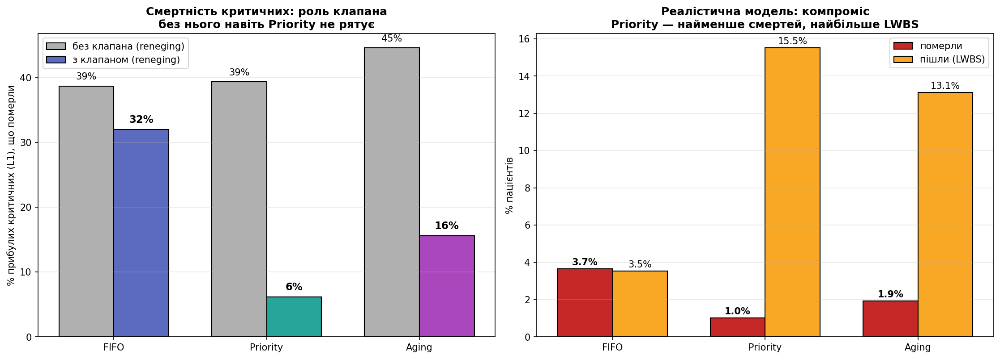

# Фаза 13. Динамічна тяжкість: погіршення і смерть

> Розділ 15 · [↑ Зміст документації](README.md) · [↑ Головний README](../README.md)

[← Фаза 12. Reneging: пацієнти йдуть, не дочекавшись (LWBS)](14-reneging-lwbs.md)  

---

## Фаза 13: Динамічна тяжкість — погіршення і смерть

### Проблема статичної тяжкості

Досі стан пацієнта **не змінювався**: хто прибув як L3, лишався L3. Реальність інша — чекаючи, L3 може стати L1 (інфекція → сепсис), а критичний без допомоги може **померти**.

> **Куди ми йдемо.** Це кульмінація дослідження: ставка тепер не хвилини, а **життя**. Фінальний результат — під FIFO помирає **32% прибулих критичних (L1)**, а під Priority — лише **6%**. Але шлях до цього висновку проходить через несподіваний провал, де Priority спершу виглядає найгіршим.

> **Примітка щодо реалізації.** Рушії погіршення показано «розгорнуто». У пакеті вони — обгортки над `run_with_departures` зі спільним кроком `_deteriorate`, а «L5 деградує у 10× повільніше» задано одним коефіцієнтом `L5_SLOWDOWN` (єдине джерело); поведінка ідентична (`src/triage_sim/deterioration.py`).

**Орієнтири з літератури (ілюстративні).** Порядки величин, які мотивують модель: близько 29.5% пацієнтів погіршуються протягом 72 год (~32.9% із сепсисом); довша затримка лікування пов'язана з вищою смертністю (OR близько 4); перевантаження відділення підвищує смертність. Конкретні числа — приблизні діапазони, а не точні оцінки (див. «Чесні оговорки» наприкінці).

### Дизайн моделі (8 врахованих аспектів)

1. **Хто/як швидко:** L2–L4 погіршуються на рівень з темпом ~1%/хв (середній час ~100 хв); L5 — у 10× повільніше; L1 не погіршується, а **помирає**.
2. **Стохастично:** кожному наперед розігруємо "розклад погіршення" (а не детерміновано).
3. **Взаємодія з дисциплінами:** ключове — як кожна реагує на погіршення.
4. **Порочне коло:** погіршення → довше лікування → більший затор → більше погіршень.
5. **Зв'язок зі шкодою:** погіршення/смерть — найпряміша метрика шкоди.
6. **Смерть** як поглинальний стан: L1 без допомоги понад 60 хв помирає. До L1 ведуть два шляхи — пацієнт **прибуває** критичним (помирає, якщо чекає ≥60 хв від прибуття) або **деградує** до L1 з легшого рівня (відлік 60 хв іде від моменту падіння до L1); метрика «прибулі L1 померли» рахує лише перших.
7. **Взаємодія з reneging:** спершу без неї, потім додамо.
8. **Чесність:** аналіз чутливості до темпу + оговорки.

**Параметри:** темп 1%/хв (L2–L4), смерть L1 через 60 хв критичного стану, час лікування **оновлюється** під нову тяжкість.

```python
BASE = {1:25, 2:18, 3:12, 4:8, 5:5}          # базовий час лікування за рівнями
DET_RATE = {2:0.01, 3:0.01, 4:0.01, 5:0.001} # ймовірність погіршення на рівень за хвилину
DEATH_THR = 60.0                              # хвилин у стані L1 до смерті

def assign_deterioration(patients, seed):
    """Кожному — наперед розіграний 'розклад погіршення' (моменти падіння тяжкості)."""
    rng = np.random.default_rng(seed + 20000)
    for patient in patients:
        patient.orig_severity = patient.severity
        patient.orig_duration = patient.service_duration
        patient.det_times = []                       # моменти (від прибуття), коли тяжкість падає
        sev = patient.severity; elapsed = 0.0
        while sev > 1:
            elapsed += rng.exponential(1.0 / DET_RATE.get(sev, 0.01))
            patient.det_times.append(elapsed); sev -= 1
    return patients

def _current_severity(patient, wait):
    """Поточна тяжкість = початкова мінус кількість пройдених порогів погіршення."""
    return patient.orig_severity - sum(1 for elapsed in patient.det_times if elapsed <= wait)

def simulate_deterioration(patients, discipline, aging_thr=45):
    """Симуляція з погіршенням і смертю (поки БЕЗ виходу пацієнтів)."""
    arr = sorted(patients, key=lambda patient: patient.arrival_time)
    i=0; waiting=[]; now=0.0; served=[]; died=[]
    while i < len(arr) or waiting:
        while i < len(arr) and arr[i].arrival_time <= now:
            waiting.append(arr[i]); i += 1
        if not waiting:
            now = arr[i].arrival_time; continue
        # оновлюємо тяжкість + час лікування, перевіряємо смерть
        alive = []
        for patient in waiting:
            wait = now - patient.arrival_time
            patient.severity = _current_severity(patient, wait)
            patient.service_duration = patient.orig_duration * BASE[patient.severity] / BASE[patient.orig_severity]
            became_crit = patient.det_times[-1] if patient.det_times else 0.0
            if patient.severity == 1 and wait >= became_crit + DEATH_THR:
                patient.death_time = patient.arrival_time + became_crit + DEATH_THR; died.append(patient)
            else:
                alive.append(patient)
        waiting = alive
        if not waiting:
            if i < len(arr): now = arr[i].arrival_time; continue
            else: break
        if discipline == 'priority': waiting.sort(key=lambda patient: (patient.severity, patient.arrival_time))
        elif discipline == 'fifo':   waiting.sort(key=lambda patient: patient.arrival_time)
        else:                        waiting.sort(key=lambda patient: (patient.severity - (now - patient.arrival_time)/aging_thr, patient.arrival_time))
        patient = waiting.pop(0); patient.start_time = now; now += patient.service_duration; served.append(patient)
    return served, died
```

### Як працює модель погіршення

- **`assign_deterioration`** — кожному пацієнту наперед розігрує `det_times`: моменти (від прибуття), коли його тяжкість падатиме на рівень. Використовуємо експоненційний розподіл (середній час до погіршення = 1/темп ≈ 100 хв для L2–L4). Розклад фіксований → чесне порівняння дисциплін.
- **`_current_severity(patient, wait)`** — поточна тяжкість = початкова мінус кількість порогів, що вже пройшли. Чим довше чекає, тим тяжчий.
- **`simulate_deterioration`** — на кожному кроці оновлює тяжкість і **час лікування** (важчий стан = довше), потім перевіряє смерть: якщо пацієнт став L1 і пробув критичним понад 60 хв — помер. Решта — як звичайна симуляція, але сортування за **поточною** (оновленою) тяжкістю.

Ключове: під Priority погіршений пацієнт **автоматично підскакує** в черзі (сортуємо за поточною тяжкістю). Під FIFO — ні (сортування за часом приходу). Це й має показати різницю.

```python
N = 300
stats = {disc: {'deteriorated':0, 'died':0, 'total':0} for disc in ['fifo','priority','aging']}
arrived_l1_died = {disc: 0 for disc in ['fifo','priority','aging']}; arrived_l1 = 0

for seed in range(N):
    base = generate_patients(seed=seed)
    arrived_l1 += sum(1 for patient in base if patient.severity == 1)
    for disc in ['fifo','priority','aging']:
        pts = assign_deterioration(copy.deepcopy(base), seed=seed)
        served, died = simulate_deterioration(pts, disc)
        for patient in served:
            stats[disc]['total'] += 1
            if patient.severity < patient.orig_severity: stats[disc]['deteriorated'] += 1
        for patient in died:
            stats[disc]['total'] += 1; stats[disc]['died'] += 1
            if patient.orig_severity == 1: arrived_l1_died[disc] += 1

print("НАЇВНА МОДЕЛЬ (без виходу пацієнтів):\n")
print(f"{'Дисципліна':<12}{'погіршились':>13}{'померли':>10}")
for disc in ['fifo','priority','aging']:
    disc_stats = stats[disc]
    print(f"{disc:<12}{100*disc_stats['deteriorated']/disc_stats['total']:>11.1f}%{100*disc_stats['died']/disc_stats['total']:>9.1f}%")
print(f"\nПрибули критичними (L1) і померли:")
for disc in ['fifo','priority','aging']:
    print(f"  {disc:<10}: {100*arrived_l1_died[disc]/arrived_l1:.0f}% прибулих L1")
```


**Результат:**

```
НАЇВНА МОДЕЛЬ (без виходу пацієнтів):

Дисципліна    погіршились   померли
fifo               25.4%      5.7%
priority           44.1%     18.0%
aging              40.2%     10.4%

Прибули критичними (L1) і померли:
  fifo      : 39% прибулих L1
  priority  : 39% прибулих L1
  aging     : 45% прибулих L1
```

### Несподіваний результат — і його діагноз

Придивіться до таблиці вище — числа **контрінтуїтивні**. Priority дає **НАЙБІЛЬШЕ смертей (18.0%)?!** — більше за FIFO (5.7%) й Aging (10.4%). А серед прибулих критичними під Priority помирає **39% — рівно стільки ж, як під FIFO**: пріоритет **не рятує навіть критичних?!** Priority мав би їх рятувати, а він — найгірший.

**Діагноз — порочне коло (критерій №4):** під Priority легкі **голодують** (чекають 300+ хв) → деградують аж до L1 → потребують довгого лікування (25 хв) → лікар захлинається → черга L1 переповнюється так, що **навіть прибулі критичні не встигають**. Система скотилась у **спіраль смерті**.

**Корінь проблеми:** наївна модель припускає, що легкі чекають **нескінченно**. Це нереально — насправді вони б **пішли** задовго до того, як деградувати до смерті. Бракує клапана (reneging).

```python
# Терпіння (як у Фазі 12), але прив'язане до ПОЧАТКОВОЇ тяжкості
PATIENCE_MEAN = {1: None, 2: 240, 3: 180, 4: 150, 5: 120}

def assign_patience_det(patients, seed=0):
    rng = np.random.default_rng(seed + 10000)
    for patient in patients:
        mean_patience = PATIENCE_MEAN[patient.orig_severity]
        patient.patience = float('inf') if mean_patience is None else max(15.0, rng.normal(mean_patience, mean_patience * 0.3))
    return patients

def simulate_deter_reneg(patients, discipline, aging_thr=45):
    """Погіршення + смерть + вихід легких (повна реалістична модель)."""
    arr = sorted(patients, key=lambda patient: patient.arrival_time)
    i=0; waiting=[]; now=0.0; served=[]; died=[]; left=[]
    while i < len(arr) or waiting:
        while i < len(arr) and arr[i].arrival_time <= now:
            waiting.append(arr[i]); i += 1
        if not waiting:
            now = arr[i].arrival_time; continue
        alive = []
        for patient in waiting:
            wait = now - patient.arrival_time
            patient.severity = _current_severity(patient, wait)
            patient.service_duration = patient.orig_duration * BASE[patient.severity] / BASE[patient.orig_severity]
            became_crit = patient.det_times[-1] if patient.det_times else 0.0
            if patient.severity == 1 and wait >= became_crit + DEATH_THR:
                died.append(patient); continue                       # критичний помер
            if patient.severity > 1 and patient.arrival_time + patient.patience <= now:
                left.append(patient); continue                       # легкий пішов (не критичний — не йде)
            alive.append(patient)
        waiting = alive
        if not waiting:
            if i < len(arr): now = arr[i].arrival_time; continue
            else: break
        if discipline == 'priority': waiting.sort(key=lambda patient: (patient.severity, patient.arrival_time))
        elif discipline == 'fifo':   waiting.sort(key=lambda patient: patient.arrival_time)
        else:                        waiting.sort(key=lambda patient: (patient.severity - (now - patient.arrival_time)/aging_thr, patient.arrival_time))
        patient = waiting.pop(0); patient.start_time = now; now += patient.service_duration; served.append(patient)
    return served, died, left
```

```python
N = 300
results = {disc: {'died':0, 'left':0, 'total':0, 'l1_died':0} for disc in ['fifo','priority','aging']}
arrived_l1 = 0

for seed in range(N):
    base = generate_patients(seed=seed)
    arrived_l1 += sum(1 for patient in base if patient.severity == 1)
    for disc in ['fifo','priority','aging']:
        pts = assign_patience_det(assign_deterioration(copy.deepcopy(base), seed=seed), seed=seed)
        served, died, left = simulate_deter_reneg(pts, disc)
        results[disc]['total'] += len(served) + len(died) + len(left)
        results[disc]['died'] += len(died); results[disc]['left'] += len(left)
        results[disc]['l1_died'] += sum(1 for patient in died if patient.orig_severity == 1)

print("РЕАЛІСТИЧНА МОДЕЛЬ (погіршення + вихід легких):\n")
print(f"{'Дисципліна':<12}{'померли':>9}{'пішли':>9}{'прибулих L1 померло':>22}")
for disc in ['fifo','priority','aging']:
    disc_results = results[disc]
    print(f"{disc:<12}{100*disc_results['died']/disc_results['total']:>8.1f}%{100*disc_results['left']/disc_results['total']:>8.1f}%{100*disc_results['l1_died']/arrived_l1:>20.0f}%")
```


**Результат:**

```
РЕАЛІСТИЧНА МОДЕЛЬ (погіршення + вихід легких):

Дисципліна    померли    пішли   прибулих L1 померло
fifo             3.7%     3.5%                  32%
priority         1.0%    15.5%                   6%
aging            1.9%    13.1%                  16%
```

### Реалістичний результат — усе стає на місця

Щойно легкі можуть **піти** до того, як деградувати до смерті, спіраль зникає й картина **прояснюється** (див. таблицю вище — тепер Priority **рятує критичних!**):

- **Priority дає найменше смертей (1.0%)** і рятує критичних: помирає лише **6% прибулих L1** проти **32% під FIFO**. Priority **самокоригується** — погіршений одразу підскакує в черзі.
- **FIFO найгірший для життя:** 32% критичних помирають, бо FIFO сліпий до тяжкості й не реагує на погіршення.
- **Ціна Priority** — найвищий LWBS (15.5%): легкі йдуть. Це знайомий компроміс із Фази 12.
- **Aging** — посередині: рятує більше критичних за FIFO (16% проти 32% смертей L1), м'якший до легких за Priority.

```python
D = {'fifo':'#5c6bc0','priority':'#26a69a','aging':'#ab47bc'}
discs = ['fifo','priority','aging']; DL = ['FIFO','Priority','Aging']
# для лівої панелі потрібні і наївні числа (l1 died %): рахуємо з 'arrived_l1_died'
naive_l1 = [100*arrived_l1_died[disc]/arrived_l1 for disc in discs]   # наївна модель
real_l1  = [100*results[disc]['l1_died']/arrived_l1 for disc in discs]      # реалістична

fig, axes = plt.subplots(1, 2, figsize=(15, 5.5))
# Панель 1: смертність критичних — роль клапана
ax = axes[0]; x = np.arange(3); w = 0.36
ax.bar(x-w/2, naive_l1, w, label='без клапана (reneging)', color='#b0b0b0', edgecolor='black')
ax.bar(x+w/2, real_l1, w, label='з клапаном (reneging)', color=[D[disc] for disc in discs], edgecolor='black')
for xi,v in zip(x-w/2,naive_l1): ax.text(xi,v+1,f'{v:.0f}%',ha='center',fontsize=10)
for xi,v in zip(x+w/2,real_l1):  ax.text(xi,v+1,f'{v:.0f}%',ha='center',fontweight='bold',fontsize=11)
ax.set_xticks(x); ax.set_xticklabels(DL); ax.set_ylabel('% прибулих критичних (L1), що померли')
ax.set_title('Смертність критичних: роль клапана\nбез нього навіть Priority не рятує', fontweight='bold')
ax.legend(); ax.grid(axis='y', alpha=0.3)
# Панель 2: реалістичний компроміс
ax = axes[1]
died = [100*results[disc]['died']/results[disc]['total'] for disc in discs]; left = [100*results[disc]['left']/results[disc]['total'] for disc in discs]
ax.bar(x-w/2, died, w, label='померли', color='#c62828', edgecolor='black')
ax.bar(x+w/2, left, w, label='пішли (LWBS)', color='#f9a825', edgecolor='black')
for xi,v in zip(x-w/2,died): ax.text(xi,v+0.2,f'{v:.1f}%',ha='center',fontweight='bold',fontsize=10)
for xi,v in zip(x+w/2,left): ax.text(xi,v+0.2,f'{v:.1f}%',ha='center',fontsize=10)
ax.set_xticks(x); ax.set_xticklabels(DL); ax.set_ylabel('% пацієнтів')
ax.set_title('Реалістична модель: компроміс\nPriority — найменше смертей, найбільше LWBS', fontweight='bold')
ax.legend(); ax.grid(axis='y', alpha=0.3)
plt.tight_layout(); plt.show()
```


**Результат:**



### Розбір підсумкового графіка погіршення

Це підсумок дослідження погіршення зі смертю. Ліва панель — **роль "клапана"** (виходу легких) для виживання критичних; права — **компроміс** реалістичної моделі.

### Панель 1 (ліва): роль клапана для смертності критичних

По вертикалі — **% прибулих критичних (L1), що померли**. Для кожної дисципліни **два** стовпчики:
- **сірий** — наївна модель (легкі НЕ йдуть, чекають нескінченно),
- **кольоровий** — реалістична модель (легкі йдуть, клапан працює).

**Сірі (без клапана):** усі три дисципліни вбивають ~39–45% критичних. Навіть Priority — 39%! Це **спіраль смерті**: легкі голодують, деградують до L1, переповнюють чергу так, що навіть прибулі критичні не встигають.

**Кольорові (з клапаном):**
- **Priority падає з 39% до 6%** — рятує критичних! Черга L1 більше не переповнюється.
- **Aging — з 45% до 16%** — теж значно краще.
- **FIFO майже не змінюється: 39% → 32%.** Бо проблема FIFO не у спіралі, а в його природі: він **сліпий до тяжкості** й змушує критичних чекати незалежно від виходу легких.

**Головне:** без клапана навіть Priority безсилий; з клапаном Priority рятує (6%), а FIFO — ні (32%).


### Панель 2 (права): реалістичний компроміс

По вертикалі — % пацієнтів: **червоний** — померли, **помаранчевий** — пішли (LWBS).

| Дисципліна | Померли | Пішли |
|---|---|---|
| FIFO | **3.7%** | 3.5% |
| Priority | **1.0%** | 15.5% |
| Aging | 1.9% | 13.1% |

Фундаментальний компроміс:
- **Priority — найменше смертей (1.0%)**, але **найбільше LWBS (15.5%)**: рятує критичних, виганяє легких.
- **FIFO — найбільше смертей (3.7%)**, найменше LWBS (3.5%): обслуговує легких, дає критичним померти.
- **Aging — посередині** на обох метриках.

Той самий вибір, що проходить крізь усе дослідження, тепер у найгострішій формі: **рятувати критичних ціною виходу легких — чи затримувати критичних, але обслуговувати легких.**


### Головний інсайт

| Панель | Що показує |
|---|---|
| Ліва | без клапана навіть Priority не рятує (спіраль); з ним Priority рятує критичних (6% проти 32% під FIFO) |
| Права | компроміс: Priority — найменше смертей, найбільше LWBS |

**Ключова думка:** динамічна модель переводить усе з хвилин у **життя**. FIFO лишає вмирати майже третину критичних; Priority рятує всіх, окрім кількох відсотків. Але є умова: Priority працює **тільки** тоді, коли система дозволяє легким піти — інакше голодування деградує її до колапсу, де гинуть усі.

**Підсумок:** цей графік — кульмінація дослідження. Він показує **дві речі одночасно**: що пріоритезація **рятує життя** (а не просто скорочує хвилини), і що вона потребує **анти-голодувального запобіжника**, щоб не захлинутись. Це і фінальний аргумент за Priority/Aging, і чесне застереження про їхню крихкість.

```python
def assign_det_rate(patients, seed, rate):
    rng = np.random.default_rng(seed + 20000)
    for patient in patients:
        patient.orig_severity=patient.severity; patient.orig_duration=patient.service_duration; patient.det_times=[]
        sev=patient.severity; elapsed=0.0
        while sev>1:
            level_rate = rate if sev in (2,3,4) else rate*0.1
            elapsed += rng.exponential(1.0/level_rate); patient.det_times.append(elapsed); sev-=1
    return patients

rates = [0.005, 0.01, 0.015, 0.02]
print("% прибулих критичних (L1), що померли, за різних темпів погіршення:\n")
print(f"{'темп/хв':>9}{'FIFO':>8}{'Priority':>10}{'Aging':>8}")
for rate in rates:
    l1_deaths = {disc:0 for disc in discs}; arrived_l1 = 0
    for seed in range(200):
        base = generate_patients(seed=seed); arrived_l1 += sum(1 for patient in base if patient.severity==1)
        for disc in discs:
            pts = assign_patience_det(assign_det_rate(copy.deepcopy(base), seed, rate), seed=seed)
            _, died, _ = simulate_deter_reneg(pts, disc)
            l1_deaths[disc] += sum(1 for patient in died if patient.orig_severity==1)
    print(f"{rate*100:>7.1f}%{100*l1_deaths['fifo']/arrived_l1:>7.0f}%{100*l1_deaths['priority']/arrived_l1:>9.0f}%{100*l1_deaths['aging']/arrived_l1:>7.0f}%")
```


**Результат:**

```
% прибулих критичних (L1), що померли, за різних темпів погіршення:

  темп/хв    FIFO  Priority   Aging
    0.5%     22%        0%      4%
    1.0%     33%        6%     16%
    1.5%     42%       21%     32%
    2.0%     50%       37%     45%
```

### Чутливість і висновки

**Чутливість до темпу погіршення** (таблиця вище): за **будь-якого** темпу FIFO найгірший, Priority найкращий — ранжування **стійке**. Що швидше погіршення, то більше смертей скрізь (при 2%/хв навіть Priority не встигає) — але порядок незмінний.

### Висновки Фази 13

1. **Динамічна модель підсилює аргумент за Priority** — і переводить його з хвилин у **життя**: FIFO лишає вмирати 32% критичних, Priority — лише 6%.
2. **Priority самокоригується:** погіршений пацієнт автоматично підскакує в черзі; FIFO сліпий до погіршення.
3. **Несподіванка-урок:** без "клапана" (виходу легких) погіршення штовхає систему в **спіраль смерті**, де навіть Priority безсилий. Це сильний аргумент за **анти-голодувальні** механізми (Aging, вихід легких).
4. **Компроміс лишається:** Priority рятує критичних ціною високого LWBS легких.
5. **Висновок стійкий** до темпу погіршення (аналіз чутливості).

### Чесні оговорки

- Темпи погіршення **ілюстративні** — реальні сильно різняться за станами; ми показали, що ранжування не залежить від конкретного числа.
- Ми вважаємо тріаж і темпи відомими; модель спрощена (один лікар, без повторного тріажу).
- "Смерть" тут — модельний крайній стан, а не клінічний прогноз.

**Найсильніша теза дослідження:** *"Під звичайною чергою (FIFO) майже третина критичних пацієнтів може загинути, не дочекавшись; пріоритетна черга рятує всіх, окрім кількох відсотків. Але працює це лише тоді, коли система дозволяє легким піти — інакше навіть пріоритет захлинається."*


---

[← Фаза 12. Reneging: пацієнти йдуть, не дочекавшись (LWBS)](14-reneging-lwbs.md)  
